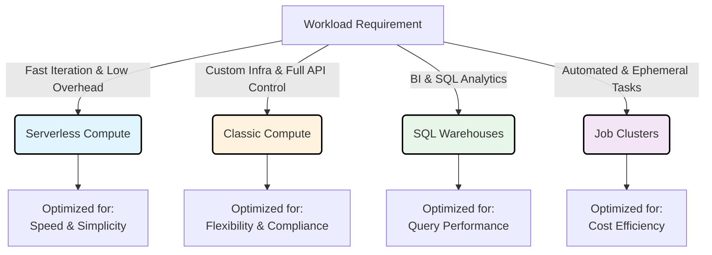

# Choose appropriate compute type

Compute selection is not merely an infrastructure decision; it is a strategic lever that dictates the efficiency, cost, and agility of your data operations. By aligning compute resources with specific workload patterns, you transform raw processing power into targeted business value.



### The Strategic Impact of Compute Choice

*   **Velocity:** Serverless options eliminate provisioning delays, allowing developers to move from idea to insight in seconds rather than minutes.
*   **Precision:** Classic compute provides the granular control necessary for complex machine learning pipelines or strict network isolation requirements.
*   **Efficiency:** Job clusters and SQL warehouses ensure that you are only paying for active processing, preventing budget drain from idle resources.

By mastering these distinctions, you move beyond generic resource allocation to a model of intentional, high-performance data engineering.

## Serverless compute
Serverless compute is managed entirely by Azure Databricks. You don't provision or configure infrastructure—Azure Databricks automatically allocates and scales resources based on your workload demands. These resources run in Databricks' Azure subscription, not yours, which means no virtual machines or networking components appear in your subscription.
With serverless compute, startup typically takes 2-6 seconds. The platform scales up rapidly when query volume increases and scales down during idle periods to minimize costs. This eliminates the need to estimate capacity or manage cluster configurations.
Serverless compute requires Unity Catalog and is available for:
- Notebooks: Interactive Python and SQL development with automatic resource allocation
- Jobs: Automated workflows that run without infrastructure setup
- Pipelines: Lakeflow Spark Declarative Pipelines with on-demand scaling
- SQL warehouses: Optimized SQL query execution with intelligent workload management
Serverless works best for exploratory analysis, ETL pipelines, business intelligence workloads, and scenarios where startup latency matters. The versionless runtime means Azure Databricks automatically applies upgrades, so you always run on the latest features without migration effort.
However, serverless has limitations. In notebooks, serverless doesn't support Scala, R language, JAR libraries, or RDD APIs (Resilient Distributed Dataset). Custom Spark configurations are also restricted. JAR tasks in Lakeflow Jobs on serverless compute are available in Public Preview. If your workload requires Scala or R notebooks, RDD APIs, or full Spark configuration control, use classic compute with dedicated access mode instead.

## Choose a serverless performance mode
Serverless compute for jobs and pipelines offers two performance modes that balance startup speed against cost.
Performance-optimized mode is the default. Azure Databricks maintains a pool of warm compute resources, enabling startups in seconds. Choose this mode for interactive workloads, latency-sensitive jobs, and scenarios where fast startup is critical.
Standard mode is optimized for cost. Serverless workloads using standard performance mode typically start within 4 to 6 minutes. Standard mode can reduce DBU consumption by up to 70% compared to performance-optimized mode, making it well suited for scheduled batch jobs and pipelines where startup latency is acceptable.
You configure the performance mode using the Performance optimized toggle in the job details page. Standard mode is not available for continuous pipelines or one-time runs submitted via the runs/submit API endpoint. For notebooks, only performance-optimized mode is available.

```
runs/submit
```

## Classic Compute

Classic compute provides granular control over cluster configuration, provisioning resources directly within your Azure subscription. This model offers full visibility into the underlying infrastructure, making it suitable for workloads requiring specific network configurations, custom dependencies, or strict compliance boundaries. However, this flexibility comes with increased management overhead compared to serverless alternatives.

### Access Modes

Access modes define how users interact with a cluster and determine the level of isolation between concurrent sessions.

| Mode | Description | Best For |
| :--- | :--- | :--- |
| **Standard Access** | Allows multiple users to share a single cluster concurrently. Lakeguard isolates user code to prevent interference. | Collaborative data engineering, shared analytics, and cost optimization through resource pooling. |
| **Dedicated Access** | Assigns the cluster exclusively to a single user or group, providing full machine-level privileges. | Workloads requiring RDD APIs, GPU acceleration, R language support, or custom container environments. |

### Cluster Architectures

The structure of the cluster determines its scalability and processing capabilities.

#### Multi-Node Clusters
*   **Structure:** Consists of one driver node and one or more worker nodes.
*   **Function:** The driver coordinates execution while workers perform distributed computations in parallel.
*   **Use Case:** Ideal for production workloads processing large volumes of data, requiring high throughput, or needing horizontal scaling to handle increased load.

#### Single-Node Clusters
*   **Structure:** Contains only a driver node; no worker nodes are present.
*   **Function:** All computation occurs on the driver, eliminating distribution overhead.
*   **Use Case:** Suitable for lightweight exploration, small dataset analysis, or machine learning experimentation using frameworks like scikit-learn that do not inherently distribute across nodes.
*   **Limitation:** Cannot scale horizontally. For workloads requiring distributed processing or fault tolerance, multi-node clusters are required.

### Operational Characteristics

*   **Management Overhead:** You are responsible for configuring instance types, autoscaling rules, and runtime versions.
*   **Startup Time:** Typically ranges from 3–7 minutes, depending on cluster size and configuration.
*   **Runtime Control:** Unlike serverless compute, you manually select and manage the Databricks Runtime version (e.g., upgrading from 13.3 LTS to 14.3 LTS). While OS and security patches can be automated, major runtime upgrades require manual intervention.

> [!NOTE]
> Classic compute is the preferred choice for workloads that need features unavailable in serverless environments, require precise control over infrastructure networking, or must meet specific compliance requirements for resource isolation.

## SQL warehouses
SQL warehouses are compute resources optimized specifically for SQL queries, analytics, and business intelligence. They come in three types, each with different performance characteristics.
Serverless SQL warehouses offer optimal performance and cost efficiency. They start in 2-6 seconds, use Intelligent Workload Management to predict query resource needs, and scale clusters dynamically based on demand. Photon and Predictive IO accelerate query execution. Choose serverless SQL warehouses for most SQL workloads—BI dashboards, ETL jobs, and ad hoc analysis.
Pro SQL warehouses support Photon and Predictive IO but lack Intelligent Workload Management. They take approximately 4 minutes to start and scale less dynamically than serverless. You use pro warehouses when you need custom networking configurations—for example, connecting to on-premises databases through federation or integrating with services in your virtual network.
Classic SQL warehouses offer entry-level SQL performance with Photon support only. They start in about 4 minutes and include basic autoscaling. Choose classic warehouses only when serverless and pro options aren't available or for basic interactive exploration with minimal performance requirements.
All SQL warehouse types optimize for SQL execution patterns, but serverless offers the most responsive scaling and lowest operational overhead.

## Instance Pools

Instance pools maintain a reserve of idle virtual machine instances, enabling near-instant cluster provisioning. By allocating resources from a pre-warmed pool rather than requesting new instances from Azure, you can reduce startup times from several minutes to under one minute.

### Operational Mechanics

*   **Capacity Management:** You define the minimum number of idle instances to keep "warm" and the maximum total capacity of the pool.
*   **Resource Recycling:** When a cluster terminates or scales down, its instances return to the pool for immediate reuse by subsequent workloads.
*   **Cost Structure:** You incur costs for the underlying virtual machines while they sit idle in the pool, but you do not pay for Azure Databricks Compute Units (DBUs) during this time.

### Strategic Use Cases

Instance pools are most cost-effective when you run workloads frequently enough that the value of reduced latency outweighs the cost of maintaining idle infrastructure.

| Scenario | Recommendation | Rationale |
| :--- | :--- | :--- |
| **High-Frequency Jobs** | Use Instance Pools | Minimizes wait time for scheduled pipelines or interactive sessions that start and stop regularly. |
| **Serverless Workloads** | Avoid Pools | Serverless compute starts faster and scales more efficiently without requiring manual management of idle capacity. |
| **Classic Compute Needs** | Use Instance Pools | Optimizes startup time for workloads that require classic compute features (e.g., specific networking or libraries) not available in serverless. |

### Cost Optimization Best Practices

To balance performance and cost, configure your pools with a hybrid instance strategy:

*   **Worker Nodes:** Use **Spot Instances** to significantly reduce compute costs for distributed processing tasks.
*   **Driver Nodes:** Use **On-Demand Instances** to ensure reliability and stability for the cluster’s coordination layer, as driver failures can terminate the entire job.

> [!NOTE]
> While serverless compute has reduced the necessity of instance pools for many modern workflows, pools remain a vital tool for organizations relying on classic compute for specialized workloads where startup latency is a critical bottleneck.

## Job Compute

Job compute refers to clusters specifically optimized for automated, non-interactive workflows. Unlike all-purpose clusters used for development, job clusters are ephemeral—they spin up to execute a specific task and terminate automatically upon completion. This lifecycle ensures you only pay for active processing time, eliminating costs associated with idle resources.

### Compute Options for Jobs

When configuring a job, you can choose between two compute models:

| Feature | Serverless Job Compute | Classic Job Compute |
| :--- | :--- | :--- |
| **Management** | Fully managed by Azure Databricks; no infrastructure configuration required. | Requires manual configuration of node types, runtime versions, and networking. |
| **Startup Time** | Faster startup due to pre-provisioned infrastructure. | Slower startup (typically 3–7 minutes) unless using instance pools. |
| **Flexibility** | Limited to supported features; ideal for standard ETL and SQL workloads. | Full flexibility; supports custom libraries, specific runtime versions, and complex networking. |
| **Cost Efficiency** | Generally lower total cost for most automated workloads due to efficient scaling. | Can be optimized further using spot instances and autoscaling. |

### Cost Optimization with Spot Instances

For classic job compute, **Azure Spot VMs** offer a significant cost-saving opportunity, often reducing compute costs by up to 90% compared to on-demand instances.

*   **How It Works:** Spot instances utilize Azure’s excess capacity. In exchange for the discount, Azure can reclaim these instances with only 30 seconds' notice when capacity is needed elsewhere.
*   **Fault Tolerance:** Apache Spark’s built-in fault tolerance makes spot instances viable for batch processing. If a node is reclaimed, Spark automatically retries failed tasks on other available nodes, ensuring job completion without manual intervention.
*   **Best Practice:** Use spot instances for worker nodes to maximize savings, but retain on-demand instances for driver nodes to ensure job stability.

### Job Compute Policies

To enforce consistency and reliability across production workloads, Azure Databricks provides **Job Compute policies**. These templates apply sensible defaults, such as:

*   Enforcing the latest **Long Term Support (LTS)** runtime version for stability.
*   Configuring appropriate autoscaling rules.
*   Restricting access to approved instance types.

> [!NOTE]
> By leveraging job compute policies and spot instances, you can build production pipelines that are not only cost-effective but also resilient to infrastructure interruptions, ensuring reliable data delivery at scale.

## Compare Compute Types

Selecting the appropriate compute resource is a foundational decision that impacts cost, performance, and operational complexity. The following comparison highlights the distinct characteristics of each option to guide your selection.

### Key Characteristics Comparison

| Feature | Serverless Compute | Classic Compute | SQL Warehouses |
| :--- | :--- | :--- | :--- |
| **Primary Use Case** | Interactive notebooks, ad-hoc analysis, and automated jobs. | Complex ETL, ML training, and workloads requiring custom infrastructure. | BI dashboards, SQL queries, and data visualization. |
| **Management Overhead** | Minimal; fully managed by Azure Databricks. | High; requires manual configuration of nodes, runtime, and networking. | Low; optimized for SQL with automatic scaling. |
| **Startup Time** | Seconds (2–4x faster than classic). | Minutes (3–7 minutes typically). | Seconds to minutes, depending on size. |
| **Networking** | Databricks-managed subscription; no custom VNet integration. | Runs in your Azure subscription; supports custom VNets and private links. | Pro tier supports custom VNets; Serverless tier does not. |
| **API Support** | Python, SQL, Scala. No RDD API support. | Full API support including RDDs, R, and GPU acceleration. | SQL only. |
| **Cost Model** | Pay-per-second of execution; no idle costs. | Pay for DBUs + underlying VMs; idle costs apply unless using job clusters. | Pay-per-second of execution; optimized for query concurrency. |

### Decision Framework

To choose the right compute type, evaluate your workload against five critical dimensions:

1.  **Workload Type:**
    *   **Interactive Notebooks:** Serverless compute offers the fastest iteration cycle.
    *   **SQL/BI:** Serverless SQL warehouses provide optimal performance and concurrency.
    *   **Automated Jobs:** Serverless job compute is ideal for most pipelines; use classic only if custom configurations are required.

2.  **API and Language Requirements:**
    *   If your code relies on **RDD APIs**, **R language**, or **GPU acceleration**, you must use **Classic Compute** with dedicated access mode.
    *   For standard Python, SQL, and Scala workloads, both serverless and classic options are viable.

3.  **Frequency of Execution:**
    *   **Infrequent Workloads:** Benefit most from serverless, as you pay only during active execution.
    *   **Recurring Workloads:** May justify instance pools with classic compute to reduce startup latency, though serverless often remains more cost-effective due to its efficiency.

4.  **Networking and Infrastructure Needs:**
    *   If you require **custom virtual networks**, **on-premises connectivity**, or specific instance types, **Classic Compute** or **Pro SQL Warehouses** are necessary.
    *   Serverless operates within the Databricks-managed subscription and does not support custom network integration or appear in your Azure subscription.

5.  **Performance and Latency:**
    *   **Latency-Sensitive:** Serverless compute starts significantly faster, reducing wait times for developers and users.
    *   **Predictable Scale:** Both models can handle large-scale workloads, but serverless adapts more dynamically to load variations without manual tuning.

> [!TIP]
> **Start with Serverless**
> For the majority of modern data workflows, serverless options provide the best balance of speed, cost, and simplicity. They minimize operational overhead and eliminate the need for infrastructure management. Reserve classic compute for scenarios where specific technical limitations—such as legacy API dependencies or strict network isolation requirements—make it unavoidable.

## Navigation

- Previous: [01. Introduction](01.%20Introduction.md)
- Next: [03. Configure compute performance](03.%20Configure%20compute%20performance.md)

## Source

Microsoft Learn: [Choose appropriate compute type](https://learn.microsoft.com/en-us/training/modules/select-and-configure-compute/2-choose-appropriate-compute-type)
