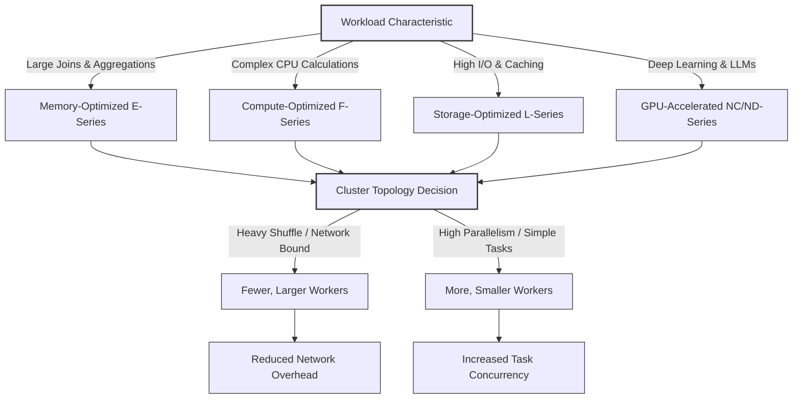

# Configure compute performance

Configuring compute resources involves balancing performance requirements with cost considerations. Over-provisioning leads to unnecessary expenses, while under-provisioning can cause stability issues and slow query execution. Understanding how to configure compute settings helps you optimize resources for your workload.

## Compute Resource Components

Compute performance in Azure Databricks is driven by the interplay of three fundamental resources: cores, memory, and local storage. Understanding how these components influence Spark’s execution engine allows you to right-size your clusters for both efficiency and cost.

### The Three Pillars of Performance

| Component | Function | Performance Impact |
| :--- | :--- | :--- |
| **Executor Cores** | Determine the maximum level of parallelism. | More cores allow Spark to process a higher number of tasks simultaneously. For example, 8 workers with 4 cores each provide 32 cores for concurrent execution. |
| **Executor Memory** | Stores data in RAM for active processing. | Critical for memory-intensive operations like joins, aggregations, and caching. Insufficient memory forces Spark to "spill" data to disk, causing significant latency. |
| **Local Storage** | Provides temporary space for shuffle and cache. | During shuffle operations, intermediate data is written to local disks on worker nodes. Faster local storage (e.g., NVMe) reduces the time spent on these I/O-heavy tasks. |

### Strategic Configuration

*   **Parallelism vs. Cost:** Increasing the number of cores boosts throughput but also increases DBU costs. Balance the need for speed against your budget by selecting node types that offer the right core-to-memory ratio for your specific workload.
*   **Memory Management:** For workloads involving large-scale transformations or complex joins, prioritize memory-optimized instances. Keeping data in memory is exponentially faster than retrieving it from disk.
*   **Storage Speed:** When dealing with massive datasets that require frequent shuffling, choose instance types with high-performance local storage to minimize I/O bottlenecks.

> [!NOTE]
> Right-sizing your compute resources is not a one-time task. As data volumes grow and query complexity increases, regularly reviewing these three components ensures your clusters remain optimized for both performance and cost.

## Configure Node Types and Cluster Size

Selecting the right node type and cluster topology is a critical architectural decision. It determines not only how fast your workload completes but also how efficiently you utilize your budget. The configuration must align with the specific resource demands of your data processing tasks—whether they are memory-intensive, compute-heavy, I/O-bound, or GPU-accelerated.

### Instance Families by Workload Profile

Azure Databricks offers specialized instance families designed to match distinct computational patterns.

| Instance Family | Primary Resource | Ideal Workload | Example Series |
| :--- | :--- | :--- | :--- |
| **Memory-Optimized** | High RAM per Core | Large joins, aggregations, and in-memory analytics where data spilling to disk must be avoided. | E-series |
| **Compute-Optimized** | High CPU Performance | Complex calculations, straightforward ETL transformations, and tasks that are CPU-bound rather than memory-bound. | F-series |
| **Storage-Optimized** | Fast Local NVMe | Workloads requiring high I/O throughput, repeated data reads, or extensive caching of intermediate shuffle data. | L-series |
| **GPU-Accelerated** | Graphics Processing Units | Deep learning, model training, fine-tuning LLMs, and image processing. Can accelerate training by 10–100x compared to CPUs. | NC-series, ND-series |

> [!IMPORTANT]
> **GPU Requirements**
> GPU instances require the **Databricks Runtime ML**. They are specifically engineered for computationally intensive AI/ML tasks and are not typically used for standard SQL or ETL workloads.

### Cluster Topology: Fewer Large Workers vs. More Small Workers

The total compute capacity of a cluster can be achieved through different combinations of worker count and instance size. For example, 32 cores and 256 GB of RAM can be provided by either two large workers or eight small workers. However, the performance implications differ significantly based on the workload's communication patterns.

#### Fewer, Larger Workers
*   **Advantage:** Reduces network overhead during shuffle operations. Since data exchange happens between fewer nodes, there is less serialization and network traffic.
*   **Best For:** Analytical workloads with complex joins, wide transformations, and heavy shuffle requirements.

#### More, Smaller Workers
*   **Advantage:** Provides higher levels of parallelism and fault tolerance granularity. If one small worker fails, the impact on the overall job is smaller than if a large worker fails.
*   **Best For:** Highly distributed batch processing, simple map-side operations, and workloads that benefit from massive task concurrency.

### Strategic Configuration Guidelines

1.  **Match Memory to Data Volume:** If your dataset exceeds the available RAM, Spark will spill to disk, causing performance to degrade exponentially. Always choose memory-optimized instances for large-scale analytics.
2.  **Leverage Local Storage for Shuffle:** For workloads with significant shuffle phases, storage-optimized instances with NVMe drives can drastically reduce the time spent writing and reading intermediate data.
3.  **Balance Cost and Latency:** While more workers provide better parallelism, they also increase coordination overhead. For most production ETL jobs, a moderate number of mid-sized workers offers the best balance of cost and performance.

## Flexible Node Types for Compute Resilience

Cloud infrastructure is inherently dynamic, and capacity constraints can disrupt even well-planned data workflows. When Azure Databricks attempts to provision a specific instance type that is currently unavailable, the result is a `CLOUD_PROVIDER_RESOURCE_STOCKOUT` error. This failure occurs without warning and can delay critical production jobs or block interactive development sessions. **Flexible node types** solve this problem by introducing an automatic fallback mechanism that maintains workload continuity without requiring manual intervention.

### How Flexible Node Types Work

When enabled, Azure Databricks automatically selects a compatible alternative instance type if the primary choice is unavailable. Compatibility is strictly enforced to ensure that workloads perform consistently regardless of which instance type is ultimately provisioned.

| Compatibility Criterion | Requirement | Rationale |
| :--- | :--- | :--- |
| **vCPU Count** | Identical to primary type | Ensures parallelism and task scheduling remain unchanged. |
| **Memory** | Within 100–110% of primary | Prevents out-of-memory errors or significant performance degradation. |
| **Local Disk Configuration** | Matching storage type and size | Guarantees shuffle and cache performance remains consistent. |
| **CPU Architecture** | Same architecture (e.g., x86_64) | Prevents binary incompatibility with compiled libraries. |
| **OS Image Support** | Compatible runtime support | Ensures the Databricks Runtime functions correctly. |

### Enabling and Managing the Feature

-   **Workspace-Level Activation:** Administrators enable flexible node types by toggling **Enable auto flexible node types** in the Workspace Compute admin settings. Once active, all new classic compute resources automatically leverage fallback instance types.
-   **Per-Cluster Override:** For workloads with strict hardware requirements (e.g., licensed software tied to specific instance families), you can disable the feature for individual clusters by setting `alternate_node_type_ids` to an empty list via the Clusters API.
-   **Custom Fallback Lists:** If you prefer deterministic control over which alternatives are used, you can specify a custom ordered list of instance types through the API instead of relying on automatic selection.

### Cost Optimization with Spot Instances

Flexible node types provide exceptional value when combined with **Azure Spot VMs**. Spot capacity is ephemeral and varies by instance type; a specific Spot SKU may be unavailable even when overall Spot capacity exists.

-   **Increased Spot Utilization:** By attempting acquisition across multiple compatible Spot types before falling back to on-demand instances, flexible node types significantly increase the percentage of workloads running on discounted Spot capacity.
-   **Reduced Total Cost:** Higher Spot utilization directly translates to lower compute spend, often saving 60–90% compared to on-demand pricing, while maintaining resilience against individual SKU stockouts.

> [!IMPORTANT]
> **Production Reliability**
> Flexible node types transform capacity constraints from a blocking failure into a transparent operational detail. For production pipelines where SLAs matter, enabling this feature is a best practice that improves both reliability and cost efficiency without compromising workload correctness.

## Configure autoscaling
Autoscaling adjusts the number of workers based on workload demands, helping you maintain performance while controlling costs.
When you enable autoscaling, you set minimum and maximum worker counts. Azure Databricks monitors workload requirements and adds workers when needed, up to the maximum you specified. When demand decreases, workers are removed down to the minimum.
Azure Databricks uses optimized autoscaling by default when you enable autoscaling. Optimized autoscaling scales up quickly in two steps from minimum to maximum. It can scale down even when the cluster isn't idle by monitoring shuffle file state. For job compute, it evaluates utilization every 40 seconds. For all-purpose compute, it checks every 150 seconds.
Consider autoscaling for workloads with variable resource needs throughout execution. Data exploration sessions often start with small data samples and later process larger datasets. Autoscaling adds workers when you process the larger datasets and removes them when you return to smaller samples.
For predictable workloads that maintain consistent resource usage, a fixed number of workers often provides more stable performance and simpler capacity planning. The overhead of scaling decisions can slightly impact performance for steady-state workloads.
Autoscaling works particularly well with instance pools. Set your minimum workers equal to or less than the minimum idle instances in the pool. This ensures quick scaling because the instances are already provisioned and ready.

## Configure termination settings
Automatic termination prevents idle compute resources from accumulating unnecessary costs while maintaining availability for scheduled workloads.
When you configure automatic termination, you specify an inactivity period in minutes. If no commands run on the cluster for longer than this period, Azure Databricks terminates the cluster. The cluster configuration remains available for restart when needed.
For interactive workloads like data analysis, set the termination period based on typical session patterns. A 45-minute timeout works well for most use cases, giving data engineers time to review results between queries without leaving clusters idle for hours.
For job compute, automatic termination happens after the job completes. The cluster starts automatically when the next scheduled run begins, so you don't need to manage startup manually.
Spot instances reduce costs but come with availability trade-offs. Azure can reclaim spot instances when capacity is needed elsewhere. For worker nodes, spot instances work well because Azure Databricks/Spark can handle worker failures. However, always use on-demand instances for driver nodes. If the driver is reclaimed, the entire cluster fails.
Enable decommissioning when using spot instances to reduce task failures. When a spot instance receives a preemption notice, decommissioning migrates shuffle and cached data to healthy workers before the instance terminates. This reduces the need to recompute lost data.

## Use instance pools
Instance pools maintain a set of idle instances ready for immediate use, reducing cluster startup time from minutes to seconds.
Configure the minimum idle instances to match your typical concurrent cluster needs. If you regularly run three notebooks simultaneously, maintain at least three idle instances. These instances remain available even when not in use, providing instant cluster startup.
Set maximum capacity to control costs and prevent one workload from consuming all available resources. When multiple teams share a workspace, pools with maximum capacity settings ensure fair resource distribution. For example, with a 100-instance quota, you might create two pools each with a 50-instance maximum for two teams.
The idle instance auto termination setting removes instances that exceed your minimum idle count after the specified period. If you set minimum idle to 3 and auto termination to 30 minutes, a pool that scales up to 8 instances will reduce back to 3 instances after 30 minutes of inactivity.
Preloading a Databricks Runtime version on pool instances accelerates cluster launches even further. When creating a cluster, if you select the preloaded runtime, the cluster starts almost immediately because the runtime is already installed on idle instances.
Pools work best for workloads with frequent cluster creation and termination cycles. Development teams creating and destroying clusters throughout the day see significant time savings. Production jobs that run on dedicated long-running clusters don't benefit as much from pools.

## Balance cost and performance
Achieving the right balance between cost and performance requires understanding your workload characteristics and adjusting configurations accordingly.
Start with conservative settings and monitor performance. If you see frequent spilling to disk or slow query execution, increase memory or core count. If utilization remains low, reduce cluster size or enable autoscaling.
Note
Use the Spark UI to identify performance issues. Check the Jobs Timeline to find long-running stages, and view the stage details page for spill statistics showing Shuffle Spill (Memory) and Shuffle Spill (Disk). Compare stage durations to identify bottlenecks and slow queries.
Use serverless compute when your workload supports it. Serverless eliminates configuration decisions and automatically scales based on demand, often providing the best cost-performance balance without manual tuning.
Regular monitoring helps you identify optimization opportunities. Review cluster metrics to see actual utilization compared to provisioned capacity. Adjust node types, worker counts, or scaling settings based on observed patterns rather than assumptions.
Note
Monitoring and observability are covered in detail in a later module.

## Navigation

- Previous: [02. Choose appropriate compute type](02.%20Choose%20appropriate%20compute%20type.md)
- Next: [04. Configure compute feature settings](04.%20Configure%20compute%20feature%20settings.md)

## Source

Microsoft Learn: [Configure compute performance](https://learn.microsoft.com/en-us/training/modules/select-and-configure-compute/3-configure-compute-performance)
