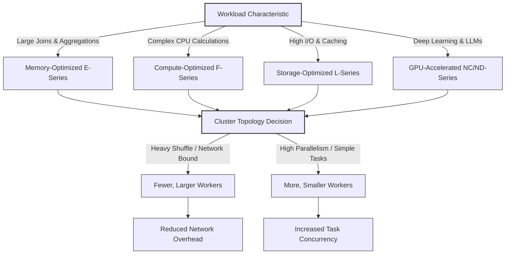

# Configure compute performance

Configuring compute resources involves balancing performance requirements with cost considerations. Over-provisioning leads to unnecessary expenses, while under-provisioning can cause stability issues and slow query execution. Understanding how to configure compute settings helps you optimize resources for your workload.

## Compute Resource Components

Compute performance in Azure Databricks is driven by the interplay of three fundamental resources: cores, memory, and local storage. Understanding how these components influence Spark’s execution engine allows you to right-size your clusters for both efficiency and cost.

### The Three Pillars of Performance

| Component | Function | Performance Impact |
| :--- | :--- | :--- |
| **Executor Cores** | Determine the maximum level of parallelism. | More cores allow Spark to process a higher number of tasks simultaneously. For example, 8 workers with 4 cores each provide 32 cores for concurrent execution. |
| **Executor Memory** | Stores data in RAM for active processing. | Critical for memory-intensive operations like joins, aggregations, and caching. Insufficient memory forces Spark to "spill" data to disk, causing significant latency. |
| **Local Storage** | Provides temporary space for shuffle and cache. | During shuffle operations, intermediate data is written to local disks on worker nodes. Faster local storage (e.g., NVMe) reduces the time spent on these I/O-heavy tasks. |

### Strategic Configuration

*   **Parallelism vs. Cost:** Increasing the number of cores boosts throughput but also increases DBU costs. Balance the need for speed against your budget by selecting node types that offer the right core-to-memory ratio for your specific workload.
*   **Memory Management:** For workloads involving large-scale transformations or complex joins, prioritize memory-optimized instances. Keeping data in memory is exponentially faster than retrieving it from disk.
*   **Storage Speed:** When dealing with massive datasets that require frequent shuffling, choose instance types with high-performance local storage to minimize I/O bottlenecks.

> [!NOTE]
> Right-sizing your compute resources is not a one-time task. As data volumes grow and query complexity increases, regularly reviewing these three components ensures your clusters remain optimized for both performance and cost.

## Configure Node Types and Cluster Size

Selecting the right node type and cluster topology is a critical architectural decision. It determines not only how fast your workload completes but also how efficiently you utilize your budget. The configuration must align with the specific resource demands of your data processing tasks—whether they are memory-intensive, compute-heavy, I/O-bound, or GPU-accelerated.

### Instance Families by Workload Profile

Azure Databricks offers specialized instance families designed to match distinct computational patterns.

| Instance Family | Primary Resource | Ideal Workload | Example Series |
| :--- | :--- | :--- | :--- |
| **Memory-Optimized** | High RAM per Core | Large joins, aggregations, and in-memory analytics where data spilling to disk must be avoided. | E-series |
| **Compute-Optimized** | High CPU Performance | Complex calculations, straightforward ETL transformations, and tasks that are CPU-bound rather than memory-bound. | F-series |
| **Storage-Optimized** | Fast Local NVMe | Workloads requiring high I/O throughput, repeated data reads, or extensive caching of intermediate shuffle data. | L-series |
| **GPU-Accelerated** | Graphics Processing Units | Deep learning, model training, fine-tuning LLMs, and image processing. Can accelerate training by 10–100x compared to CPUs. | NC-series, ND-series |

> [!IMPORTANT]
> **GPU Requirements**
> GPU instances require the **Databricks Runtime ML**. They are specifically engineered for computationally intensive AI/ML tasks and are not typically used for standard SQL or ETL workloads.

### Cluster Topology: Fewer Large Workers vs. More Small Workers

The total compute capacity of a cluster can be achieved through different combinations of worker count and instance size. For example, 32 cores and 256 GB of RAM can be provided by either two large workers or eight small workers. However, the performance implications differ significantly based on the workload's communication patterns.

#### Fewer, Larger Workers
*   **Advantage:** Reduces network overhead during shuffle operations. Since data exchange happens between fewer nodes, there is less serialization and network traffic.
*   **Best For:** Analytical workloads with complex joins, wide transformations, and heavy shuffle requirements.

#### More, Smaller Workers
*   **Advantage:** Provides higher levels of parallelism and fault tolerance granularity. If one small worker fails, the impact on the overall job is smaller than if a large worker fails.
*   **Best For:** Highly distributed batch processing, simple map-side operations, and workloads that benefit from massive task concurrency.

### Strategic Configuration Guidelines

1.  **Match Memory to Data Volume:** If your dataset exceeds the available RAM, Spark will spill to disk, causing performance to degrade exponentially. Always choose memory-optimized instances for large-scale analytics.
2.  **Leverage Local Storage for Shuffle:** For workloads with significant shuffle phases, storage-optimized instances with NVMe drives can drastically reduce the time spent writing and reading intermediate data.
3.  **Balance Cost and Latency:** While more workers provide better parallelism, they also increase coordination overhead. For most production ETL jobs, a moderate number of mid-sized workers offers the best balance of cost and performance.

## Flexible Node Types for Compute Resilience

Cloud infrastructure is inherently dynamic, and capacity constraints can disrupt even well-planned data workflows. When Azure Databricks attempts to provision a specific instance type that is currently unavailable, the result is a `CLOUD_PROVIDER_RESOURCE_STOCKOUT` error. This failure occurs without warning and can delay critical production jobs or block interactive development sessions. **Flexible node types** solve this problem by introducing an automatic fallback mechanism that maintains workload continuity without requiring manual intervention.

### How Flexible Node Types Work

When enabled, Azure Databricks automatically selects a compatible alternative instance type if the primary choice is unavailable. Compatibility is strictly enforced to ensure that workloads perform consistently regardless of which instance type is ultimately provisioned.

| Compatibility Criterion | Requirement | Rationale |
| :--- | :--- | :--- |
| **vCPU Count** | Identical to primary type | Ensures parallelism and task scheduling remain unchanged. |
| **Memory** | Within 100–110% of primary | Prevents out-of-memory errors or significant performance degradation. |
| **Local Disk Configuration** | Matching storage type and size | Guarantees shuffle and cache performance remains consistent. |
| **CPU Architecture** | Same architecture (e.g., x86_64) | Prevents binary incompatibility with compiled libraries. |
| **OS Image Support** | Compatible runtime support | Ensures the Databricks Runtime functions correctly. |

### Enabling and Managing the Feature

-   **Workspace-Level Activation:** Administrators enable flexible node types by toggling **Enable auto flexible node types** in the Workspace Compute admin settings. Once active, all new classic compute resources automatically leverage fallback instance types.
-   **Per-Cluster Override:** For workloads with strict hardware requirements (e.g., licensed software tied to specific instance families), you can disable the feature for individual clusters by setting `alternate_node_type_ids` to an empty list via the Clusters API.
-   **Custom Fallback Lists:** If you prefer deterministic control over which alternatives are used, you can specify a custom ordered list of instance types through the API instead of relying on automatic selection.

### Cost Optimization with Spot Instances

Flexible node types provide exceptional value when combined with **Azure Spot VMs**. Spot capacity is ephemeral and varies by instance type; a specific Spot SKU may be unavailable even when overall Spot capacity exists.

-   **Increased Spot Utilization:** By attempting acquisition across multiple compatible Spot types before falling back to on-demand instances, flexible node types significantly increase the percentage of workloads running on discounted Spot capacity.
-   **Reduced Total Cost:** Higher Spot utilization directly translates to lower compute spend, often saving 60–90% compared to on-demand pricing, while maintaining resilience against individual SKU stockouts.

> [!IMPORTANT]
> **Production Reliability**
> Flexible node types transform capacity constraints from a blocking failure into a transparent operational detail. For production pipelines where SLAs matter, enabling this feature is a best practice that improves both reliability and cost efficiency without compromising workload correctness.

## Configure Autoscaling

Autoscaling dynamically adjusts the number of worker nodes in a cluster based on real-time workload demands. This mechanism ensures that you maintain optimal performance during peak processing while minimizing costs during periods of low activity. By defining minimum and maximum worker counts, you establish boundaries within which Azure Databricks automatically manages resource allocation.

### Optimized Autoscaling Mechanics

By default, Azure Databricks employs **optimized autoscaling**, which is designed to balance responsiveness with cost efficiency through intelligent monitoring and multi-step scaling.

*   **Rapid Scale-Up:** When demand spikes, the system scales up quickly in two steps from the minimum to the maximum worker count, ensuring that resources are available before bottlenecks occur.
*   **Intelligent Scale-Down:** Unlike basic autoscaling, optimized autoscaling can scale down even when the cluster is not fully idle. It monitors the state of shuffle files to ensure that removing workers will not disrupt ongoing data exchanges.
*   **Evaluation Intervals:** The frequency of utilization checks depends on the compute type:
    *   **Job Compute:** Evaluated every 40 seconds for rapid response to batch processing needs.
    *   **All-Purpose Compute:** Evaluated every 150 seconds to balance stability with interactive development requirements.

### Strategic Application

| Workload Pattern | Recommendation | Rationale |
| :--- | :--- | :--- |
| **Variable Demand** | Enable Autoscaling | Ideal for data exploration sessions that start with small samples and expand to full datasets, or ETL jobs with distinct heavy-light phases. |
| **Predictable/Steady-State** | Use Fixed Worker Count | For workloads with consistent resource usage, a fixed configuration avoids the slight overhead of scaling decisions and provides more stable performance. |

### Integration with Instance Pools

Autoscaling achieves its highest efficiency when paired with **instance pools**. By setting your minimum worker count equal to or less than the minimum number of idle instances in your pool, you ensure that scale-up events are nearly instantaneous. Since the instances are already provisioned and "warm," the cluster can absorb increased load without the typical 3–7 minute startup delay associated with new virtual machine provisioning.

> [!NOTE]
> While autoscaling is a powerful tool for cost management, it requires careful tuning of min/max thresholds. Setting the minimum too high negates cost savings, while setting the maximum too low may restrict performance during peak loads. Monitor your workload patterns over time to refine these boundaries for optimal results.

## Configure Termination Settings

Automatic termination is a critical cost-control mechanism that prevents idle compute resources from accruing unnecessary charges. By defining specific inactivity thresholds, you ensure that clusters are only running when actively processing workloads, while their configurations remain preserved for rapid restart when needed.

### Inactivity-Based Termination

For interactive all-purpose clusters, termination is triggered by a period of inactivity—defined as the time elapsed since the last command execution.

*   **Configuration:** You specify an inactivity period in minutes. If no commands are run within this window, Azure Databricks terminates the cluster.
*   **Best Practice for Interactive Workloads:** A **45-minute timeout** is generally optimal for data engineering and analysis sessions. This duration provides sufficient time for users to review results or consult documentation between queries without leaving expensive resources idle for hours.
*   **Job Compute Behavior:** For automated jobs, termination is intrinsic to the lifecycle. The cluster starts for the scheduled run and terminates automatically upon completion, requiring no manual inactivity configuration.

### Spot Instance Management and Driver Stability

While Spot instances offer significant cost savings (often up to 90%), they introduce availability risks that must be managed through strategic configuration.

| Component | Recommended Instance Type | Rationale |
| :--- | :--- | :--- |
| **Worker Nodes** | Spot Instances | Spark’s distributed architecture handles worker failures gracefully by retrying tasks on remaining nodes. |
| **Driver Node** | On-Demand Instances | The driver coordinates the entire job. If it is reclaimed by Azure, the cluster fails immediately, causing total job loss. |

### Decommissioning for Data Resilience

To mitigate the impact of Spot instance preemption, enable **decommissioning**. When Azure sends a 30-second preemption notice:

1.  **Data Migration:** The decommissioning process proactively migrates shuffle data and cached blocks from the terminating node to healthy workers.
2.  **Task Completion:** It allows currently running tasks to finish before the node is removed.
3.  **Reduced Recomputation:** By preserving intermediate data, decommissioning significantly reduces the need for Spark to recompute lost stages, improving overall job efficiency and reliability.

> [!IMPORTANT]
> **Balance Cost and Reliability**
> While Spot instances with decommissioning provide a robust cost-saving strategy, always prioritize driver stability with on-demand instances. For mission-critical production pipelines where even minor delays are unacceptable, consider using flexible node types or instance pools to further insulate your workloads from capacity fluctuations.

## Use Instance Pools

Instance pools optimize cluster provisioning by maintaining a reserve of idle, pre-configured virtual machines. By allocating resources from this warm pool rather than requesting new instances from Azure, you reduce cluster startup times from several minutes to mere seconds. This capability is particularly valuable for interactive development and high-frequency job execution where latency directly impacts productivity.

### Core Configuration Parameters

Effective pool management requires balancing availability with cost control through three key settings:

| Parameter | Function | Strategic Recommendation |
| :--- | :--- | :--- |
| **Minimum Idle Instances** | The number of instances kept "warm" and ready for immediate use. | Match this to your typical concurrent workload. If three notebooks run simultaneously, maintain at least three idle instances. |
| **Maximum Capacity** | The upper limit on total instances (idle + in-use) the pool can provision. | Essential for multi-team workspaces to prevent resource monopolization. For a 100-instance quota, consider splitting into two pools of 50 to ensure fair distribution. |
| **Idle Instance Auto Termination** | Removes instances that exceed the minimum idle count after a specified period of inactivity. | Prevents cost waste from over-provisioning. For example, if the pool scales to 8 instances but only 3 are required, the excess 5 will terminate after the configured timeout. |

### Accelerating Launches with Preloaded Runtimes

To further minimize startup latency, enable **runtime preloading**. When you specify a Databricks Runtime version during pool creation, that runtime is installed on all idle instances. When a cluster is launched from the pool using that specific runtime, it bypasses the installation phase entirely, resulting in near-instantaneous availability.

### Ideal Use Cases

*   **Interactive Development:** Teams that frequently create and destroy clusters throughout the day benefit most from the reduced wait times.
*   **High-Frequency Jobs:** Short, recurring batch processes that would otherwise spend a significant portion of their execution time just waiting for infrastructure to provision.
*   **Not Recommended For:** Long-running, dedicated production clusters. Since these clusters remain active for extended periods, they do not benefit from the rapid startup advantages of a pool and may incur unnecessary costs if left idle within the pool's minimum threshold.

> [!NOTE]
> Instance pools are a classic compute feature. As serverless compute continues to evolve, offering even faster startup times without the need for managing idle capacity, the role of instance pools is shifting toward specialized legacy workloads or scenarios requiring strict control over underlying infrastructure.

## Balance Cost and Performance

Achieving an optimal balance between cost and performance is not a static configuration but a continuous process of observation and adjustment. It requires aligning infrastructure resources with the specific behavioral patterns of your workloads.

### The Iterative Optimization Cycle

1.  **Start Conservative:** Begin with modest cluster sizes or serverless defaults to establish a baseline.
2.  **Monitor and Identify:** Use observability tools to pinpoint inefficiencies.
3.  **Adjust Strategically:** Scale up resources only where bottlenecks exist, or scale down where capacity is wasted.

### Diagnosing Performance with Spark UI

The **Spark UI** is the primary tool for identifying resource mismatches. Key metrics to monitor include:

*   **Shuffle Spill (Memory vs. Disk):** High disk spill indicates that executor memory is insufficient for the workload’s join or aggregation operations. Increasing memory-optimized nodes is the direct remedy.
*   **Stage Duration:** Long-running stages often point to data skew or insufficient parallelism. Comparing stage durations helps isolate whether the bottleneck is compute-bound or I/O-bound.
*   **Jobs Timeline:** Visualizes the execution flow, making it easier to spot idle periods or unexpected delays in task scheduling.

### Leveraging Serverless for Automatic Balance

For workloads that do not require custom infrastructure control, **serverless compute** offers the most efficient path to balanced performance. By eliminating manual configuration decisions and handling scaling automatically, it ensures you pay only for active processing while maintaining high responsiveness. This removes the guesswork from right-sizing clusters.

### Data-Driven Configuration

Regular monitoring transforms assumptions into facts. Review cluster metrics to compare **actual utilization** against **provisioned capacity**.

*   If CPU or memory utilization consistently remains low, reduce the worker count or switch to smaller node types.
*   If utilization hits 100% frequently, consider enabling autoscaling or moving to more powerful instance families.

> [!NOTE]
> Optimization is an ongoing discipline. As data volumes grow and query complexity evolves, regular reviews of these metrics ensure your compute configuration remains aligned with both performance goals and budget constraints. Detailed strategies for monitoring and observability are explored in a later module.

## Navigation

- Previous: [02. Choose appropriate compute type](02.%20Choose%20appropriate%20compute%20type.md)
- Next: [04. Configure compute feature settings](04.%20Configure%20compute%20feature%20settings.md)

## Source

Microsoft Learn: [Configure compute performance](https://learn.microsoft.com/en-us/training/modules/select-and-configure-compute/3-configure-compute-performance)
