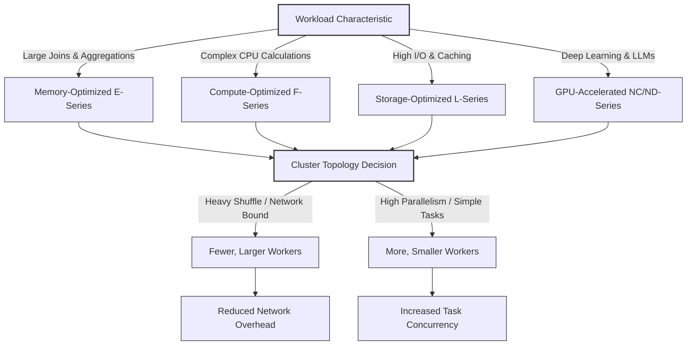

## Configure Node Types and Cluster Size

Selecting the right node type and cluster topology is a critical architectural decision. It determines not only how fast your workload completes but also how efficiently you utilize your budget. The configuration must align with the specific resource demands of your data processing tasks—whether they are memory-intensive, compute-heavy, I/O-bound, or GPU-accelerated.

### Instance Families by Workload Profile

Azure Databricks offers specialized instance families designed to match distinct computational patterns.

| Instance Family | Primary Resource | Ideal Workload | Example Series |
| :--- | :--- | :--- | :--- |
| **Memory-Optimized** | High RAM per Core | Large joins, aggregations, and in-memory analytics where data spilling to disk must be avoided. | E-series |
| **Compute-Optimized** | High CPU Performance | Complex calculations, straightforward ETL transformations, and tasks that are CPU-bound rather than memory-bound. | F-series |
| **Storage-Optimized** | Fast Local NVMe | Workloads requiring high I/O throughput, repeated data reads, or extensive caching of intermediate shuffle data. | L-series |
| **GPU-Accelerated** | Graphics Processing Units | Deep learning, model training, fine-tuning LLMs, and image processing. Can accelerate training by 10–100x compared to CPUs. | NC-series, ND-series |

> [!IMPORTANT]
> **GPU Requirements**
> GPU instances require the **Databricks Runtime ML**. They are specifically engineered for computationally intensive AI/ML tasks and are not typically used for standard SQL or ETL workloads.

### Cluster Topology: Fewer Large Workers vs. More Small Workers

The total compute capacity of a cluster can be achieved through different combinations of worker count and instance size. For example, 32 cores and 256 GB of RAM can be provided by either two large workers or eight small workers. However, the performance implications differ significantly based on the workload's communication patterns.

#### Fewer, Larger Workers
*   **Advantage:** Reduces network overhead during shuffle operations. Since data exchange happens between fewer nodes, there is less serialization and network traffic.
*   **Best For:** Analytical workloads with complex joins, wide transformations, and heavy shuffle requirements.

#### More, Smaller Workers
*   **Advantage:** Provides higher levels of parallelism and fault tolerance granularity. If one small worker fails, the impact on the overall job is smaller than if a large worker fails.
*   **Best For:** Highly distributed batch processing, simple map-side operations, and workloads that benefit from massive task concurrency.

### Strategic Configuration Guidelines

1.  **Match Memory to Data Volume:** If your dataset exceeds the available RAM, Spark will spill to disk, causing performance to degrade exponentially. Always choose memory-optimized instances for large-scale analytics.
2.  **Leverage Local Storage for Shuffle:** For workloads with significant shuffle phases, storage-optimized instances with NVMe drives can drastically reduce the time spent writing and reading intermediate data.
3.  **Balance Cost and Latency:** While more workers provide better parallelism, they also increase coordination overhead. For most production ETL jobs, a moderate number of mid-sized workers offers the best balance of cost and performance.

