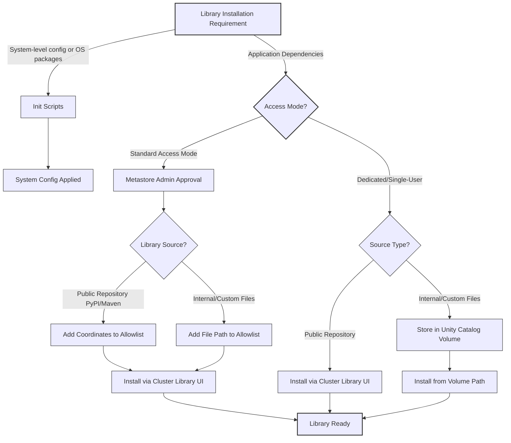

# Install libraries for compute

When you run notebooks and jobs on Azure Databricks compute, you often need third-party packages or custom code that isn't included in the default runtime. Installing libraries at the cluster level ensures that every notebook and job using that compute has access to the same dependencies, creating a consistent execution environment.
Understanding how to install libraries effectively becomes critical as your data engineering workflows grow in complexity. You need to know which installation method to use, where to store library files, and how access modes affect your options.

## Understand Compute-Scoped Libraries

Compute-scoped libraries are installed directly onto a cluster, creating a shared execution environment for all notebooks and jobs that utilize that resource. Unlike notebook-scoped libraries, which are ephemeral and tied to a specific session, compute-scoped libraries persist across cluster restarts. Azure Databricks automatically reinstalls these dependencies every time the cluster initializes, ensuring a consistent and reproducible environment without manual intervention.

### Installation Sources and Types

You can install a variety of library formats from multiple sources, depending on your organizational security and storage preferences:

*   **Supported Formats:** Python wheels (`.whl`), Java JAR files (`.jar`), and R packages.
*   **Repositories:** Public or private repositories such as PyPI and Maven.
*   **Storage Locations:** Workspace files, Unity Catalog volumes, or cloud object storage (e.g., Azure Blob Storage or ADLS Gen2).

> [!IMPORTANT]
> **Permission Requirements**
> To install or manage libraries at the cluster level, you must possess the **CAN MANAGE** permission on that specific cluster. This privilege is required to modify the cluster configuration. Without it, the library installation interface will remain inaccessible, preventing you from adding or removing dependencies.

### Strategic Considerations and Limitations

While compute-scoped libraries offer convenience and consistency, they introduce a "shared state" constraint that must be managed carefully.

> [!WARNING]
> **Version Conflicts**
> Because these libraries are available to every notebook on the cluster, you cannot have conflicting versions of the same package running simultaneously. If Team A requires `pandas 1.5` and Team B requires `pandas 2.0`, they cannot share the same cluster. In such scenarios, you must either provision separate clusters for each team or switch to notebook-scoped installations to isolate dependencies.

### Best Practices for Management

*   **Standardize Environments:** Use compute-scoped libraries for foundational packages that are universally required across your organization, such as common data connectors or internal utility libraries.
*   **Leverage Unity Catalog:** Storing custom wheels or JARs in Unity Catalog volumes provides better governance and access control compared to workspace files.
*   **Monitor Cluster Startup Time:** Installing a large number of heavy libraries can increase cluster startup latency. Balance the convenience of pre-installed packages with the need for rapid provisioning.

> [!NOTE]
> For dynamic or experimental workflows where dependency requirements change frequently, consider using notebook-scoped libraries (`%pip install`) to avoid cluttering the cluster environment and to prevent version conflicts between concurrent users.

## Install Libraries from Package Repositories

Package repositories are the primary source for external dependencies, offering automated dependency resolution and version management. Azure Databricks supports PyPI for Python, Maven for Java/Scala, and CRAN for R, each with distinct configuration requirements and security considerations.

### Python (PyPI)

When installing from PyPI, you specify the package name. For production stability, always pin the exact version to prevent unexpected breaks caused by upstream updates.

> [!IMPORTANT]
> **Pin Your Versions**
> Without a specific version number, Azure Databricks installs the latest available release. To ensure reproducibility, use the `==` operator. For example:
> `pymssql==2.3.9`

### Java and Scala (Maven)

Maven libraries require coordinates in the standard `groupId:artifactId:version` format. You can search for packages directly within the installation dialog if the exact coordinates are unknown.

*   **Example:** To install the Microsoft JDBC Driver for SQL Server, use:
    `com.microsoft.sqlserver:mssql-jdbc:13.2.1.jre11`
*   **Dependency Management:** Maven allows you to exclude specific transitive dependencies that might conflict with other libraries in your environment.

### R (CRAN)

For R packages, you simply provide the package name. However, CRAN installations behave differently than PyPI or Maven.

> [!NOTE]
> **Version Pinning Limitation**
> CRAN installations always pull the latest version from the configured mirror. If you need to pin a specific R package version for reproducibility, you must store the package file (`.tar.gz`) in workspace files or Unity Catalog volumes and install it from there instead of using the CRAN repository.

### Security and Allowlists

In clusters configured with **Standard Access Mode**, security policies restrict which libraries can be installed on shared resources.

> [!WARNING]
> **Allowlist Approval**
> Maven coordinates and JAR file paths often require approval via an **allowlist** before they can be installed. This administrative control ensures that only reviewed and trusted libraries are executed on shared compute, preventing potential security risks or environment instability.

Note
To learn more about configuring and managing allowlists for libraries, see the [documentation](https://learn.microsoft.com/en-us/azure/databricks/data-governance/unity-catalog/manage-privileges/allowlist).

```
allowlists
```
## Install Libraries from Files

Storing library files in Workspace Files or Unity Catalog volumes provides precise control over dependency versions and sources. This approach is essential for internal packages, libraries unavailable in public repositories, or specific legacy versions that have been removed from PyPI or Maven. By centralizing these assets, you avoid the security risks associated with ad-hoc installations via direct `pip` commands or unmanaged scripts within notebooks.

### Workspace Files

Workspace Files offer a convenient, user-centric location for storing library assets, though they are subject to a **500 MB file size limit**.

*   **Installation Path:** After uploading a wheel, JAR, or `requirements.txt` file via the Workspace Import dialog, reference it using its absolute path.
    *   Example: `/Workspace/Users/you@example.com/libraries/mypackage-1.0.0-py3-none-any.whl`

> [!NOTE]
> While easy to use, Workspace Files lack the granular governance features of Unity Catalog. They are best suited for individual development or small-team collaboration where strict audit trails are not a primary requirement.

### Unity Catalog Volumes

Unity Catalog volumes provide enhanced security, governance, and scalability for library storage. Access is controlled through Unity Catalog’s permission model, ensuring that only authorized users can read or modify library files, and all interactions are captured in audit logs.

*   **Installation Path:** Upload files to a volume via Catalog Explorer and reference them using the volume path.
    *   Example: `/Volumes/main/engineering/libraries/mypackage-1.0.0-py3-none-any.whl`
*   **Permission Requirement:** The identity performing the installation must have **READ VOLUME** permission on the specified volume.

> [!IMPORTANT]
> **Governance Advantage**
> Using Unity Catalog volumes ensures that your library supply chain is governed by the same security policies as your data. This prevents "shadow IT" dependencies and provides a clear lineage of which code is running on your compute resources.

### Managing Dependencies with `requirements.txt`

For Databricks Runtime 15.0 and above, you can install multiple Python dependencies simultaneously by uploading a `requirements.txt` file to either Workspace Files or Unity Catalog volumes. Azure Databricks automatically parses the file and installs all listed packages, simplifying environment consistency across clusters.

### Security and Allowlists

In clusters configured with **Standard Access Mode**, security policies restrict the execution of arbitrary code.

> [!WARNING]
> **Allowlist Approval Required**
> Before installing libraries from files (whether in Workspace Files or Unity Catalog volumes), you must add the specific file paths to the cluster’s **allowlist**. This administrative step ensures that only reviewed and trusted libraries are permitted on shared compute resources, maintaining the integrity of the shared environment.

## Use Init Scripts for Advanced Configuration

Init scripts execute shell commands during cluster startup, running before the Spark driver and executors initialize. While Databricks recommends cluster-scoped libraries for dependency management, init scripts remain essential for system-level configurations that standard library installation cannot address.

### Appropriate Use Cases

Init scripts are designed for infrastructure and OS-level tasks rather than application dependencies.

> [!NOTE]
> **When to Use Init Scripts**
> Reserve init scripts for scenarios such as:
> -   Installing system packages via `apt-get` or `yum`.
> -   Configuring OS-level environment variables required by native drivers.
> -   Setting up third-party monitoring or security agents.
> -   Installing specialized database drivers that depend on underlying system libraries.

For standard Python, Java, or R libraries, always prefer cluster-scoped libraries to ensure proper version resolution and avoid startup failures.

### Storage and Security with Unity Catalog

For clusters running Databricks Runtime 13.3 LTS and above, store init scripts in **Unity Catalog volumes**. This approach provides centralized governance, auditability, and fine-grained access control.

-   **Path Format:** Reference scripts using their absolute volume path, for example: `/Volumes/main/engineering/scripts/setup.sh`
-   **Permissions:** The cluster’s identity must have read access to the volume containing the script.

> [!WARNING]
> **Allowlist Requirement for Standard Access Mode**
> In clusters configured with Standard Access Mode, you must add the init script path to the cluster’s **allowlist** before configuration. This security measure ensures administrators explicitly approve every script that executes on shared compute resources.

### Execution Behavior and Troubleshooting

Init scripts run sequentially in the order specified during cluster configuration. This execution model includes built-in failure protection.

-   **Fail-Fast Mechanism:** If any init script returns a non-zero exit code, the cluster fails to start immediately. This prevents workloads from running with incomplete or misconfigured environments.
-   **Debugging:** Configure cluster log delivery to capture init script output. Examine these logs to identify syntax errors, missing dependencies, or permission issues that cause startup failures.

### Best Practices and Alternatives

> [!IMPORTANT]
> **Treat Init Scripts as a Last Resort**
> Before creating an init script, evaluate whether cluster policies or cluster-scoped libraries can achieve the same result. Cluster policies can set environment variables and Spark configurations declaratively, offering a simpler and more maintainable alternative to imperative shell scripting. Use init scripts only when no other mechanism can fulfill the configuration requirement.

## Configure Libraries for Standard Access Mode

Clusters operating in **Standard Access Mode** provide the highest level of security and isolation within Azure Databricks. By design, this mode prevents unauthorized code execution on shared compute resources by requiring explicit administrative approval for all external libraries and initialization scripts. This governance model ensures that only vetted, trusted dependencies are introduced into the shared environment.

### The Allowlist Mechanism

The core of this security model is the **allowlist**, managed by metastore admins via Catalog Explorer under Metastore Settings. Approval is required for both Maven coordinates and file-based libraries.

#### Maven Libraries
Maven libraries are allowlisted using their coordinates. Admins can define permissions at varying levels of granularity:

*   **Specific Version:** `groupId:artifactId:version` (Most secure)
*   **All Versions:** `groupId:artifactId` (Flexible for frequent updates)
*   **Entire Group:** `groupId` (Broadest access, use with caution)

#### File-Based Libraries and Init Scripts
For JARs, wheels, or init scripts stored in Unity Catalog volumes or object storage, the allowlist uses **prefix matching**.

> [!IMPORTANT]
> **Prefix Matching and Trailing Slashes**
> When allowlisting a directory, always include a trailing slash to prevent unintended matches. For example, adding `/Volumes/prod-libraries/` permits all files and subdirectories within that location. Without the trailing slash, a path like `/Volumes/prod-libraries-backup` might inadvertently be granted access.

### Permission Validation

Being on the allowlist grants permission to *use* a path for installation, but it does not bypass data access controls.

*   **Data Permissions:** The identity installing the library must still possess the appropriate data access rights, such as **READ VOLUME** permission for files stored in Unity Catalog volumes.
*   **Identity Validation:** In Standard Access Mode, the cluster owner’s identity is used to validate these data permissions during the installation process.

### Centralized Governance

By centralizing allowlist management in Catalog Explorer, security teams can maintain a comprehensive audit trail of all approved dependencies. This approach balances strict security requirements with operational productivity, ensuring that developers have access to necessary tools while protecting the integrity of the shared compute environment.

> [!NOTE]
> Init scripts require separate allowlist entries from JAR files, even if they reside in the same directory. This distinction ensures that administrative oversight applies equally to system-level configuration scripts and application-level dependencies.

## Choose the right installation method
Different library installation methods suit different scenarios. The following diagram illustrates a decision flow to help you select the appropriate installation approach:



## Navigation

- Previous: [04. Configure compute feature settings](04.%20Configure%20compute%20feature%20settings.md)
- Next: [06. Configure compute access permissions](06.%20Configure%20compute%20access%20permissions.md)

## Source

Microsoft Learn: [Install libraries for compute](https://learn.microsoft.com/en-us/training/modules/select-and-configure-compute/5-install-libraries-for-compute)
