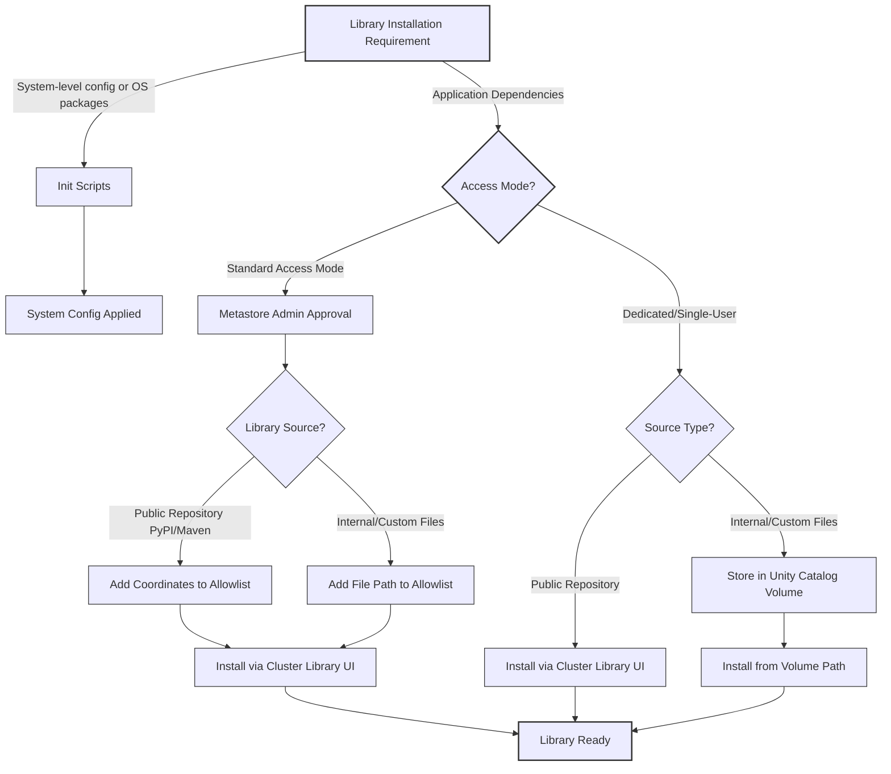

## Choose the right installation method
Different library installation methods suit different scenarios. The following diagram illustrates a decision flow to help you select the appropriate installation approach:

