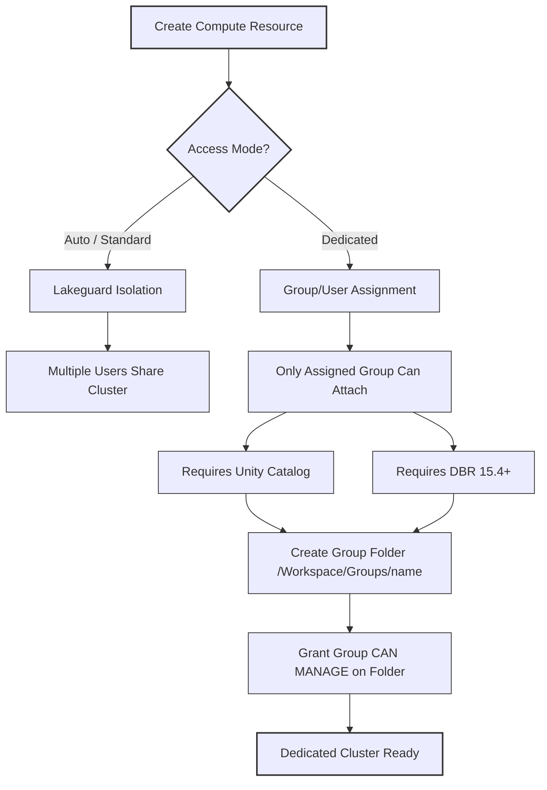

# Configure compute access permissions

Managing access to compute resources protects sensitive data while enabling collaboration across your data engineering teams. You control who can attach notebooks, restart clusters, or modify compute configurations through permission levels assigned in the Azure Databricks workspace.
Proper access configuration prevents unauthorized users from viewing driver logs containing secrets, controls who can consume compute resources, and ensures teams work efficiently without conflicting infrastructure changes. With Unity Catalog enabled, you can assign compute resources to entire groups with automatic permission scoping.

## Understand Compute Permission Levels

Azure Databricks employs a hierarchical permission model for compute resources, ensuring that access is granted on a least-privilege basis. These permissions operate at the workspace level and are distinct from Azure subscription-level controls. The four levels—No Permissions, Can Attach To, Can Restart, and Can Manage—provide progressively greater control over the lifecycle and configuration of clusters and SQL warehouses.

### Compute Permission Hierarchy

| Permission Level | Capabilities | Ideal User Role |
| :--- | :--- | :--- |
| **No Permissions** | Default state. Users cannot see, attach to, or view metrics for the resource. Ensures privacy until access is explicitly granted. | N/A (Default) |
| **Can Attach To** | Attach notebooks, view Spark UI, and monitor metrics. Cannot start, stop, or restart the resource. | Data Analysts, Junior Engineers |
| **Can Restart** | All "Attach" capabilities plus lifecycle management (start, stop, restart). Cannot edit configuration or libraries. | Team Leads, Senior Engineers |
| **Can Manage** | Full administrative control. Edit configuration, manage libraries, resize clusters, and modify permissions for other users. | Workspace Admins, Resource Owners |

> [!WARNING]
> **Security Risk in Legacy Modes**
> In the legacy **No isolation shared access mode**, users with "Can Attach To" permissions can potentially view service account keys exposed in `log4j` files. Due to this significant security vulnerability, this access mode should be avoided in favor of **Standard** or **Dedicated** access modes, which provide robust isolation between users.

### Driver Log Access and Security

By default, viewing driver logs on job clusters, dedicated access mode clusters, and standard access mode clusters is restricted to users with **Can Manage** permission. This restriction is a critical security measure because driver logs often contain sensitive information, such as secrets or credentials, printed to `stdout` and `stderr` streams.

> [!IMPORTANT]
> **Modifying Log Access**
> While it is possible to relax this restriction using the Spark configuration property `spark.databricks.acl.needAdminPermissionToViewLogs`, doing so introduces significant security risks. Only adjust this setting if absolutely necessary and ensure that your workloads do not print sensitive data to the console.

### Ownership and Defaults

*   **Resource Owners:** The user who creates a compute resource automatically receives **Can Manage** permission.
*   **Workspace Admins:** Administrators are granted **Can Manage** permission on all compute resources within the workspace by default, ensuring they can maintain operational continuity and enforce governance policies.

## Configure Permissions in the Workspace

Compute permissions in Azure Databricks are managed at the workspace level, operating independently from Azure subscription-level controls. This layer of governance ensures that users with workspace access can only interact with compute resources according to their assigned privileges, adhering to the principle of least privilege.

### Permission Levels and Capabilities

The following table outlines the four distinct permission levels and their associated capabilities:

| Permission Level | Capabilities | Ideal User Role |
| :--- | :--- | :--- |
| **No Permissions** | Default state. Users cannot see, attach to, or view metrics for the resource. | N/A (Default) |
| **Can Attach To** | Attach notebooks, view Spark UI, and monitor metrics. Cannot manage lifecycle. | Data Analysts, Junior Engineers |
| **Can Restart** | All "Attach" capabilities plus start, stop, and restart the resource. | Team Leads, Senior Engineers |
| **Can Manage** | Full control: edit config, manage libraries, resize, and modify permissions. | Workspace Admins, Resource Owners |

> [!WARNING]
> **Legacy Mode Risk**
> Avoid **No isolation shared access mode**. In this legacy configuration, users with "Can Attach To" permissions can potentially view service account keys in `log4j` files. Migrate existing clusters to **Standard** or **Dedicated** access modes to ensure robust security isolation.

### Managing Access via Groups

Granting permissions to groups rather than individual users simplifies administration and scales with organizational growth.

*   **Onboarding:** Adding a user to a group automatically grants them the correct compute access.
*   **Offboarding:** Removing a user from a group immediately revokes their permissions without manual cleanup.
*   **Structure:** Create groups that mirror your teams (e.g., `data-engineering`, `analytics-team`) and assign permissions to these groups.

### Workspace Entitlements: Unrestricted Cluster Creation

Beyond specific resource permissions, workspace entitlements govern global capabilities. The **Allow cluster creation** entitlement allows non-admin users to provision clusters of any size or VM configuration.

> [!IMPORTANT]
> **Least Privilege for Creation**
> By default, only Workspace Admins can create unrestricted clusters. Granting this entitlement to data engineers allows them to build production pipelines without elevating them to full admin status. They still cannot manage workspace settings or view other users' private notebooks.

To grant this entitlement:
1.  Navigate to **Settings > Identity and access > Users or Groups**.
2.  Select the target user or group.
3.  Enable the **Allow cluster creation** entitlement.

### Access Modes: Standard vs. Dedicated

When creating compute, the **Access mode** determines how users interact with the resource. The default is **Auto**, which selects Standard unless ML runtimes are used.

| Feature | Standard Access Mode | Dedicated Access Mode |
| :--- | :--- | :--- |
| **Isolation** | Multi-user sharing with Lakeguard isolation. | Assigned to a single user or group. |
| **Supported Runtimes** | Most standard DBR versions. | Required for ML, RDD APIs, and R. |
| **Permission Scoping** | Individual permissions apply. | Permissions scope down to the group's level. |
| **Best For** | General SQL/Python analytics. | Specialized ML workloads and group collaboration. |

### Configuring Dedicated Group Clusters

To set up a cluster dedicated to a specific group, you must use **Unity Catalog** and **Databricks Runtime 15.4+**.

1.  **Folder Setup:** Create a folder at `/Workspace/Groups/<groupName>` and grant the group **CAN MANAGE** permission.
2.  **Cluster Creation:** In the Advanced section, select **Dedicated** access mode.
3.  **Assignment:** Choose the group in the "Single user or group" field.

> [!NOTE]
> **Object Ownership**
> On group clusters, data objects (like schemas or tables) created by any member are owned by the **group**, not the individual. For example, `CREATE SCHEMA human_resources` results in the group owning the schema. This prevents permission errors when other group members access the same assets.

### Security Best Practices

*   **Driver Logs:** By default, only **Can Manage** users can view driver logs to prevent secret exposure. If you must change this via `spark.databricks.acl.needAdminPermissionToViewLogs`, ensure secrets are managed via Databricks Secret Scopes.
*   **Audit Monitoring:** Regularly review the `system.access.audit` table to verify that permissions align with current organizational needs and that former employees no longer have access.
*   **Production Isolation:** Restrict **Can Manage** on production clusters to the responsible team only. Grant **Can Attach To** to others only if they have a legitimate business need to query production data.

## Navigation

- Previous: [05. Install libraries for compute](05.%20Install%20libraries%20for%20compute.md)
- Next: [07. Exercise](07.%20Exercise.md)

## Source

Microsoft Learn: [Configure compute access permissions](https://learn.microsoft.com/en-us/training/modules/select-and-configure-compute/6-configure-compute-access-perms)
