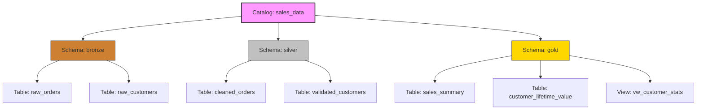

## Apply Naming Conventions

Consistent naming conventions are the backbone of effective data governance in Azure Databricks Unity Catalog. They transform a chaotic collection of datasets into a navigable, self-documenting platform. By applying standardized patterns, you enable teams to instantly understand data purpose, enforce access controls more effectively, and maintain compliance with organizational standards.

### Technical Constraints and Rules

Before designing your strategy, it is essential to understand the technical boundaries imposed by Unity Catalog. These rules ensure compatibility and consistency across the platform.

| Constraint | Rule | Example/Note |
| :--- | :--- | :--- |
| **Character Limit** | Maximum 255 characters. | Keep names concise to improve readability in queries. |
| **Case Sensitivity** | Stored in **lowercase**; case-insensitive matching. | `SalesData`, `salesdata`, and `SALESDATA` all resolve to `salesdata`. |
| **Prohibited Characters** | Periods (`.`), spaces, forward slashes (`/`), ASCII control characters. | Periods are reserved for namespace separation (catalog.schema.table). |
| **Special Characters** | Allowed if enclosed in backticks. | Use `` `sales-data` `` instead of `sales.data`. |
| **Column Names** | Casing is preserved, but queries remain case-insensitive. | You can use `` `Customer ID` `` for descriptive fields. |

> [!IMPORTANT]
> **The Lowercase Reality**
> Because Unity Catalog automatically converts all object names to lowercase, avoid using camelCase or PascalCase (e.g., `customerData`). This creates a disconnect between what you type and what the system stores, leading to confusion. Stick to **lowercase with underscores** (e.g., `customer_data`) for maximum clarity.

### The Medallion Architecture Pattern

One of the most effective ways to organize data is by aligning schema names with the **Medallion Architecture**. This makes the transformation pipeline immediately apparent to anyone browsing the catalog.



*   **Bronze:** Raw, ingested data (e.g., `sales_data.bronze.raw_orders`).
*   **Silver:** Cleaned, validated, and enriched data (e.g., `sales_data.silver.cleaned_orders`).
*   **Gold:** Aggregated, business-level metrics ready for reporting (e.g., `sales_data.gold.monthly_revenue`).

### Object Type Prefixes

To distinguish between base tables, views, and temporary objects at a glance, use consistent prefixes. This prevents accidental querying of staging data and clarifies the nature of the object.

| Object Type | Prefix | Example | Purpose |
| :--- | :--- | :--- | :--- |
| **Base Table** | None | `product_inventory` | The primary source of structured data. |
| **View / Materialized View** | `vw_` | `vw_customer_stats` | Indicates a virtual or pre-computed query result. |
| **Temporary / Staging** | `tmp_` | `tmp_import_staging` | Signals that the data is transient and should not be used for production reporting. |

### Catalog Strategy: Domain vs. Environment

Your top-level catalog naming strategy should reflect how your organization manages data ownership and lifecycle stages.

| Strategy | Description | Examples | Best For |
| :--- | :--- | :--- | :--- |
| **Domain-Based** | Organizes data by business function or subject area. | `sales_data`, `finance_data`, `marketing_data` | Organizations with clear data ownership models and cross-functional teams. |
| **Environment-Based** | Separates data by development lifecycle stage. | `dev`, `test`, `prod` | Teams requiring strict isolation between development work and production assets. |

> [!NOTE]
> **Avoid Versioning in Names**
> Resist the urge to include version numbers or dates in object names (e.g., `sales_report_v1_updated`). This information belongs in **table properties** or **metadata**, not the identifier itself. Keeping names stable ensures that downstream queries and dashboards don't break every time you refresh the data.


## Apply naming conventions for compute and development resources
Beyond data objects, consistent naming conventions for compute resources, development artifacts, and operational components help you navigate the Azure Databricks workspace efficiently and maintain clear ownership boundaries.

### Clusters
Name clusters according to their purpose and environment to make resource allocation transparent. Use patterns like {environment}_{domain}_cluster to produce names such as dev_sales_cluster, prod_etl_cluster, and ad_hoc_analysis_cluster. This convention immediately identifies whether a cluster is for development experimentation or production workloads, helping you manage costs and apply appropriate access controls.

```
{environment}_{domain}_cluster
```


```
dev_sales_cluster
```


```
prod_etl_cluster
```


```
ad_hoc_analysis_cluster
```

### Jobs and pipelines
Structure job names using the pattern job_{layer}_{purpose} to align with your data transformation pipeline. Examples include job_bronze_orders_ingestion, job_silver_orders_transformation, and job_gold_sales_aggregation. This naming pattern makes dependencies between jobs immediately visible and helps you trace data lineage across the medallion architecture.

```
job_{layer}_{purpose}
```


```
job_bronze_orders_ingestion
```


```
job_silver_orders_transformation
```


```
job_gold_sales_aggregation
```

For Lakeflow Spark Declarative Pipelines pipelines, use the prefix pipe_ followed by the data domain or purpose: pipe_orders_processing, pipe_customer_data_cleaning.

```
pipe_
```


```
pipe_orders_processing
```


```
pipe_customer_data_cleaning
```

Name streaming pipelines to include both source and target, following patterns like stream_{source}_to_{target}. Examples such as stream_kafka_to_bronze and stream_iot_sensor_data make data flow explicit without requiring pipeline documentation. This convention is especially valuable when managing multiple concurrent streaming workloads.

```
stream_{source}_to_{target}
```


```
stream_kafka_to_bronze
```


```
stream_iot_sensor_data
```

### Notebooks and repositories
Organize notebooks in folder hierarchies aligned with your project structure and data layers. A recommended pattern mirrors the medallion architecture:

```
/Repos/ sales_project/ bronze/ ingestion_orders/ silver/ transformation_orders/ gold/ sales_aggregation/
```


```
/Repos/ sales_project/ bronze/ ingestion_orders/ silver/ transformation_orders/ gold/ sales_aggregation/
```

Individual notebook names should reflect their purpose and layer using patterns like notebook_{layer}_{purpose}. Examples include notebook_bronze_orders_ingestion, notebook_silver_orders_transformation, and notebook_gold_sales_reporting. This creates consistency between notebook names and the job names that execute them.

```
notebook_{layer}_{purpose}
```


```
notebook_bronze_orders_ingestion
```


```
notebook_silver_orders_transformation
```


```
notebook_gold_sales_reporting
```

Repository names should identify the project or domain they contain. Use patterns like repo_{project_name} to produce names such as repo_sales_project and repo_customer_analytics. When you integrate with Git, this naming convention helps map Databricks repositories to their corresponding remote repositories.

```
repo_{project_name}
```


```
repo_sales_project
```


```
repo_customer_analytics
```

### Dashboards and monitoring
Name SQL dashboards to reflect their business purpose using patterns like dashboard_{domain}_{purpose}. Examples include dashboard_sales_performance and dashboard_customer_trends. This convention helps business users quickly locate relevant dashboards and distinguishes operational dashboards from exploratory analyses.

```
dashboard_{domain}_{purpose}
```


```
dashboard_sales_performance
```


```
dashboard_customer_trends
```

Individual SQL queries should be named descriptively using patterns like query_{purpose}. Names such as query_monthly_sales_report and query_customer_retention_analysis make query libraries searchable and help teams identify reusable queries for similar reporting needs.

```
query_{purpose}
```


```
query_monthly_sales_report
```


```
query_customer_retention_analysis
```

## Implement conventions across your organization
Successful implementation of naming conventions requires more than technical patterns—you need organizational alignment, documentation, and enforcement mechanisms that make conventions easy to follow and hard to bypass.
Start by documenting your conventions in a central location accessible to all data team members. Include specific examples, decision criteria, and rationale for each pattern. A documented standard like "Use {domain}_{layer} for schema names, where domain is the business area and layer is bronze/silver/gold" removes ambiguity. Provide examples of both correct and incorrect names to illustrate the pattern clearly.

```
{domain}_{layer}
```

Control access through Unity Catalog permissions to limit who can create objects in specific catalogs and schemas. While you can't enforce naming patterns through permissions alone, restricting CREATE TABLE and CREATE SCHEMA privileges to specific teams helps maintain organizational boundaries. For example, grant the marketing team permissions only to the marketing catalog, reducing the risk of objects being created in the wrong location.

```
CREATE TABLE
```


```
CREATE SCHEMA
```

Validate names during CI/CD pipelines when deploying data assets through automation. Include checks in your deployment scripts that reject names violating your standards before objects are created. This automated validation catches errors early and maintains consistency across all environments.
Review existing objects regularly to identify naming inconsistencies and plan remediation. Use Unity Catalog's information schema to query object names and flag those that don't match your patterns. For newly identified legacy objects, decide whether to rename them for consistency or document them as exceptions with justification.
Balance flexibility with standardization based on your organization's needs. Strict enforcement works well for highly regulated environments where consistency is critical for compliance. More flexible guidelines may be appropriate for smaller teams or during periods of rapid experimentation, as long as you eventually converge on standards for production data.

## Navigation

- Previous: [01. Introduction](01.%20Introduction.md)
- Next: [03. Create a catalog](03.%20Create%20a%20catalog.md)

## Source

Microsoft Learn: [Apply naming conventions](https://learn.microsoft.com/en-us/training/modules/create-and-organize-objects-in-unity-catalog/2-apply-naming-conventions)
