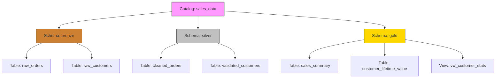
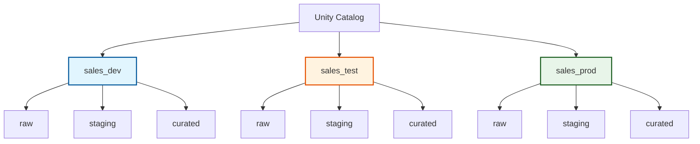

## Apply Naming Conventions

Consistent naming conventions are the backbone of effective data governance in Azure Databricks Unity Catalog. They transform a chaotic collection of datasets into a navigable, self-documenting platform. By applying standardized patterns, you enable teams to instantly understand data purpose, enforce access controls more effectively, and maintain compliance with organizational standards.

### Technical Constraints and Rules

Before designing your strategy, it is essential to understand the technical boundaries imposed by Unity Catalog. These rules ensure compatibility and consistency across the platform.

| Constraint | Rule | Example/Note |
| :--- | :--- | :--- |
| **Character Limit** | Maximum 255 characters. | Keep names concise to improve readability in queries. |
| **Case Sensitivity** | Stored in **lowercase**; case-insensitive matching. | `SalesData`, `salesdata`, and `SALESDATA` all resolve to `salesdata`. |
| **Prohibited Characters** | Periods (`.`), spaces, forward slashes (`/`), ASCII control characters. | Periods are reserved for namespace separation (catalog.schema.table). |
| **Special Characters** | Allowed if enclosed in backticks. | Use `` `sales-data` `` instead of `sales.data`. |
| **Column Names** | Casing is preserved, but queries remain case-insensitive. | You can use `` `Customer ID` `` for descriptive fields. |

> [!IMPORTANT]
> **The Lowercase Reality**
> Because Unity Catalog automatically converts all object names to lowercase, avoid using camelCase or PascalCase (e.g., `customerData`). This creates a disconnect between what you type and what the system stores, leading to confusion. Stick to **lowercase with underscores** (e.g., `customer_data`) for maximum clarity.

### The Medallion Architecture Pattern

One of the most effective ways to organize data is by aligning schema names with the **Medallion Architecture**. This makes the transformation pipeline immediately apparent to anyone browsing the catalog.



*   **Bronze:** Raw, ingested data (e.g., `sales_data.bronze.raw_orders`).
*   **Silver:** Cleaned, validated, and enriched data (e.g., `sales_data.silver.cleaned_orders`).
*   **Gold:** Aggregated, business-level metrics ready for reporting (e.g., `sales_data.gold.monthly_revenue`).

### Object Type Prefixes

To distinguish between base tables, views, and temporary objects at a glance, use consistent prefixes. This prevents accidental querying of staging data and clarifies the nature of the object.

| Object Type | Prefix | Example | Purpose |
| :--- | :--- | :--- | :--- |
| **Base Table** | None | `product_inventory` | The primary source of structured data. |
| **View / Materialized View** | `vw_` | `vw_customer_stats` | Indicates a virtual or pre-computed query result. |
| **Temporary / Staging** | `tmp_` | `tmp_import_staging` | Signals that the data is transient and should not be used for production reporting. |

### Catalog Strategy: Domain vs. Environment

Your top-level catalog naming strategy should reflect how your organization manages data ownership and lifecycle stages.

| Strategy | Description | Examples | Best For |
| :--- | :--- | :--- | :--- |
| **Domain-Based** | Organizes data by business function or subject area. | `sales_data`, `finance_data`, `marketing_data` | Organizations with clear data ownership models and cross-functional teams. |
| **Environment-Based** | Separates data by development lifecycle stage. | `dev`, `test`, `prod` | Teams requiring strict isolation between development work and production assets. |

> [!NOTE]
> **Avoid Versioning in Names**
> Resist the urge to include version numbers or dates in object names (e.g., `sales_report_v1_updated`). This information belongs in **table properties** or **metadata**, not the identifier itself. Keeping names stable ensures that downstream queries and dashboards don't break every time you refresh the data.

## Design Naming Strategies for Environment Isolation

Environment isolation is not just a technical requirement; it is a safety mechanism. It prevents accidental data modifications, ensures testing integrity, and maintains clear boundaries between development, staging, and production workloads. A well-designed naming strategy makes these boundaries visible to everyone, from data engineers to business analysts.

### Strategy 1: Separate Catalogs per Environment

For organizations prioritizing strict isolation, using separate catalogs for each environment is the most robust approach. This method leverages Unity Catalog’s highest-level namespace to enforce separation.

*   **Structure:** `sales_dev`, `sales_test`, `sales_prod`
*   **Benefit:** Permissions are granted at the catalog level, simplifying access control. Developers work exclusively in `dev`, while production queries reference only `prod`.
*   **Risk Mitigation:** Eliminates the risk of cross-environment contamination. A developer cannot accidentally drop a production table if they don’t have access to the `prod` catalog.



### Strategy 2: Domain and Environment Combination

When managing multiple business domains, combining domain and environment in the catalog name provides clarity and scalability.

*   **Pattern:** `{domain}_{environment}`
*   **Examples:** `sales_prod`, `sales_dev`, `marketing_prod`, `finance_dev`
*   **Consideration:** This strategy increases the total number of catalogs. While it offers granular control, it requires robust catalog management practices to avoid clutter.

> [!NOTE]
> **Scalability vs. Complexity**
> While `{domain}_{environment}` is highly descriptive, ensure your team has the governance tools to manage dozens or hundreds of catalogs. For smaller organizations, a simpler environment-based structure might be more manageable.

### Strategy 3: Layer-Based Organization within Environment Catalogs

If environment separation is handled at the workspace or infrastructure level, you can organize by data layer within a single environment catalog.

*   **Structure:** A single `prod` catalog containing schemas like `sales_bronze`, `sales_silver`, and `sales_gold`.
*   **Benefit:** Consolidates all production data under one roof, simplifying high-level governance and discovery.
*   **Use Case:** Ideal for teams that use workspace-level permissions to restrict access to `dev` vs. `prod` environments.

### External Sharing and Storage Alignment

Naming conventions should extend beyond internal use to support external collaboration and storage consistency.

| Scenario | Naming Pattern | Example | Purpose |
| :--- | :--- | :--- | :--- |
| **External Sharing** | `{purpose}_shared` | `customer_analytics_shared` | Clearly indicates data intended for partners, preventing accidental sharing of sensitive internal assets. |
| **Internal Only** | `internal_{domain}` | `internal_sales_raw_data` | Signals that the data is restricted and not for external consumption. |
| **Storage Paths** | `.../env/layer/domain/table/` | `abfss://.../prod/gold/sales/monthly_revenue/` | Mirrors Unity Catalog structure in cloud storage, making the relationship between metadata and physical files transparent. |

> [!IMPORTANT]
> **Consistency is Key**
> Whether you choose separate catalogs or layer-based schemas, ensure your cloud storage paths (e.g., Azure Data Lake Storage) mirror your Unity Catalog naming. This alignment simplifies troubleshooting, auditing, and data lineage tracking across the entire platform.


## Implement conventions across your organization
Successful implementation of naming conventions requires more than technical patterns—you need organizational alignment, documentation, and enforcement mechanisms that make conventions easy to follow and hard to bypass.
Start by documenting your conventions in a central location accessible to all data team members. Include specific examples, decision criteria, and rationale for each pattern. A documented standard like "Use {domain}_{layer} for schema names, where domain is the business area and layer is bronze/silver/gold" removes ambiguity. Provide examples of both correct and incorrect names to illustrate the pattern clearly.

```
{domain}_{layer}
```

Control access through Unity Catalog permissions to limit who can create objects in specific catalogs and schemas. While you can't enforce naming patterns through permissions alone, restricting CREATE TABLE and CREATE SCHEMA privileges to specific teams helps maintain organizational boundaries. For example, grant the marketing team permissions only to the marketing catalog, reducing the risk of objects being created in the wrong location.

```
CREATE TABLE
```


```
CREATE SCHEMA
```

Validate names during CI/CD pipelines when deploying data assets through automation. Include checks in your deployment scripts that reject names violating your standards before objects are created. This automated validation catches errors early and maintains consistency across all environments.
Review existing objects regularly to identify naming inconsistencies and plan remediation. Use Unity Catalog's information schema to query object names and flag those that don't match your patterns. For newly identified legacy objects, decide whether to rename them for consistency or document them as exceptions with justification.
Balance flexibility with standardization based on your organization's needs. Strict enforcement works well for highly regulated environments where consistency is critical for compliance. More flexible guidelines may be appropriate for smaller teams or during periods of rapid experimentation, as long as you eventually converge on standards for production data.

## Navigation

- Previous: [01. Introduction](01.%20Introduction.md)
- Next: [03. Create a catalog](03.%20Create%20a%20catalog.md)

## Source

Microsoft Learn: [Apply naming conventions](https://learn.microsoft.com/en-us/training/modules/create-and-organize-objects-in-unity-catalog/2-apply-naming-conventions)
