## Apply Naming Conventions

Consistent naming conventions are the backbone of effective data governance in Azure Databricks Unity Catalog. They transform a chaotic collection of datasets into a navigable, self-documenting platform. By applying standardized patterns, you enable teams to instantly understand data purpose, enforce access controls more effectively, and maintain compliance with organizational standards.

### Technical Constraints and Rules

Before designing your strategy, it is essential to understand the technical boundaries imposed by Unity Catalog. These rules ensure compatibility and consistency across the platform.

| Constraint | Rule | Example/Note |
| :--- | :--- | :--- |
| **Character Limit** | Maximum 255 characters. | Keep names concise to improve readability in queries. |
| **Case Sensitivity** | Stored in **lowercase**; case-insensitive matching. | `SalesData`, `salesdata`, and `SALESDATA` all resolve to `salesdata`. |
| **Prohibited Characters** | Periods (`.`), spaces, forward slashes (`/`), ASCII control characters. | Periods are reserved for namespace separation (catalog.schema.table). |
| **Special Characters** | Allowed if enclosed in backticks. | Use `` `sales-data` `` instead of `sales.data`. |
| **Column Names** | Casing is preserved, but queries remain case-insensitive. | You can use `` `Customer ID` `` for descriptive fields. |

> [!IMPORTANT]
> **The Lowercase Reality**
> Because Unity Catalog automatically converts all object names to lowercase, avoid using camelCase or PascalCase (e.g., `customerData`). This creates a disconnect between what you type and what the system stores, leading to confusion. Stick to **lowercase with underscores** (e.g., `customer_data`) for maximum clarity.

### The Medallion Architecture Pattern

One of the most effective ways to organize data is by aligning schema names with the **Medallion Architecture**. This makes the transformation pipeline immediately apparent to anyone browsing the catalog.

```mermaid
graph TD
    A[Catalog: sales_data] --> B[Schema: bronze]
    A --> C[Schema: silver]
    A --> D[Schema: gold]

    B --> E[Table: raw_orders]
    B --> F[Table: raw_customers]

    C --> G[Table: cleaned_orders]
    C --> H[Table: validated_customers]

    D --> I[Table: sales_summary]
    D --> J[Table: customer_lifetime_value]
    D --> K[View: vw_customer_stats]

    style A fill:#000000,stroke:#000000,stroke-width:2px
    style B fill:#000000,stroke:#000000,stroke-width:1px
    style C fill:#000000,stroke:#000000,stroke-width:1px
    style D fill:#000000,stroke:#000000,stroke-width:1px
```

*   **Bronze:** Raw, ingested data (e.g., `sales_data.bronze.raw_orders`).
*   **Silver:** Cleaned, validated, and enriched data (e.g., `sales_data.silver.cleaned_orders`).
*   **Gold:** Aggregated, business-level metrics ready for reporting (e.g., `sales_data.gold.monthly_revenue`).

### Object Type Prefixes

To distinguish between base tables, views, and temporary objects at a glance, use consistent prefixes. This prevents accidental querying of staging data and clarifies the nature of the object.

| Object Type | Prefix | Example | Purpose |
| :--- | :--- | :--- | :--- |
| **Base Table** | None | `product_inventory` | The primary source of structured data. |
| **View / Materialized View** | `vw_` | `vw_customer_stats` | Indicates a virtual or pre-computed query result. |
| **Temporary / Staging** | `tmp_` | `tmp_import_staging` | Signals that the data is transient and should not be used for production reporting. |

### Catalog Strategy: Domain vs. Environment

Your top-level catalog naming strategy should reflect how your organization manages data ownership and lifecycle stages.

| Strategy | Description | Examples | Best For |
| :--- | :--- | :--- | :--- |
| **Domain-Based** | Organizes data by business function or subject area. | `sales_data`, `finance_data`, `marketing_data` | Organizations with clear data ownership models and cross-functional teams. |
| **Environment-Based** | Separates data by development lifecycle stage. | `dev`, `test`, `prod` | Teams requiring strict isolation between development work and production assets. |

> [!NOTE]
> **Avoid Versioning in Names**
> Resist the urge to include version numbers or dates in object names (e.g., `sales_report_v1_updated`). This information belongs in **table properties** or **metadata**, not the identifier itself. Keeping names stable ensures that downstream queries and dashboards don't break every time you refresh the data.

<!-- path-normalized -->