## Design Naming Strategies for Environment Isolation

Environment isolation is not just a technical requirement; it is a safety mechanism. It prevents accidental data modifications, ensures testing integrity, and maintains clear boundaries between development, staging, and production workloads. A well-designed naming strategy makes these boundaries visible to everyone, from data engineers to business analysts.

### Strategy 1: Separate Catalogs per Environment

For organizations prioritizing strict isolation, using separate catalogs for each environment is the most robust approach. This method leverages Unity Catalog’s highest-level namespace to enforce separation.

*   **Structure:** `sales_dev`, `sales_test`, `sales_prod`
*   **Benefit:** Permissions are granted at the catalog level, simplifying access control. Developers work exclusively in `dev`, while production queries reference only `prod`.
*   **Risk Mitigation:** Eliminates the risk of cross-environment contamination. A developer cannot accidentally drop a production table if they don’t have access to the `prod` catalog.

```mermaid
graph TD
    A[Unity Catalog] --> B[sales_dev]
    A --> C[sales_test]
    A --> D[sales_prod]

    B --> E[raw]
    B --> F[staging]
    B --> G[curated]

    C --> H[raw]
    C --> I[staging]
    C --> J[curated]

    D --> K[raw]
    D --> L[staging]
    D --> M[curated]

    style B fill:#000000,stroke:#000000,stroke-width:2px
    style C fill:#000000,stroke:#000000,stroke-width:2px
    style D fill:#000000,stroke:#000000,stroke-width:2px
```

### Strategy 2: Domain and Environment Combination

When managing multiple business domains, combining domain and environment in the catalog name provides clarity and scalability.

*   **Pattern:** `{domain}_{environment}`
*   **Examples:** `sales_prod`, `sales_dev`, `marketing_prod`, `finance_dev`
*   **Consideration:** This strategy increases the total number of catalogs. While it offers granular control, it requires robust catalog management practices to avoid clutter.

> [!NOTE]
> **Scalability vs. Complexity**
> While `{domain}_{environment}` is highly descriptive, ensure your team has the governance tools to manage dozens or hundreds of catalogs. For smaller organizations, a simpler environment-based structure might be more manageable.

### Strategy 3: Layer-Based Organization within Environment Catalogs

If environment separation is handled at the workspace or infrastructure level, you can organize by data layer within a single environment catalog.

*   **Structure:** A single `prod` catalog containing schemas like `sales_bronze`, `sales_silver`, and `sales_gold`.
*   **Benefit:** Consolidates all production data under one roof, simplifying high-level governance and discovery.
*   **Use Case:** Ideal for teams that use workspace-level permissions to restrict access to `dev` vs. `prod` environments.

### External Sharing and Storage Alignment

Naming conventions should extend beyond internal use to support external collaboration and storage consistency.

| Scenario | Naming Pattern | Example | Purpose |
| :--- | :--- | :--- | :--- |
| **External Sharing** | `{purpose}_shared` | `customer_analytics_shared` | Clearly indicates data intended for partners, preventing accidental sharing of sensitive internal assets. |
| **Internal Only** | `internal_{domain}` | `internal_sales_raw_data` | Signals that the data is restricted and not for external consumption. |
| **Storage Paths** | `.../env/layer/domain/table/` | `abfss://.../prod/gold/sales/monthly_revenue/` | Mirrors Unity Catalog structure in cloud storage, making the relationship between metadata and physical files transparent. |

> [!IMPORTANT]
> **Consistency is Key**
> Whether you choose separate catalogs or layer-based schemas, ensure your cloud storage paths (e.g., Azure Data Lake Storage) mirror your Unity Catalog naming. This alignment simplifies troubleshooting, auditing, and data lineage tracking across the entire platform.

<!-- path-normalized -->