## Implement Conventions Across Your Organization

Establishing naming conventions is only the first step; ensuring they are adopted requires a blend of cultural alignment, technical enforcement, and continuous governance. Without these mechanisms, even the best-designed patterns will degrade over time as teams prioritize speed over consistency.

### 1. Document and Socialize Standards

A naming convention is useless if it lives only in one engineer’s head. Create a central, accessible documentation hub that serves as the single source of truth for your organization.

*   **Define Clear Patterns:** Use simple templates like `{domain}_{layer}` for schemas.
*   **Provide Rationale:** Explain *why* a pattern exists (e.g., "We use `vw_` prefixes to distinguish views from base tables for query optimization").
*   **Show, Don’t Just Tell:** Include side-by-side examples of correct and incorrect names to eliminate ambiguity.

| Pattern | Correct Example | Incorrect Example | Why? |
| :--- | :--- | :--- | :--- |
| **Schema** | `sales_gold` | `gold_sales_final` | Domain first ensures logical grouping in catalog browsers. |
| **Table** | `raw_orders` | `orders_raw_v2` | Avoids versioning in names; keeps identifiers stable. |
| **Job** | `job_bronze_ingest` | `ingest_job_1` | Aligns with Medallion layer for easy lineage tracing. |

### 2. Enforce Through Permissions and Access Control

While Unity Catalog cannot natively validate string patterns during object creation, you can use permissions to restrict *where* objects are created, reducing the risk of structural chaos.

*   **Limit CREATE Privileges:** Grant `CREATE TABLE` and `CREATE SCHEMA` privileges only to specific teams within their designated catalogs. For example, the marketing team should only have write access to the `marketing` catalog.
*   **Prevent Cross-Contamination:** By restricting access, you prevent a developer from accidentally creating a production table in a development schema or vice versa.

> [!IMPORTANT]
> **Permissions Are Not Validation**
> Restricting access helps maintain boundaries, but it doesn’t stop a user from naming a table `table1` inside the correct schema. You must combine permission controls with active validation strategies.

### 3. Automate Validation in CI/CD Pipelines

The most effective way to enforce standards is to catch violations before they reach your data platform. Integrate naming checks into your deployment automation.

*   **Pre-Deployment Checks:** Use scripts in your CI/CD pipeline (e.g., GitHub Actions, Azure DevOps) to parse SQL files or Terraform configurations.
*   **Reject Non-Compliant Names:** If a script detects a name that violates your regex patterns, fail the build immediately. This provides instant feedback to developers and ensures that only compliant assets are deployed.

```mermaid
graph LR
    A[Developer Code] --> B{CI/CD Pipeline}
    B -->|Check Naming Regex| C[Pass?]
    C -->|No| D[Fail Build & Notify]
    C -->|Yes| E[Deploy to Unity Catalog]
    
    style D fill:#000000,stroke:#000000,stroke-width:2px
    style E fill:#000000,stroke:#000000,stroke-width:2px
```

### 4. Audit and Remediate Legacy Assets

New standards don’t fix old problems. Regularly review your existing data estate to identify inconsistencies and plan for remediation.

*   **Use the Information Schema:** Query `system.information_schema.tables` and `system.information_schema.schemata` to find objects that don’t match your patterns.
*   **Decide on Action:** For legacy objects, choose between:
    *   **Renaming:** Update the object and all downstream dependencies.
    *   **Exception Logging:** Document the object as a known exception with a justification for why it remains unchanged.

### 5. Balance Flexibility with Standardization

Not every environment requires the same level of rigidity. Tailor your enforcement strategy to the context:

*   **Production/Regulated Environments:** Strict enforcement is non-negotiable. Consistency is critical for compliance, auditing, and reliability.
*   **Development/Experimentation:** Allow more flexibility. During rapid prototyping, strict naming can slow down innovation. However, establish a "gate" where assets must be renamed and standardized before being promoted to staging or production.

> [!NOTE]
> **Convergence Over Time**
> The goal isn’t to punish deviation but to guide the organization toward a shared language. Start with strict guidelines for new projects, and gradually refactor legacy assets as business priorities allow. Over time, consistent naming becomes second nature, transforming your workspace from a collection of files into a coherent, governed data platform.

<!-- path-normalized -->