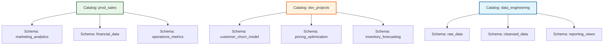

# Create a schema

Your catalog provides the foundation for data isolation across environments, but within each catalog you need more detailed organization for your tables, views, and functions. Different teams work on different projects, departments manage distinct datasets, and various use cases require separate namespaces. Schemas in Unity Catalog give you this logical organization layer. They let you group related data assets within a catalog while maintaining clear boundaries and access controls.

## What is a Schema?

A schema is the second level in Unity Catalog’s three-layer namespace (`catalog.schema.table`). While catalogs define the broadest boundaries—such as environments or security domains—schemas organize the data within those boundaries into logical, functional categories.

### The "Room" Analogy

If a catalog is the foundation of your data house, a schema is a specific room within it. Each room serves a distinct purpose and contains related items. For example, a `prod_catalog` might contain:

*   **`customer_analytics`**: Tables and views related to user behavior and segmentation.
*   **`financial_reporting`**: Datasets used for revenue tracking and balance sheets.
*   **`operations_metrics`**: Data concerning supply chain, logistics, and internal efficiency.

This grouping transforms a chaotic list of hundreds of tables into a navigable structure, helping data engineers and analysts quickly locate the assets relevant to their specific domain.

### Terminology: Schema vs. Database

In Azure Databricks, you may encounter the term "database" used interchangeably with "schema." This is because `CREATE DATABASE` is an alias for `CREATE SCHEMA`.

> [!NOTE]
> **Why "Schema"?**
> While both commands function identically in Databricks SQL, using the term **schema** is preferred in the context of Unity Catalog. It aligns more accurately with the standard three-layer namespace hierarchy (Catalog > Schema > Table) and distinguishes these objects from traditional standalone databases that exist outside of a unified governance framework.

By organizing data into schemas, you create a logical map of your data estate. This structure not only improves discoverability but also simplifies permission management, allowing you to grant access to entire functional areas (like `financial_reporting`) rather than managing permissions for individual tables one by one.

## Organize Data with Schemas

Designing your schema structure is an exercise in logical grouping. While catalogs define the "where" (environment or domain), schemas define the "what" and "who." They create clear ownership boundaries and make your data estate navigable for both engineers and business users.

### Common Organizational Patterns

There are three primary ways to structure schemas within a catalog, each serving different operational needs:

#### 1. Department-Based Organization
This pattern aligns schemas with business units, reflecting how teams are structured and who owns the data.

*   **Structure:** `marketing_analytics`, `financial_data`, `operations_metrics`
*   **Best For:** Production environments where distinct departments manage their own datasets. It simplifies access control by allowing you to grant permissions at the schema level to specific team groups.

#### 2. Project-Based Organization
This pattern creates dedicated workspaces for temporary initiatives or specific analytical models.

*   **Structure:** `customer_churn_model`, `pricing_optimization`, `inventory_forecasting`
*   **Best For:** Development catalogs. It keeps experimental work isolated and makes it easy to archive or delete all assets related to a project once it is completed or deprecated.

#### 3. Functional (Stage-Based) Organization
This pattern mirrors the data pipeline architecture, grouping schemas by the stage of data processing.

*   **Structure:** `raw_data`, `cleansed_data`, `reporting_views`
*   **Best For:** Environments focused on data engineering workflows. It provides a clear visual map of the data lineage, from ingestion to final consumption.



### Impact on Discoverability and Access Control

The way you organize schemas directly influences how easily users can find data and how securely you can manage it.

*   **Discoverability:** Well-named schemas act as signposts. An analyst looking for revenue data knows to check `financial_data` rather than searching through hundreds of unrelated tables.
*   **Granular Permissions:** Schema-level boundaries allow for precise access control. For example, you can grant data engineers full `CREATE` and `MODIFY` rights on a `staging` schema while giving business analysts only `SELECT` access on a `curated_views` schema.

> [!NOTE]
> **Hybrid Approaches**
> Many organizations use a hybrid model. For instance, a production catalog might use department-based schemas (`marketing`, `finance`), while a development catalog uses project-based schemas (`churn_v1`, `pricing_test`). The key is consistency within each catalog to avoid confusion.

## Create a Schema

Creating a schema establishes a dedicated namespace within a catalog for your tables, views, and functions. To perform this action, you must have `USE CATALOG` and `CREATE SCHEMA` permissions on the parent catalog. These privileges are typically granted by a metastore admin or the catalog owner.

### Method 1: Using SQL

SQL provides a precise way to create schemas, ensuring they are placed in the correct catalog using the three-part namespace (`catalog.schema`).

```sql
CREATE SCHEMA IF NOT EXISTS prod_catalog.customer_analytics 
COMMENT 'Customer behavior and segmentation analysis';
```

> [!NOTE]
> **Idempotency with `IF NOT EXISTS`**
> Including the `IF NOT EXISTS` clause is a best practice. It prevents errors if the script is executed multiple times, making your deployment pipelines more robust and reliable.

### Method 2: Using Catalog Explorer

For a visual approach, you can create schemas directly through the Azure Databricks UI:

1.  Navigate to **Catalog** in the left sidebar.
2.  Select the specific **catalog** where you want to add the schema.
3.  Click **Create schema** in the catalog detail pane.
4.  Enter a unique name and an optional description.
5.  Select **Create**.

### Permissions and Access Control

Once a schema is created, it is not automatically accessible to all users. You must explicitly grant privileges to control who can interact with it.

| Permission | Capability | Who Needs It? |
| :--- | :--- | :--- |
| **USE SCHEMA** | Allows users to see the schema and query its existing contents. | Analysts, Data Scientists, Business Users. |
| **CREATE TABLE** | Allows users to create new tables, views, or other objects within the schema. | Data Engineers, Developers. |
| **MODIFY** | Allows users to update or delete existing objects in the schema. | Senior Engineers, Data Stewards. |

> [!IMPORTANT]
> **The System Metadata Schema**
> Every new schema automatically includes a system-generated `information_schema`. This read-only schema contains metadata about all objects within the parent schema, such as table definitions and column types. You can query this metadata to programmatically discover and document your data assets.

By carefully managing schema creation and permissions, you ensure that your data remains organized and secure. This structure allows teams to collaborate effectively while maintaining clear boundaries between different functional areas or projects.

## Configure Managed Storage for Schemas

While not mandatory, specifying a managed storage location at the schema level provides granular control over where Unity Catalog stores the underlying data files for managed tables. By default, schemas inherit the storage location of their parent catalog (or the metastore’s default if the catalog has none). However, overriding this allows for physical isolation within a single catalog.

### Prerequisites and Configuration

To assign a dedicated storage path to a schema, you must have an **external location** configured in Unity Catalog and possess the `CREATE MANAGED STORAGE` privilege on that location.

```sql
CREATE SCHEMA IF NOT EXISTS prod_catalog.financial_data 
MANAGED LOCATION 'abfss://finance@mystorageaccount.dfs.core.windows.net/schema-data' 
COMMENT 'Financial transactions and reporting data with dedicated storage';
```

> [!NOTE]
> **Physical Isolation Within a Catalog**
> This configuration ensures that all managed tables created within `financial_data` store their files in a specific Azure Data Lake Storage Gen2 path. This is distinct from other schemas in `prod_catalog`, allowing you to apply unique security policies or retention rules to specific subsets of data without creating a new catalog.

### Why Use Schema-Level Storage?

| Benefit | Description |
| :--- | :--- |
| **Compliance & Security** | Isolates sensitive data (e.g., financial records, PII) into storage accounts with specific encryption or access controls. |
| **Cost Management** | Allows you to map high-value data to premium storage tiers while keeping less critical data in standard tiers. |
| **Simplified Cleanup** | When a schema is dropped, Unity Catalog can safely delete all underlying files in that specific path without affecting other schemas. |

### Default Behavior and Flexibility

If you do not specify a managed location, the schema functions normally by using the catalog’s storage. This simplifies management when physical isolation is not a requirement.

> [!IMPORTANT]
> **Updating Storage Later**
> You are not locked into your initial choice. If your requirements change, you can update a schema later to add or change its managed storage location. This flexibility allows you to start with a simple structure and evolve toward more complex, isolated storage patterns as your governance needs mature.

## Navigation

- Previous: [03. Create a catalog](03.%20Create%20a%20catalog.md)
- Next: [05. Create tables views and materialized views](05.%20Create%20tables%20views%20and%20materialized%20views.md)

## Source

Microsoft Learn: [Create a schema](https://learn.microsoft.com/en-us/training/modules/create-and-organize-objects-in-unity-catalog/4-create-schema)
