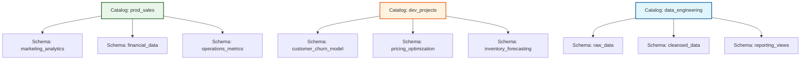

# Create a schema

Your catalog provides the foundation for data isolation across environments, but within each catalog you need more detailed organization for your tables, views, and functions. Different teams work on different projects, departments manage distinct datasets, and various use cases require separate namespaces. Schemas in Unity Catalog give you this logical organization layer. They let you group related data assets within a catalog while maintaining clear boundaries and access controls.

## What is a Schema?

A schema is the second level in Unity Catalog’s three-layer namespace (`catalog.schema.table`). While catalogs define the broadest boundaries—such as environments or security domains—schemas organize the data within those boundaries into logical, functional categories.

### The "Room" Analogy

If a catalog is the foundation of your data house, a schema is a specific room within it. Each room serves a distinct purpose and contains related items. For example, a `prod_catalog` might contain:

*   **`customer_analytics`**: Tables and views related to user behavior and segmentation.
*   **`financial_reporting`**: Datasets used for revenue tracking and balance sheets.
*   **`operations_metrics`**: Data concerning supply chain, logistics, and internal efficiency.

This grouping transforms a chaotic list of hundreds of tables into a navigable structure, helping data engineers and analysts quickly locate the assets relevant to their specific domain.

### Terminology: Schema vs. Database

In Azure Databricks, you may encounter the term "database" used interchangeably with "schema." This is because `CREATE DATABASE` is an alias for `CREATE SCHEMA`.

> [!NOTE]
> **Why "Schema"?**
> While both commands function identically in Databricks SQL, using the term **schema** is preferred in the context of Unity Catalog. It aligns more accurately with the standard three-layer namespace hierarchy (Catalog > Schema > Table) and distinguishes these objects from traditional standalone databases that exist outside of a unified governance framework.

By organizing data into schemas, you create a logical map of your data estate. This structure not only improves discoverability but also simplifies permission management, allowing you to grant access to entire functional areas (like `financial_reporting`) rather than managing permissions for individual tables one by one.

## Organize Data with Schemas

Designing your schema structure is an exercise in logical grouping. While catalogs define the "where" (environment or domain), schemas define the "what" and "who." They create clear ownership boundaries and make your data estate navigable for both engineers and business users.

### Common Organizational Patterns

There are three primary ways to structure schemas within a catalog, each serving different operational needs:

#### 1. Department-Based Organization
This pattern aligns schemas with business units, reflecting how teams are structured and who owns the data.

*   **Structure:** `marketing_analytics`, `financial_data`, `operations_metrics`
*   **Best For:** Production environments where distinct departments manage their own datasets. It simplifies access control by allowing you to grant permissions at the schema level to specific team groups.

#### 2. Project-Based Organization
This pattern creates dedicated workspaces for temporary initiatives or specific analytical models.

*   **Structure:** `customer_churn_model`, `pricing_optimization`, `inventory_forecasting`
*   **Best For:** Development catalogs. It keeps experimental work isolated and makes it easy to archive or delete all assets related to a project once it is completed or deprecated.

#### 3. Functional (Stage-Based) Organization
This pattern mirrors the data pipeline architecture, grouping schemas by the stage of data processing.

*   **Structure:** `raw_data`, `cleansed_data`, `reporting_views`
*   **Best For:** Environments focused on data engineering workflows. It provides a clear visual map of the data lineage, from ingestion to final consumption.



### Impact on Discoverability and Access Control

The way you organize schemas directly influences how easily users can find data and how securely you can manage it.

*   **Discoverability:** Well-named schemas act as signposts. An analyst looking for revenue data knows to check `financial_data` rather than searching through hundreds of unrelated tables.
*   **Granular Permissions:** Schema-level boundaries allow for precise access control. For example, you can grant data engineers full `CREATE` and `MODIFY` rights on a `staging` schema while giving business analysts only `SELECT` access on a `curated_views` schema.

> [!NOTE]
> **Hybrid Approaches**
> Many organizations use a hybrid model. For instance, a production catalog might use department-based schemas (`marketing`, `finance`), while a development catalog uses project-based schemas (`churn_v1`, `pricing_test`). The key is consistency within each catalog to avoid confusion.

## Create a schema
Creating a schema establishes a namespace for the tables, views, and functions you'll add later. You need USE CATALOG and CREATE SCHEMA permissions on the parent catalog. A metastore admin or the catalog owner can grant you these privileges.
Using SQL, you create a schema with this command:

```
CREATE SCHEMA IF NOT EXISTS prod_catalog.customer_analytics COMMENT 'Customer behavior and segmentation analysis';
```


```
CREATE SCHEMA IF NOT EXISTS prod_catalog.customer_analytics COMMENT 'Customer behavior and segmentation analysis';
```

This creates a schema named customer_analytics in the prod_catalog catalog. The IF NOT EXISTS clause prevents errors if the schema already exists, making your code safe to run repeatedly. The three-part namespace (catalog.schema.table) requires you to specify the catalog name, ensuring schemas end up in the correct container.

```
customer_analytics
```


```
prod_catalog
```


```
IF NOT EXISTS
```


```
catalog.schema.table
```

Using Catalog Explorer, you can create schemas through the Azure Databricks workspace UI:
1. Select Catalog from the left navigation.
2. Select the catalog where you want to create the schema.
3. Select Create schema from the catalog detail pane.
4. Enter a schema name and optional description.
5. Select Create.
After creating the schema, you grant privileges to control who can use it and create objects within it. At minimum, users need USE SCHEMA permission to see the schema and query its contents. To create tables or views in the schema, users need CREATE TABLE or other object-specific permissions.
Each new schema includes a system-generated information_schema that contains metadata about the schema's objects. You can query this metadata to discover tables, views, and their structure.

## Configure managed storage
While not required, specifying a managed storage location for your schema gives you control over where Unity Catalog stores data files for managed tables created within the schema. Without a schema-level storage location, managed tables use the catalog's managed storage (or the metastore's default if the catalog has none specified).
To configure managed storage, you need an external location already set up in Unity Catalog and the CREATE MANAGED STORAGE privilege on that location. This lets you separate data for different schemas, even within the same catalog.

```
CREATE SCHEMA IF NOT EXISTS prod_catalog.financial_data MANAGED LOCATION 'abfss://finance@mystorageaccount.dfs.core.windows.net/schema-data' COMMENT 'Financial transactions and reporting data with dedicated storage';
```


```
CREATE SCHEMA IF NOT EXISTS prod_catalog.financial_data MANAGED LOCATION 'abfss://finance@mystorageaccount.dfs.core.windows.net/schema-data' COMMENT 'Financial transactions and reporting data with dedicated storage';
```

This command creates a schema with its own storage location in Azure Data Lake Storage Gen2. All managed tables created in this schema store their data files under this path, separate from other schemas in the catalog. This physical isolation helps you meet compliance requirements where financial data must reside in specific storage accounts with particular security configurations.
If you don't specify managed storage, your schema works the same way. Managed tables use the catalog's storage location, which simplifies management when physical isolation isn't required. You can always update the schema later to add a managed location if your requirements change.

## Navigation

- Previous: [03. Create a catalog](03.%20Create%20a%20catalog.md)
- Next: [05. Create tables views and materialized views](05.%20Create%20tables%20views%20and%20materialized%20views.md)

## Source

Microsoft Learn: [Create a schema](https://learn.microsoft.com/en-us/training/modules/create-and-organize-objects-in-unity-catalog/4-create-schema)
