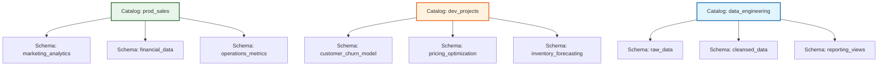

## Organize Data with Schemas

Designing your schema structure is an exercise in logical grouping. While catalogs define the "where" (environment or domain), schemas define the "what" and "who." They create clear ownership boundaries and make your data estate navigable for both engineers and business users.

### Common Organizational Patterns

There are three primary ways to structure schemas within a catalog, each serving different operational needs:

#### 1. Department-Based Organization
This pattern aligns schemas with business units, reflecting how teams are structured and who owns the data.

*   **Structure:** `marketing_analytics`, `financial_data`, `operations_metrics`
*   **Best For:** Production environments where distinct departments manage their own datasets. It simplifies access control by allowing you to grant permissions at the schema level to specific team groups.

#### 2. Project-Based Organization
This pattern creates dedicated workspaces for temporary initiatives or specific analytical models.

*   **Structure:** `customer_churn_model`, `pricing_optimization`, `inventory_forecasting`
*   **Best For:** Development catalogs. It keeps experimental work isolated and makes it easy to archive or delete all assets related to a project once it is completed or deprecated.

#### 3. Functional (Stage-Based) Organization
This pattern mirrors the data pipeline architecture, grouping schemas by the stage of data processing.

*   **Structure:** `raw_data`, `cleansed_data`, `reporting_views`
*   **Best For:** Environments focused on data engineering workflows. It provides a clear visual map of the data lineage, from ingestion to final consumption.

### Impact on Discoverability and Access Control

The way you organize schemas directly influences how easily users can find data and how securely you can manage it.

*   **Discoverability:** Well-named schemas act as signposts. An analyst looking for revenue data knows to check `financial_data` rather than searching through hundreds of unrelated tables.
*   **Granular Permissions:** Schema-level boundaries allow for precise access control. For example, you can grant data engineers full `CREATE` and `MODIFY` rights on a `staging` schema while giving business analysts only `SELECT` access on a `curated_views` schema.

> [!NOTE]
> **Hybrid Approaches**
> Many organizations use a hybrid model. For instance, a production catalog might use department-based schemas (`marketing`, `finance`), while a development catalog uses project-based schemas (`churn_v1`, `pricing_test`). The key is consistency within each catalog to avoid confusion.

<!-- structure-verified -->