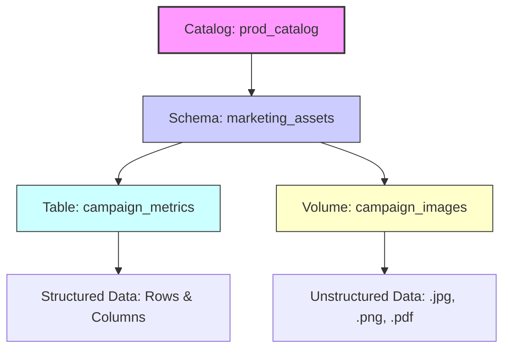

# Create volumes

Your data engineering team needs to store machine learning models, CSV files for ingestion, and image files for analytics workloads. You already organized your data using catalogs and schemas, but you need a governed way to manage these nontabular files in cloud object storage. Unity Catalog volumes provide the solution by extending governance to files while maintaining the same security model you use for tables.

## What are Volumes?

A volume is a Unity Catalog object that serves as a logical container for files stored in cloud object storage. If catalogs are the foundation of your data house and schemas are the rooms, volumes are the closets and shelves where you store everything that doesn’t fit neatly into a spreadsheet. They represent the third and final level of Unity Catalog’s namespace: `catalog.schema.volume`.

### Bridging Structured and Unstructured Data

While tables are designed for structured, row-and-column data, volumes govern **files of any format**. This includes:

*   **Semi-structured data:** CSV, JSON, XML.
*   **Unstructured data:** Images, audio files, PDFs, video.
*   **Machine Learning artifacts:** Model binaries, training datasets, feature stores.

By introducing volumes, Unity Catalog extends its governance framework beyond SQL analytics to cover the entire data lifecycle. You no longer need separate, ungoverned storage buckets for raw files; instead, you manage them alongside your tables using the same security policies, audit logs, and access controls.

### The Three-Layer Hierarchy

Understanding where volumes fit in the namespace is critical for effective organization:

1.  **Catalog:** The highest-level boundary (e.g., `prod_catalog`).
2.  **Schema:** The logical grouping within the catalog (e.g., `marketing_assets`).
3.  **Volume:** The specific container for files (e.g., `campaign_images`).



> [!NOTE]
> **Unified Governance**
> Whether you are querying a Delta table or reading a JSON file from a volume, Unity Catalog provides a single pane of glass for security and lineage. This eliminates the "governance gap" that often exists between structured data warehouses and raw data lakes.

## Create a volume
Creating a volume establishes a governed storage location for your files. You must have CREATE VOLUME privilege on the schema and USE privileges on both the schema and catalog. For external volumes, you also need CREATE EXTERNAL VOLUME privilege on the target external location.
Using SQL, create a managed volume with this syntax:

```
CREATE VOLUME IF NOT EXISTS dev_catalog.bronze_schema.landing_files COMMENT 'Landing area for CSV files from external systems';
```


```
CREATE VOLUME IF NOT EXISTS dev_catalog.bronze_schema.landing_files COMMENT 'Landing area for CSV files from external systems';
```

This creates a volume named landing_files in the specified schema. The IF NOT EXISTS clause prevents errors if the volume already exists, making your code resilient to repeated execution.

```
landing_files
```


```
IF NOT EXISTS
```

For external volumes, add the LOCATION clause to specify the cloud storage path:

```
LOCATION
```


```
CREATE EXTERNAL VOLUME prod_catalog.silver_schema.ml_models LOCATION 'abfss://models@mystorageaccount.dfs.core.windows.net/production/';
```


```
CREATE EXTERNAL VOLUME prod_catalog.silver_schema.ml_models LOCATION 'abfss://models@mystorageaccount.dfs.core.windows.net/production/';
```

The location must point to a path within an external location that Unity Catalog already governs. This ensures that Unity Catalog maintains security control even when the volume references existing storage.
Using Catalog Explorer, create volumes through the UI:
1. Select Catalog from the left navigation.
2. Navigate to the target schema and select it.
3. Select Create > Volume.
4. Enter a volume name.
5. Choose Managed or External as the volume type.
6. For external volumes, select an external location and specify the subdirectory path.
7. Select Create.
After creation, your volume is ready to store files. The volume inherits permissions from its parent schema, though you can grant specific permissions to individual users or groups as needed.

## Access files in volumes
Once you create a volume, you access files using a standard path format that works across all Azure Databricks tools and languages. The path follows this pattern:

```
/Volumes/<catalog>/<schema>/<volume>/<path>/<filename>
```


```
/Volumes/<catalog>/<schema>/<volume>/<path>/<filename>
```

This POSIX-style path works with Apache Spark, pandas, SQL, and other frameworks without requiring cloud storage credentials or connection strings. For example, to read a CSV file stored in your volume:

```
df = spark.read.format("csv").load("/Volumes/dev_catalog/bronze_schema/landing_files/data.csv")
```


```
df = spark.read.format("csv").load("/Volumes/dev_catalog/bronze_schema/landing_files/data.csv")
```

The same path works in pandas:

```
import pandas as pd df = pd.read_csv('/Volumes/dev_catalog/bronze_schema/landing_files/data.csv')
```


```
import pandas as pd df = pd.read_csv('/Volumes/dev_catalog/bronze_schema/landing_files/data.csv')
```

You can also query files directly using SQL:

```
SELECT * FROM csv.`/Volumes/dev_catalog/bronze_schema/landing_files/data.csv`;
```


```
SELECT * FROM csv.`/Volumes/dev_catalog/bronze_schema/landing_files/data.csv`;
```

For file management operations, use dbutils.fs commands in notebooks:

```
dbutils.fs
```


```
# List files in a volume dbutils.fs.ls("/Volumes/dev_catalog/bronze_schema/landing_files") # Copy a file dbutils.fs.cp( "/Volumes/dev_catalog/bronze_schema/landing_files/source.csv", "/Volumes/dev_catalog/silver_schema/processed/destination.csv" )
```


```
# List files in a volume dbutils.fs.ls("/Volumes/dev_catalog/bronze_schema/landing_files") # Copy a file dbutils.fs.cp( "/Volumes/dev_catalog/bronze_schema/landing_files/source.csv", "/Volumes/dev_catalog/silver_schema/processed/destination.csv" )
```

External volumes support an additional access pattern. Users with appropriate permissions can access files using cloud storage URIs directly, such as abfss://container@account.dfs.core.windows.net/path/file.csv. However, Unity Catalog still governs this access through volume permissions, not external location permissions.

```
abfss://container@account.dfs.core.windows.net/path/file.csv
```

## Manage volume permissions
Volume permissions control who can read and write files. Unity Catalog provides four key privileges for volumes:
- READ VOLUME: Allows listing and reading files in the volume
- WRITE VOLUME: Allows creating, updating, and deleting files
- CREATE VOLUME: Allows creating new volumes in a schema
- CREATE EXTERNAL VOLUME: Allows creating external volumes using an external location
To grant read access to a data engineers group:

```
GRANT READ VOLUME ON VOLUME dev_catalog.bronze_schema.landing_files TO `data-engineers`;
```


```
GRANT READ VOLUME ON VOLUME dev_catalog.bronze_schema.landing_files TO `data-engineers`;
```

To grant full read and write access to data engineers:

```
GRANT READ VOLUME, WRITE VOLUME ON VOLUME dev_catalog.bronze_schema.landing_files TO `data-engineers`;
```


```
GRANT READ VOLUME, WRITE VOLUME ON VOLUME dev_catalog.bronze_schema.landing_files TO `data-engineers`;
```

Permissions cascade from parent objects. If you grant READ VOLUME at the catalog level, users can read files from all volumes in that catalog. This makes it simple to set up broad access policies while restricting sensitive data through more specific grants.
Note
Unity Catalog volumes don't support folder-level or subdirectory-level ACLs. Permissions apply to the entire volume. If you need different access controls for different sets of files, create separate volumes for each security boundary.
Remember that reading or writing files requires both volume permissions and the necessary USE privileges on the parent catalog and schema. Unity Catalog enforces this hierarchy to maintain consistent access control across your data assets.

```
USE
```

## Navigation

- Previous: [05. Create tables views and materialized views](05.%20Create%20tables%20views%20and%20materialized%20views.md)
- Next: [07. Implement DDL operations](07.%20Implement%20DDL%20operations.md)

## Source

Microsoft Learn: [Create volumes](https://learn.microsoft.com/en-us/training/modules/create-and-organize-objects-in-unity-catalog/6-create-volumes)
