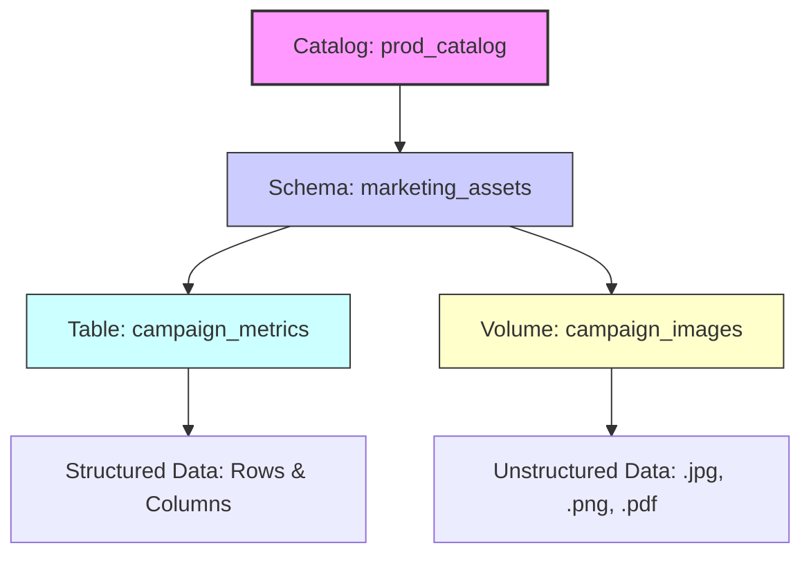

# Create volumes

Your data engineering team needs to store machine learning models, CSV files for ingestion, and image files for analytics workloads. You already organized your data using catalogs and schemas, but you need a governed way to manage these nontabular files in cloud object storage. Unity Catalog volumes provide the solution by extending governance to files while maintaining the same security model you use for tables.

## What are Volumes?

A volume is a Unity Catalog object that serves as a logical container for files stored in cloud object storage. If catalogs are the foundation of your data house and schemas are the rooms, volumes are the closets and shelves where you store everything that doesn’t fit neatly into a spreadsheet. They represent the third and final level of Unity Catalog’s namespace: `catalog.schema.volume`.

### Bridging Structured and Unstructured Data

While tables are designed for structured, row-and-column data, volumes govern **files of any format**. This includes:

*   **Semi-structured data:** CSV, JSON, XML.
*   **Unstructured data:** Images, audio files, PDFs, video.
*   **Machine Learning artifacts:** Model binaries, training datasets, feature stores.

By introducing volumes, Unity Catalog extends its governance framework beyond SQL analytics to cover the entire data lifecycle. You no longer need separate, ungoverned storage buckets for raw files; instead, you manage them alongside your tables using the same security policies, audit logs, and access controls.

### The Three-Layer Hierarchy

Understanding where volumes fit in the namespace is critical for effective organization:

1.  **Catalog:** The highest-level boundary (e.g., `prod_catalog`).
2.  **Schema:** The logical grouping within the catalog (e.g., `marketing_assets`).
3.  **Volume:** The specific container for files (e.g., `campaign_images`).



> [!NOTE]
> **Unified Governance**
> Whether you are querying a Delta table or reading a JSON file from a volume, Unity Catalog provides a single pane of glass for security and lineage. This eliminates the "governance gap" that often exists between structured data warehouses and raw data lakes.

## Choose Between Managed and External Volumes

When creating a volume, you must decide between **managed** and **external** types. This choice dictates where your files physically reside in cloud storage and how Unity Catalog handles their lifecycle—specifically, what happens when the volume is deleted.

### Managed Volumes: Simplified Lifecycle

Managed volumes are the default choice for workflows that live entirely within the Azure Databricks ecosystem. Unity Catalog automatically manages the underlying storage location, typically placing files in the managed storage path associated with the parent schema or catalog.

*   **Storage Control:** Azure Databricks determines the physical path. You do not need to configure external locations or manage credentials for basic access.
*   **Deletion Behavior:** When you drop a managed volume, Unity Catalog marks the underlying files for deletion. After a **seven-day retention period**, the files are permanently removed from cloud storage.
*   **Best For:** Data engineering pipelines, temporary staging areas, and ML artifacts that are generated and consumed exclusively within Databricks. It eliminates the overhead of managing storage paths and ensures clean cleanup when projects end.

### External Volumes: Governance for Existing Data

External volumes allow you to bring existing cloud storage containers under Unity Catalog’s governance umbrella. You specify the storage path during creation, and the files remain in that location regardless of the volume’s status in the catalog.

*   **Storage Control:** You define the specific Azure Data Lake Storage Gen2 path. The volume acts as a logical pointer to an existing location.
*   **Deletion Behavior:** Dropping an external volume only removes the metadata registration from Unity Catalog. The physical files **remain untouched** in cloud storage.
*   **Best For:** Sharing data with non-Databricks systems, governing legacy datasets produced by other tools, or scenarios where multiple applications need direct access to the same storage container.

### Comparison Summary

| Feature | Managed Volume | External Volume |
| :--- | :--- | :--- |
| **Storage Location** | Auto-managed by Unity Catalog (schema/catalog root). | User-defined path in cloud storage. |
| **Setup Complexity** | Low; no external location configuration required. | Higher; requires a pre-configured external location. |
| **Drop Behavior** | Files are marked for deletion (7-day retention). | Files remain in storage; only metadata is removed. |
| **Primary Use Case** | Internal Databricks workflows, ETL staging, ML artifacts. | Cross-system sharing, legacy data governance, multi-tool access. |

> [!NOTE]
> **Unified Access Experience**
> Regardless of the type, the technical implementation for accessing files is identical. You use the same three-level namespace path (`catalog.schema.volume`), apply the same Unity Catalog permissions, and utilize the same APIs (such as `dbutils.fs` or standard file I/O). The distinction lies solely in storage ownership and lifecycle management, not in how you interact with the data day-to-day.

## Create a Volume

Creating a volume establishes a governed storage location for your files within the Unity Catalog hierarchy. To perform this action, you must possess the `CREATE VOLUME` privilege on the target schema, as well as `USE` privileges on both the schema and its parent catalog. For external volumes, an additional `CREATE EXTERNAL VOLUME` privilege on the specific external location is required.

### Method 1: Using SQL

SQL provides a scriptable and reproducible way to create volumes. The `IF NOT EXISTS` clause ensures idempotency, preventing errors if the command is executed multiple times.

#### Creating a Managed Volume
For managed volumes, Unity Catalog automatically handles the underlying storage path.

```sql
CREATE VOLUME IF NOT EXISTS dev_catalog.bronze_schema.landing_files 
COMMENT 'Landing area for CSV files from external systems';
```

#### Creating an External Volume
For external volumes, you must specify the `LOCATION` clause pointing to a path within a pre-configured external location.

```sql
CREATE EXTERNAL VOLUME prod_catalog.silver_schema.ml_models 
LOCATION 'abfss://models@mystorageaccount.dfs.core.windows.net/production/';
```

> [!IMPORTANT]
> **External Location Requirement**
> The path specified in the `LOCATION` clause must reside within an **external location** that is already registered and governed by Unity Catalog. This ensures that the necessary storage credentials and access policies are applied, maintaining security even when referencing existing cloud storage.

### Method 2: Using Catalog Explorer

You can also create volumes through the Azure Databricks UI for a more visual approach:

1.  Navigate to **Catalog** in the left sidebar.
2.  Select the target **schema** where you want to create the volume.
3.  Click **Create > Volume**.
4.  Enter a unique name for the volume.
5.  Choose between **Managed** or **External** as the volume type.
6.  If selecting External, choose an existing external location and specify the subdirectory path.
7.  Select **Create**.

### Permissions and Access

Upon creation, a volume inherits permissions from its parent schema. However, you can refine access by granting specific privileges to individual users or groups.

| Permission | Capability |
| :--- | :--- |
| **READ VOLUME** | Allows users to list and read files within the volume. |
| **WRITE VOLUME** | Allows users to upload, modify, and delete files within the volume. |
| **CREATE VOLUME** | Allows users to create new volumes within the schema. |

By creating volumes, you bring unstructured and semi-structured data under the same governance umbrella as your structured tables, ensuring that all assets in your data lake are secure, discoverable, and auditable.


## Manage volume permissions
Volume permissions control who can read and write files. Unity Catalog provides four key privileges for volumes:
- READ VOLUME: Allows listing and reading files in the volume
- WRITE VOLUME: Allows creating, updating, and deleting files
- CREATE VOLUME: Allows creating new volumes in a schema
- CREATE EXTERNAL VOLUME: Allows creating external volumes using an external location
To grant read access to a data engineers group:

```
GRANT READ VOLUME ON VOLUME dev_catalog.bronze_schema.landing_files TO `data-engineers`;
```


```
GRANT READ VOLUME ON VOLUME dev_catalog.bronze_schema.landing_files TO `data-engineers`;
```

To grant full read and write access to data engineers:

```
GRANT READ VOLUME, WRITE VOLUME ON VOLUME dev_catalog.bronze_schema.landing_files TO `data-engineers`;
```


```
GRANT READ VOLUME, WRITE VOLUME ON VOLUME dev_catalog.bronze_schema.landing_files TO `data-engineers`;
```

Permissions cascade from parent objects. If you grant READ VOLUME at the catalog level, users can read files from all volumes in that catalog. This makes it simple to set up broad access policies while restricting sensitive data through more specific grants.
Note
Unity Catalog volumes don't support folder-level or subdirectory-level ACLs. Permissions apply to the entire volume. If you need different access controls for different sets of files, create separate volumes for each security boundary.
Remember that reading or writing files requires both volume permissions and the necessary USE privileges on the parent catalog and schema. Unity Catalog enforces this hierarchy to maintain consistent access control across your data assets.

```
USE
```

## Navigation

- Previous: [05. Create tables views and materialized views](05.%20Create%20tables%20views%20and%20materialized%20views.md)
- Next: [07. Implement DDL operations](07.%20Implement%20DDL%20operations.md)

## Source

Microsoft Learn: [Create volumes](https://learn.microsoft.com/en-us/training/modules/create-and-organize-objects-in-unity-catalog/6-create-volumes)
