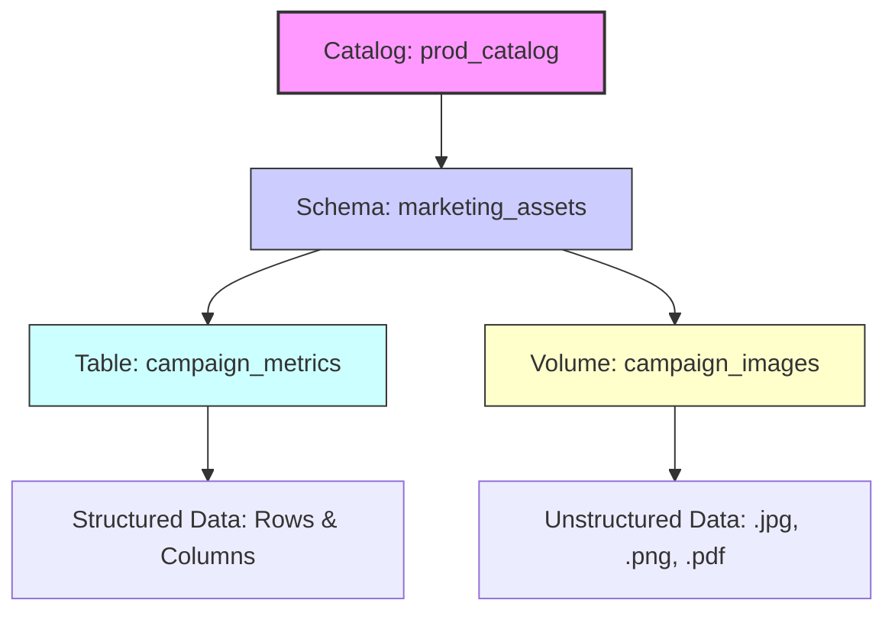

# Create volumes

Your data engineering team needs to store machine learning models, CSV files for ingestion, and image files for analytics workloads. You already organized your data using catalogs and schemas, but you need a governed way to manage these nontabular files in cloud object storage. Unity Catalog volumes provide the solution by extending governance to files while maintaining the same security model you use for tables.

## What are Volumes?

A volume is a Unity Catalog object that serves as a logical container for files stored in cloud object storage. If catalogs are the foundation of your data house and schemas are the rooms, volumes are the closets and shelves where you store everything that doesn’t fit neatly into a spreadsheet. They represent the third and final level of Unity Catalog’s namespace: `catalog.schema.volume`.

### Bridging Structured and Unstructured Data

While tables are designed for structured, row-and-column data, volumes govern **files of any format**. This includes:

*   **Semi-structured data:** CSV, JSON, XML.
*   **Unstructured data:** Images, audio files, PDFs, video.
*   **Machine Learning artifacts:** Model binaries, training datasets, feature stores.

By introducing volumes, Unity Catalog extends its governance framework beyond SQL analytics to cover the entire data lifecycle. You no longer need separate, ungoverned storage buckets for raw files; instead, you manage them alongside your tables using the same security policies, audit logs, and access controls.

### The Three-Layer Hierarchy

Understanding where volumes fit in the namespace is critical for effective organization:

1.  **Catalog:** The highest-level boundary (e.g., `prod_catalog`).
2.  **Schema:** The logical grouping within the catalog (e.g., `marketing_assets`).
3.  **Volume:** The specific container for files (e.g., `campaign_images`).



> [!NOTE]
> **Unified Governance**
> Whether you are querying a Delta table or reading a JSON file from a volume, Unity Catalog provides a single pane of glass for security and lineage. This eliminates the "governance gap" that often exists between structured data warehouses and raw data lakes.

## Choose Between Managed and External Volumes

When creating a volume, you must decide between **managed** and **external** types. This choice dictates where your files physically reside in cloud storage and how Unity Catalog handles their lifecycle—specifically, what happens when the volume is deleted.

### Managed Volumes: Simplified Lifecycle

Managed volumes are the default choice for workflows that live entirely within the Azure Databricks ecosystem. Unity Catalog automatically manages the underlying storage location, typically placing files in the managed storage path associated with the parent schema or catalog.

*   **Storage Control:** Azure Databricks determines the physical path. You do not need to configure external locations or manage credentials for basic access.
*   **Deletion Behavior:** When you drop a managed volume, Unity Catalog marks the underlying files for deletion. After a **seven-day retention period**, the files are permanently removed from cloud storage.
*   **Best For:** Data engineering pipelines, temporary staging areas, and ML artifacts that are generated and consumed exclusively within Databricks. It eliminates the overhead of managing storage paths and ensures clean cleanup when projects end.

### External Volumes: Governance for Existing Data

External volumes allow you to bring existing cloud storage containers under Unity Catalog’s governance umbrella. You specify the storage path during creation, and the files remain in that location regardless of the volume’s status in the catalog.

*   **Storage Control:** You define the specific Azure Data Lake Storage Gen2 path. The volume acts as a logical pointer to an existing location.
*   **Deletion Behavior:** Dropping an external volume only removes the metadata registration from Unity Catalog. The physical files **remain untouched** in cloud storage.
*   **Best For:** Sharing data with non-Databricks systems, governing legacy datasets produced by other tools, or scenarios where multiple applications need direct access to the same storage container.

### Comparison Summary

| Feature | Managed Volume | External Volume |
| :--- | :--- | :--- |
| **Storage Location** | Auto-managed by Unity Catalog (schema/catalog root). | User-defined path in cloud storage. |
| **Setup Complexity** | Low; no external location configuration required. | Higher; requires a pre-configured external location. |
| **Drop Behavior** | Files are marked for deletion (7-day retention). | Files remain in storage; only metadata is removed. |
| **Primary Use Case** | Internal Databricks workflows, ETL staging, ML artifacts. | Cross-system sharing, legacy data governance, multi-tool access. |

> [!NOTE]
> **Unified Access Experience**
> Regardless of the type, the technical implementation for accessing files is identical. You use the same three-level namespace path (`catalog.schema.volume`), apply the same Unity Catalog permissions, and utilize the same APIs (such as `dbutils.fs` or standard file I/O). The distinction lies solely in storage ownership and lifecycle management, not in how you interact with the data day-to-day.

## Create a Volume

Creating a volume establishes a governed storage location for your files within the Unity Catalog hierarchy. To perform this action, you must possess the `CREATE VOLUME` privilege on the target schema, as well as `USE` privileges on both the schema and its parent catalog. For external volumes, an additional `CREATE EXTERNAL VOLUME` privilege on the specific external location is required.

### Method 1: Using SQL

SQL provides a scriptable and reproducible way to create volumes. The `IF NOT EXISTS` clause ensures idempotency, preventing errors if the command is executed multiple times.

#### Creating a Managed Volume
For managed volumes, Unity Catalog automatically handles the underlying storage path.

```sql
CREATE VOLUME IF NOT EXISTS dev_catalog.bronze_schema.landing_files 
COMMENT 'Landing area for CSV files from external systems';
```

#### Creating an External Volume
For external volumes, you must specify the `LOCATION` clause pointing to a path within a pre-configured external location.

```sql
CREATE EXTERNAL VOLUME prod_catalog.silver_schema.ml_models 
LOCATION 'abfss://models@mystorageaccount.dfs.core.windows.net/production/';
```

> [!IMPORTANT]
> **External Location Requirement**
> The path specified in the `LOCATION` clause must reside within an **external location** that is already registered and governed by Unity Catalog. This ensures that the necessary storage credentials and access policies are applied, maintaining security even when referencing existing cloud storage.

### Method 2: Using Catalog Explorer

You can also create volumes through the Azure Databricks UI for a more visual approach:

1.  Navigate to **Catalog** in the left sidebar.
2.  Select the target **schema** where you want to create the volume.
3.  Click **Create > Volume**.
4.  Enter a unique name for the volume.
5.  Choose between **Managed** or **External** as the volume type.
6.  If selecting External, choose an existing external location and specify the subdirectory path.
7.  Select **Create**.

### Permissions and Access

Upon creation, a volume inherits permissions from its parent schema. However, you can refine access by granting specific privileges to individual users or groups.

| Permission | Capability |
| :--- | :--- |
| **READ VOLUME** | Allows users to list and read files within the volume. |
| **WRITE VOLUME** | Allows users to upload, modify, and delete files within the volume. |
| **CREATE VOLUME** | Allows users to create new volumes within the schema. |

By creating volumes, you bring unstructured and semi-structured data under the same governance umbrella as your structured tables, ensuring that all assets in your data lake are secure, discoverable, and auditable.

## Access Files in Volumes

Once a volume is created, it provides a unified, POSIX-style interface for accessing files across the Azure Databricks ecosystem. This abstraction layer eliminates the need to manage complex cloud storage credentials, connection strings, or service principals in your code. Instead, you interact with files using a standard path format that works seamlessly with Apache Spark, pandas, SQL, and native file utilities.

### The Unified Path Structure

All volumes, whether managed or external, are accessed via a consistent hierarchical path:

```text
/Volumes/<catalog>/<schema>/<volume>/<path>/<filename>
```

This structure mirrors the Unity Catalog namespace, making it intuitive for users who are already familiar with `catalog.schema.table` conventions. Because this path is resolved by the Databricks runtime, it automatically applies the necessary security contexts and storage credentials based on the user’s identity and permissions.

### Multi-Language Accessibility

The versatility of volume paths allows you to use the same location across different programming frameworks without modification.

#### 1. Apache Spark (PySpark/Scala)
Spark can read directly from volume paths using standard data source APIs.

```python
df = spark.read.format("csv").option("header", "true").load("/Volumes/dev_catalog/bronze_schema/landing_files/data.csv")
```

#### 2. Python (pandas)
For single-node processing or lightweight analysis, pandas can access volume files just like local filesystem paths.

```python
import pandas as pd
df = pd.read_csv('/Volumes/dev_catalog/bronze_schema/landing_files/data.csv')
```

#### 3. SQL
You can query unstructured or semi-structured files directly using SQL by referencing the volume path as an external table source.

```sql
SELECT * FROM csv.`/Volumes/dev_catalog/bronze_schema/landing_files/data.csv`;
```

> [!NOTE]
> **Format Specification**
> When using SQL to query files in volumes, you must specify the file format (e.g., `csv`, `json`, `parquet`) before the backtick-enclosed path. This tells the engine how to parse the underlying data.

### File Management with `dbutils.fs`

For operational tasks such as listing, copying, moving, or deleting files, `dbutils.fs` provides a powerful command-line-like interface within notebooks. These commands respect Unity Catalog permissions, ensuring that users can only perform actions they are authorized to do.

```python
# List all files in a volume directory
dbutils.fs.ls("/Volumes/dev_catalog/bronze_schema/landing_files")

# Copy a file from one volume to another (or within the same volume)
dbutils.fs.cp(
    "/Volumes/dev_catalog/bronze_schema/landing_files/source.csv", 
    "/Volumes/dev_catalog/silver_schema/processed/destination.csv"
)

# Remove a file
dbutils.fs.rm("/Volumes/dev_catalog/bronze_schema/landing_files/temp_file.csv")
```

### External Volume Direct Access

While the `/Volumes/...` path is the recommended standard for most operations, **external volumes** support an additional access pattern for integration with non-Databricks systems. Users with appropriate permissions can access files using their native cloud storage URIs, such as:

```text
abfss://models@mystorageaccount.dfs.core.windows.net/production/model_v1.pkl
```

> [!IMPORTANT]
> **Governance Still Applies**
> Even when accessing files via their direct cloud storage URI, Unity Catalog governance remains active. Access is controlled by **volume permissions**, not just the underlying storage account keys. This ensures that if a user’s access to the volume is revoked in Unity Catalog, they lose access to the files regardless of whether they use the `/Volumes/` path or the direct `abfss://` URI. This dual-access capability makes external volumes ideal for scenarios where legacy applications or third-party tools need to read data produced by Databricks without changing their existing connection logic.

### Best Practices for File Access

*   **Use Relative Paths in Code:** When possible, define the base volume path as a variable or configuration parameter. This makes your code more portable across environments (e.g., switching from `dev_catalog` to `prod_catalog`).
*   **Leverage Auto Loader:** For incremental ingestion of files from volumes, use Structured Streaming with Auto Loader (`cloudFiles`) pointing to the volume path. This combines the governance of volumes with the scalability of streaming ingestion.
*   **Avoid Hardcoding Credentials:** Never embed storage keys or SAS tokens in your notebooks when accessing volumes. Rely on the unified path and Unity Catalog’s identity-based access control to handle authentication securely.

## Manage Volume Permissions

Volume permissions in Unity Catalog provide granular control over who can interact with your file-based assets. Unlike traditional file systems that might rely on complex Access Control Lists (ACLs) for every folder, Unity Catalog simplifies governance by applying permissions at the volume level. This ensures that security policies are consistent, auditable, and easy to manage.

### Key Privileges

Unity Catalog defines four specific privileges for volumes, each serving a distinct role in the data lifecycle:

| Privilege | Capability | Who Needs It? |
| :--- | :--- | :--- |
| **READ VOLUME** | List directory contents and read/download files. | Data Analysts, Data Scientists, Downstream Applications. |
| **WRITE VOLUME** | Create, update, overwrite, and delete files within the volume. | Data Engineers, ETL Pipelines, ML Training Jobs. |
| **CREATE VOLUME** | Create new managed or external volumes within a schema. | Platform Engineers, Data Stewards. |
| **CREATE EXTERNAL VOLUME** | Register existing cloud storage paths as external volumes. | Admins managing legacy data or cross-system integrations. |

### Granting Access via SQL

You can manage permissions using standard SQL `GRANT` statements. This approach is scriptable and integrates seamlessly into your infrastructure-as-code pipelines.

#### Granting Read-Only Access
```sql
GRANT READ VOLUME ON VOLUME dev_catalog.bronze_schema.landing_files 
TO `data-engineers`;
```

#### Granting Full Read/Write Access
```sql
GRANT READ VOLUME, WRITE VOLUME ON VOLUME dev_catalog.bronze_schema.landing_files 
TO `data-engineers`;
```

> [!NOTE]
> **Group-Based Management**
> Always grant permissions to groups (e.g., `data-engineers`) rather than individual users. This simplifies administration; when team members join or leave, you only need to update group membership, not individual object permissions.

### Permission Cascading and Hierarchy

Permissions in Unity Catalog follow a hierarchical model. Grants applied at a higher level (Catalog or Schema) automatically cascade down to all child objects.

*   **Catalog-Level Grant:** If you grant `READ VOLUME` on a catalog, users can read files from **every** volume within that catalog.
*   **Schema-Level Grant:** Grants apply to all volumes within that specific schema.
*   **Volume-Level Grant:** The most granular level, restricting access to a single volume.

This cascading behavior allows you to set broad baseline policies (e.g., "All analysts can read from the `prod_catalog`") while using specific grants to restrict sensitive areas (e.g., "Only HR can write to the `employee_records` volume").

### Important Limitations and Requirements

1.  **No Subdirectory ACLs:** Unity Catalog does **not** support folder-level or subdirectory-level permissions within a volume. Permissions apply to the entire volume. If you need different security boundaries for different sets of files, you must create **separate volumes** for each boundary.
2.  **Parent Object Dependencies:** To read or write files in a volume, a user must also have `USE` privileges on the parent **Catalog** and **Schema**. Unity Catalog enforces this hierarchy to ensure that access to lower-level objects is always preceded by permission to navigate the namespace.

```sql
-- Example: Ensuring a user can navigate to the volume
GRANT USE ON CATALOG dev_catalog TO `data-analyst`;
GRANT USE ON SCHEMA dev_catalog.bronze_schema TO `data-analyst`;
GRANT READ VOLUME ON VOLUME dev_catalog.bronze_schema.landing_files TO `data-analyst`;
```

By structuring your volumes according to security needs and leveraging cascading permissions, you can maintain a robust governance model that scales with your organization without becoming administratively burdensome.

## Navigation

- Previous: [05. Create tables views and materialized views](05.%20Create%20tables%20views%20and%20materialized%20views.md)
- Next: [07. Implement DDL operations](07.%20Implement%20DDL%20operations.md)

## Source

Microsoft Learn: [Create volumes](https://learn.microsoft.com/en-us/training/modules/create-and-organize-objects-in-unity-catalog/6-create-volumes)
