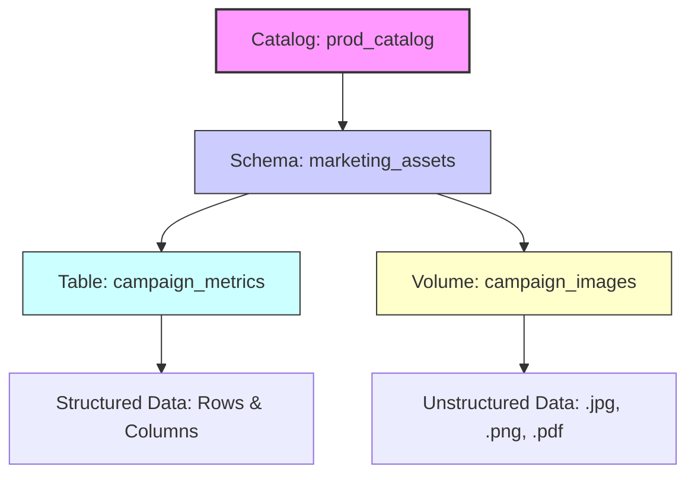

## What are Volumes?

A volume is a Unity Catalog object that serves as a logical container for files stored in cloud object storage. If catalogs are the foundation of your data house and schemas are the rooms, volumes are the closets and shelves where you store everything that doesn’t fit neatly into a spreadsheet. They represent the third and final level of Unity Catalog’s namespace: `catalog.schema.volume`.

### Bridging Structured and Unstructured Data

While tables are designed for structured, row-and-column data, volumes govern **files of any format**. This includes:

*   **Semi-structured data:** CSV, JSON, XML.
*   **Unstructured data:** Images, audio files, PDFs, video.
*   **Machine Learning artifacts:** Model binaries, training datasets, feature stores.

By introducing volumes, Unity Catalog extends its governance framework beyond SQL analytics to cover the entire data lifecycle. You no longer need separate, ungoverned storage buckets for raw files; instead, you manage them alongside your tables using the same security policies, audit logs, and access controls.

### The Three-Layer Hierarchy

Understanding where volumes fit in the namespace is critical for effective organization:

1.  **Catalog:** The highest-level boundary (e.g., `prod_catalog`).
2.  **Schema:** The logical grouping within the catalog (e.g., `marketing_assets`).
3.  **Volume:** The specific container for files (e.g., `campaign_images`).

> [!NOTE]
> **Unified Governance**
> Whether you are querying a Delta table or reading a JSON file from a volume, Unity Catalog provides a single pane of glass for security and lineage. This eliminates the "governance gap" that often exists between structured data warehouses and raw data lakes.

<!-- structure-verified -->