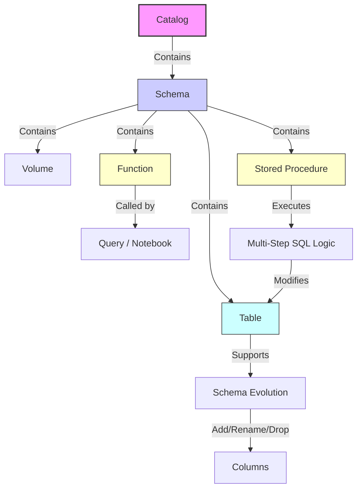

# Implement DDL Operations

Data Definition Language (DDL) in Unity Catalog extends far beyond simple table creation. It provides the architectural toolkit for building a governed, scalable, and intelligent data platform. By leveraging functions, stored procedures, and advanced schema modifications, you can encapsulate business logic, orchestrate complex workflows, and adapt your data model to evolving requirements—all while maintaining strict governance and lineage tracking.

## 1. Functions: Encapsulating Reusable Logic

Functions allow you to define reusable logic that can be invoked across queries, notebooks, and dashboards. In Unity Catalog, functions are first-class governed objects, meaning their usage is tracked, and their permissions are managed centrally.

### Types of Functions

| Type | Description | Use Case |
| :--- | :--- | :--- |
| **Scalar SQL** | Returns a single value based on input parameters. | Standardizing calculations (e.g., tax, discounts). |
| **Scalar Python** | Executes Python code to return a single value. | Complex string manipulation, regex, or using external libraries. |
| **Table-Valued (SQL)** | Returns a result set (table) from input parameters. | Unnesting arrays, generating sequences, or parameterized views. |
| **Table-Valued (Python)** | Executes Python code to return a result set. | Complex data generation or transformation logic. |
| **Temporary** | Exists only for the duration of the current session. | Ad-hoc analysis or testing logic before permanent creation. |

### Creating Scalar Functions

Scalar functions are ideal for ensuring consistency in business calculations.

```sql
-- SQL Scalar Function
CREATE FUNCTION dev_catalog.finance_schema.calculate_discount(
    price DOUBLE, 
    discount_rate DOUBLE
) 
RETURNS DOUBLE 
COMMENT 'Calculate discounted price' 
RETURN price * (1 - discount_rate);
```

For more complex logic, such as text normalization or custom parsing, Python functions provide greater flexibility. These execute within the secure environment of SQL Warehouses.

```sql
-- Python Scalar Function
CREATE FUNCTION dev_catalog.analytics_schema.normalize_text(
    input_text STRING
) 
RETURNS STRING 
LANGUAGE PYTHON 
COMMENT 'Normalize text using Python' 
AS $$ 
return input_text.lower().strip() if input_text else None 
$$;
```

### Creating Table-Valued Functions (TVFs)

TVFs allow you to treat logic like a table. This is powerful for transforming complex data structures, such as exploding arrays into rows.

```sql
-- SQL TVF: Explode an array into rows
CREATE FUNCTION dev_catalog.utils_schema.split_to_rows(
    input_array ARRAY<STRING>
) 
RETURNS TABLE(value STRING) 
RETURN SELECT explode(input_array) AS value;

-- Usage: SELECT * FROM dev_catalog.utils_schema.split_to_rows(array('a', 'b', 'c'));
```

You can also use Python to generate dynamic datasets, such as sequences or synthetic data for testing.

```sql
-- Python TVF: Generate a number sequence
CREATE FUNCTION dev_catalog.utils_schema.generate_sequence(
    start INT, 
    end INT
) 
RETURNS TABLE(num INT) 
LANGUAGE PYTHON 
COMMENT 'Generate a sequence of numbers' 
AS $$ 
return [(i,) for i in range(start, end + 1)] 
$$;
```

> [!NOTE]
> **Temporary Functions**
> For one-off tasks, use `CREATE TEMPORARY FUNCTION`. These do not persist in the catalog and do not require namespace qualifiers, making them ideal for interactive notebook sessions.

---

## 2. Stored Procedures: Orchestrating Multi-Step Workflows

Stored procedures allow you to bundle multiple SQL statements, control flow logic, and error handling into a single executable unit. They are essential for ETL/ELT processes that require conditional execution, iterative processing, or transactional integrity.

### Key Features
*   **Control Flow:** Support for `IF/ELSE`, `WHILE` loops, and variable declaration.
*   **Parameters:** `IN` (input), `OUT` (output), and `INOUT` (bidirectional) parameters.
*   **Security Context:** `SQL SECURITY INVOKER` ensures the procedure runs with the caller’s permissions, enforcing least-privilege access.

### Example: Refreshing a Summary Table

This procedure deletes existing data for a specific date, inserts new aggregated data, and returns the count of processed rows.

```sql
CREATE PROCEDURE dev_catalog.etl_schema.refresh_customer_summary(
    IN source_date DATE, 
    OUT rows_processed INT
)
LANGUAGE SQL
SQL SECURITY INVOKER
COMMENT 'Refresh customer summary table for specified date'
BEGIN
    DECLARE row_count INT;

    -- Step 1: Clear existing data for the date
    DELETE FROM dev_catalog.analytics_schema.customer_summary 
    WHERE summary_date = source_date;

    -- Step 2: Insert new aggregated data
    INSERT INTO dev_catalog.analytics_schema.customer_summary
    SELECT 
        customer_id, 
        summary_date, 
        SUM(amount) as total
    FROM dev_catalog.sales_schema.transactions
    WHERE transaction_date = source_date
    GROUP BY customer_id, summary_date;

    -- Step 3: Capture metrics
    SET row_count = (
        SELECT COUNT(*) 
        FROM dev_catalog.analytics_schema.customer_summary 
        WHERE summary_date = source_date
    );
    
    SET rows_processed = row_count;
END;
```

To execute the procedure:

```sql
CALL dev_catalog.etl_schema.refresh_customer_summary(DATE '2024-01-15', :rows);
```

---

## 3. Modifying Catalogs: Ownership and Metadata

As organizations mature, catalog management becomes critical. You may need to transfer ownership, classify assets with tags, or enable automated optimizations.

### Transferring Ownership
Ownership determines who has the `MANAGE` privilege by default. Transferring ownership is common during team reorganizations.

```sql
ALTER CATALOG dev_catalog SET OWNER TO `data_engineering_team`;
```

### Applying Tags for Governance
Tags provide searchable metadata that helps with discovery, cost allocation, and compliance classification.

```sql
ALTER CATALOG dev_catalog SET TAGS (
    environment = 'development', 
    cost_center = 'engineering', 
    data_classification = 'internal'
);
```

### Enabling Predictive Optimization
Predictive optimization automates maintenance tasks like file compaction and Z-Ordering. Enabling it at the catalog level applies it to all tables within, unless overridden.

```sql
ALTER CATALOG prod_catalog ENABLE PREDICTIVE OPTIMIZATION;
```

---

## 4. Modifying Tables: Schema Evolution

Delta Lake and Unity Catalog support robust schema evolution, allowing you to adapt your data model without rebuilding tables. These operations require the `MODIFY` privilege.

### Common Schema Modifications

| Operation | Syntax | Impact |
| :--- | :--- | :--- |
| **Add Column** | `ADD COLUMN name TYPE` | Adds a new column; existing rows get `NULL`. |
| **Rename Column** | `RENAME COLUMN old TO new` | Updates metadata; requires column mapping. |
| **Drop Column** | `DROP COLUMN name` | Removes column and its data permanently. |
| **Change Type** | `ALTER COLUMN name TYPE new_type` | Converts data; must be compatible (e.g., INT to BIGINT). |

### Examples

```sql
-- Add a new column for shipping carrier
ALTER TABLE dev_catalog.sales_schema.orders 
ADD COLUMN shipping_carrier STRING COMMENT 'Name of the shipping carrier';

-- Rename a column for clarity
ALTER TABLE dev_catalog.sales_schema.orders 
RENAME COLUMN customer_email TO email_address;

-- Widen a column type to handle larger quantities
ALTER TABLE dev_catalog.sales_schema.orders 
ALTER COLUMN quantity TYPE BIGINT;

-- Drop a temporary field
ALTER TABLE dev_catalog.sales_schema.orders 
DROP COLUMN temporary_field;
```

> [!IMPORTANT]
> **Column Mapping Requirement**
> Renaming and dropping columns require Delta Lake column mapping to be enabled. This is typically handled automatically in modern Databricks Runtimes, but it’s good practice to verify table properties if you encounter errors.

---

## 5. Visualizing DDL Relationships

The following diagram illustrates how these DDL objects interact within the Unity Catalog hierarchy.



By mastering these DDL operations, you move from simply storing data to actively managing a dynamic, governed, and efficient data ecosystem. Whether you are standardizing calculations with functions, orchestrating ETL with procedures, or evolving schemas to meet new business needs, Unity Catalog provides the tools to do so securely and at scale.

## Navigation

- Previous: [06. Create volumes](06.%20Create%20volumes.md)
- Next: [08. Implement a foreign catalog](08.%20Implement%20a%20foreign%20catalog.md)

## Source

Microsoft Learn: [Implement DDL operations](https://learn.microsoft.com/en-us/training/modules/create-and-organize-objects-in-unity-catalog/7-implement-data-definition-language-operations)
