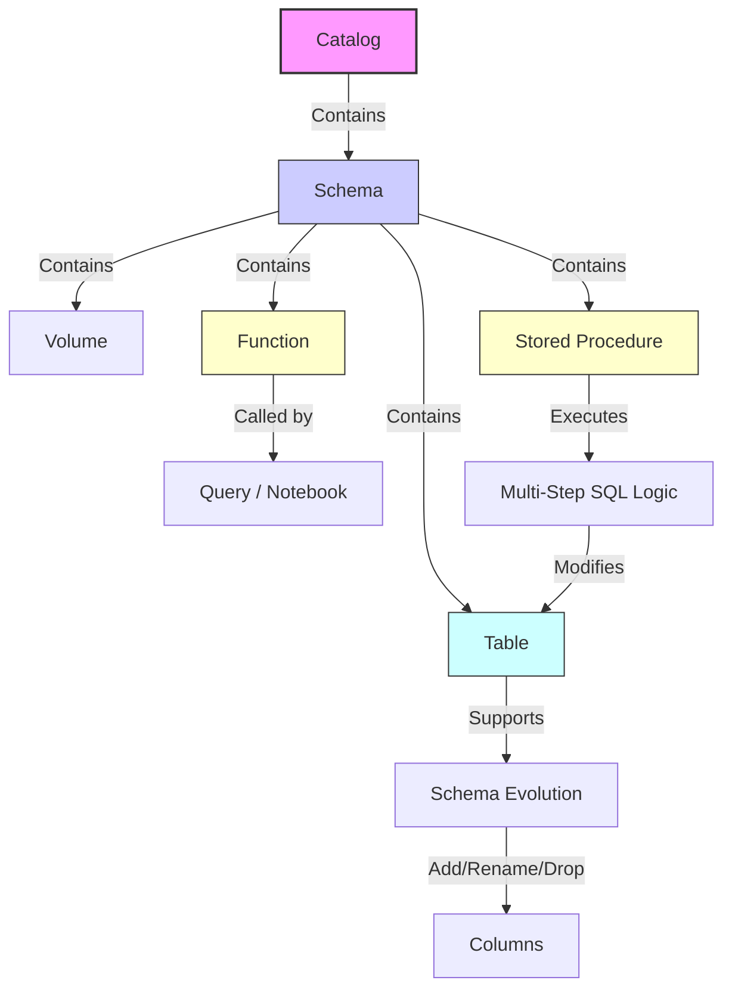

## 5. Visualizing DDL Relationships

The following diagram illustrates how these DDL objects interact within the Unity Catalog hierarchy.

By mastering these DDL operations, you move from simply storing data to actively managing a dynamic, governed, and efficient data ecosystem. Whether you are standardizing calculations with functions, orchestrating ETL with procedures, or evolving schemas to meet new business needs, Unity Catalog provides the tools to do so securely and at scale.

