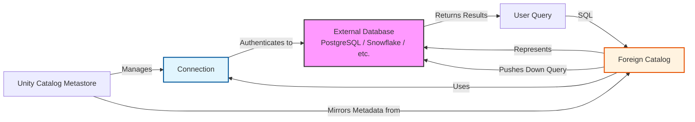

# Implement a Foreign Catalog

Foreign catalogs represent a paradigm shift in how organizations approach data integration. Instead of forcing all data into a central lakehouse through costly and time-consuming ETL pipelines, foreign catalogs allow Unity Catalog to extend its governance umbrella over external databases. This enables you to query live operational data—such as PostgreSQL, MySQL, Snowflake, or Azure SQL—directly from Azure Databricks while maintaining centralized security, lineage, and auditability.

## Why Implement Foreign Catalogs?

The traditional approach to analytics involves migrating data from operational systems into a data lake. While this is necessary for historical analysis and heavy transformation, it creates friction for exploratory work and real-time insights. Foreign catalogs solve several critical challenges:

1.  **Zero-Copy Governance:** Security policies defined in Unity Catalog apply seamlessly to external data. You manage permissions in one place, regardless of where the data physically resides.
2.  **Accelerated Time-to-Insight:** Analysts can run ad-hoc queries on live production data without waiting for engineering teams to build ingestion pipelines.
3.  **Auditability:** Every query against a foreign table is logged in Unity Catalog’s audit trail, providing complete visibility into who accessed sensitive operational data and when.
4.  **Incremental Migration:** For organizations transitioning to the lakehouse architecture, foreign catalogs allow legacy systems to remain active while new workloads are built in Databricks, enabling a gradual, low-risk migration.

## Architecture: Connections vs. Foreign Catalogs

Understanding the distinction between a **Connection** and a **Foreign Catalog** is essential for proper implementation.

*   **Connection:** A technical object that stores the credentials and network details required to reach an external database (e.g., JDBC URL, host, port, secrets). It acts as the "bridge" but does not contain data metadata.
*   **Foreign Catalog:** A logical representation of an external database within Unity Catalog’s namespace. It uses a Connection to synchronize metadata (schemas and tables) from the external system, making them visible and queryable via standard SQL.



> [!NOTE]
> **One-to-Many Relationship**
> A single Connection can support multiple Foreign Catalogs. For example, one connection to a PostgreSQL server can be used to create separate foreign catalogs for `prod_sales`, `prod_inventory`, and `dev_testing`, each pointing to different databases on the same server.

## Step 1: Create a Connection

A Connection defines *how* Azure Databricks reaches your external system. Before creating one, ensure your workspace has network connectivity (via VNet injection or Private Link) to the target database and that you have the `CREATE CONNECTION` privilege.

### Security Best Practice: Use Secrets
Never hardcode passwords in SQL statements. Always reference credentials stored in **Databricks Secrets**.

#### Example: PostgreSQL Connection
```sql
CREATE CONNECTION postgresql_prod 
TYPE postgresql 
OPTIONS (
    host 'prod-db.example.com', 
    port '5432', 
    user secret ('prod-secrets', 'postgres-user'), 
    password secret ('prod-secrets', 'postgres-password')
);
```

#### Example: Azure SQL Connection
```sql
CREATE CONNECTION azuresql_prod 
TYPE SQLSERVER 
OPTIONS (
    host 'myserver.database.windows.net', 
    port '1433', 
    user secret ('prod-secrets', 'azuresql-user'), 
    password secret ('prod-secrets', 'azuresql-password')
);
```

### Validation
After creation, always test the connection. In Catalog Explorer, use the **Test Connection** button. If using SQL, you can verify by attempting to create a foreign catalog; if the connection fails, the catalog creation will error out. Ensure firewalls allow traffic from Azure Databricks worker IPs.

## Step 2: Create a Foreign Catalog

Once the connection is validated, you can create a Foreign Catalog. This object mirrors the structure of the external database, making its schemas and tables visible in Unity Catalog.

### Prerequisites
*   `CREATE CATALOG` privilege on the metastore.
*   `CREATE FOREIGN CATALOG` privilege on the specific Connection.

#### Using SQL
```sql
CREATE FOREIGN CATALOG IF NOT EXISTS prod_customer_data 
USING CONNECTION postgresql_prod 
OPTIONS (database 'customers');
```

This command creates a catalog named `prod_customer_data` that maps to the `customers` database on the PostgreSQL server referenced by `postgresql_prod`. Unity Catalog immediately begins synchronizing metadata.

#### Using Catalog Explorer
1.  Navigate to **Catalog** > **Create Catalog**.
2.  Select **Foreign Catalog** as the type.
3.  Choose the existing **Connection**.
4.  Specify the **External Database Name**.
5.  Click **Create**.

## Step 3: Manage Metadata Synchronization

Unity Catalog automatically synchronizes metadata (table names, column types) when you first access a foreign catalog. However, for high-frequency queries or rapidly changing schemas, automatic synchronization on every query can introduce latency.

### Manual Refresh Strategies
You can control when metadata updates occur using the `REFRESH FOREIGN` command. This is ideal for scheduling during off-peak hours or after known schema changes in the source system.

```sql
-- Refresh entire catalog
REFRESH FOREIGN CATALOG prod_customer_data;

-- Refresh specific schema
REFRESH FOREIGN SCHEMA prod_customer_data.public;

-- Refresh specific table
REFRESH FOREIGN TABLE prod_customer_data.public.transactions;
```

> [!TIP]
> **Schedule with Lakeflow Jobs**
> For critical datasets, create a Lakeflow Job that runs `REFRESH FOREIGN CATALOG` on a schedule (e.g., hourly). This ensures metadata is fresh without impacting interactive query performance.

## Step 4: Grant Access and Query Data

Foreign catalogs adhere to the same hierarchical permission model as native Unity Catalog objects. Users need permissions at the catalog, schema, and table levels.

### Granting Permissions
```sql
-- Allow users to see the catalog
GRANT USE CATALOG ON CATALOG prod_customer_data TO `data-analysts`;

-- Allow users to see the schema
GRANT USE SCHEMA ON SCHEMA prod_customer_data.public TO `data-analysts`;

-- Allow users to read specific tables
GRANT SELECT ON TABLE prod_customer_data.public.transactions TO `data-analysts`;
```

### Querying Foreign Data
Users query foreign tables using standard SQL. The syntax is identical to querying native Delta tables.

```sql
SELECT 
    customer_id, 
    SUM(transaction_amount) AS total_spent 
FROM prod_customer_data.public.transactions 
WHERE transaction_date >= '2024-01-01' 
GROUP BY customer_id 
ORDER BY total_spent DESC 
LIMIT 100;
```

### Understanding Query Execution: Pushdown
When you run a query against a foreign table, Azure Databricks does not pull all data into its cluster. Instead, it uses **query pushdown**:

1.  **Translation:** Databricks translates the Spark SQL query into the native dialect of the external database (e.g., PostgreSQL SQL).
2.  **Execution:** The query is sent to the external database, which performs filtering, joins, and aggregations using its own compute resources.
3.  **Return:** Only the final result set is transferred back to Databricks.

> [!WARNING]
> **Performance Considerations**
> While pushdown is efficient, large result sets can still strain memory. Avoid `SELECT *` on massive foreign tables. For frequently accessed, heavy aggregations, consider creating a **Materialized View** in Databricks that caches the results locally, refreshing it on a schedule.

## Summary

Foreign catalogs bridge the gap between operational systems and the lakehouse. By decoupling governance from physical storage, they enable secure, real-time access to external data without the overhead of migration. Whether you are exploring live production data or managing a hybrid multi-cloud environment, foreign catalogs provide the flexibility and control needed for modern data architectures.

## Navigation

- Previous: [07. Implement DDL operations](07.%20Implement%20DDL%20operations.md)
- Next: [09. Configure AI-BI Genie instructions](09.%20Configure%20AI-BI%20Genie%20instructions.md)

## Source

Microsoft Learn: [Implement a foreign catalog](https://learn.microsoft.com/en-us/training/modules/create-and-organize-objects-in-unity-catalog/8-implement-foreign-catalog)
