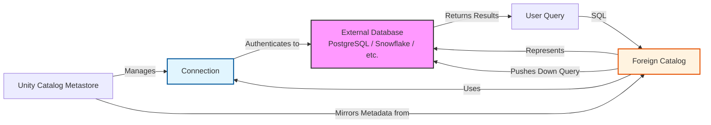

## Architecture: Connections vs. Foreign Catalogs

Understanding the distinction between a **Connection** and a **Foreign Catalog** is essential for proper implementation.

*   **Connection:** A technical object that stores the credentials and network details required to reach an external database (e.g., JDBC URL, host, port, secrets). It acts as the "bridge" but does not contain data metadata.
*   **Foreign Catalog:** A logical representation of an external database within Unity Catalog’s namespace. It uses a Connection to synchronize metadata (schemas and tables) from the external system, making them visible and queryable via standard SQL.

> [!NOTE]
> **One-to-Many Relationship**
> A single Connection can support multiple Foreign Catalogs. For example, one connection to a PostgreSQL server can be used to create separate foreign catalogs for `prod_sales`, `prod_inventory`, and `dev_testing`, each pointing to different databases on the same server.

