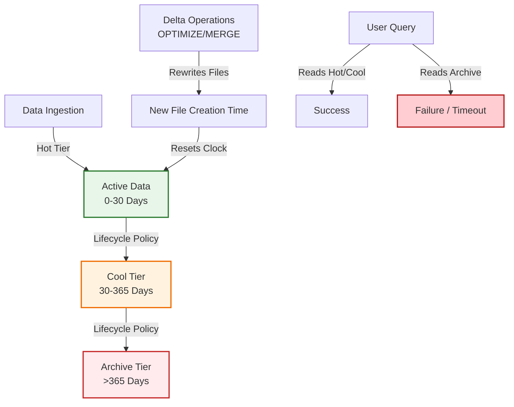

# Apply data retention policies

Description: Learn how to configure and enforce data retention policies in Azure Databricks using Delta Lake VACUUM, deletion operations for regulatory compliance, and predictive optimization for automated maintenance.

## Why Apply Data Retention Policies?

Every organization faces the delicate balancing act of maintaining data availability for business intelligence while adhering to strict compliance regulations and managing spiraling storage costs. In a lakehouse architecture, where data is often kept indefinitely for historical analysis, this challenge is amplified. Without active governance, your storage accounts become graveyards of obsolete files, increasing costs and exposing your organization to regulatory risk.

Implementing robust data retention policies in Azure Databricks ensures that data is kept only as long as it provides value or is legally required. This unit explores how to configure retention settings, leverage Delta Lake’s `VACUUM` command for physical cleanup, handle sensitive deletion requests, and automate these processes using predictive optimization.

## 1. The Mechanics of Deletion in Delta Lake

To understand retention, you must first understand how Delta Lake handles deletions. Unlike traditional databases that overwrite data in place, Delta Lake uses an **append-only** model.

*   **Logical Deletion:** When you run a `DELETE` or `UPDATE` statement, Delta Lake does not immediately remove the old data files from cloud storage. Instead, it creates new files with the updated data and marks the old files as "removed" in the transaction log (`_delta_log`).
*   **Time Travel:** These old files remain accessible for "time travel" queries (using `VERSION AS OF` or `TIMESTAMP AS OF`). This is a powerful feature for auditing and recovery, but it means your storage usage continues to grow even after you delete data.
*   **Physical Deletion:** To actually reclaim storage space and ensure data is irretrievable, you must perform a physical cleanup. This is where `VACUUM` comes in.

## 2. Using VACUUM for Physical Cleanup

The `VACUUM` command permanently removes data files that are no longer referenced by the current version of the Delta table and are older than a specified retention interval.

### Default Retention Period
By default, Delta Lake has a retention threshold of **7 days** (168 hours). This ensures that any concurrent readers or writers who started a transaction before your deletion can still complete their work without errors.

```sql
-- Vacuum a table using the default 7-day retention
VACUUM sales.customers.profiles;
```

### Customizing Retention Intervals
For compliance scenarios where data must be deleted immediately (e.g., a "Right to be Forgotten" request), you may need to reduce this interval. However, reducing it below 7 days requires disabling a safety check to prevent accidental data loss for active transactions.

```sql
-- Set the retention interval to 0 hours (immediate cleanup)
SET spark.databricks.delta.retentionDurationCheck.enabled = false;
VACUUM sales.customers.profiles RETAIN 0 HOURS;
```

> [!WARNING]
> **Risk of Aggressive Vacuuming**
> Setting the retention duration to less than 7 days can cause failures for long-running queries or concurrent writes that started before the vacuum. Only use short retention periods when you are certain no long-running transactions are active on the table.

## 3. Handling Compliance and Deletion Requests

Regulations like GDPR and CCPA require organizations to delete personal data upon request. In a governed lakehouse, this process involves two steps: logical removal and physical purging.

### Step 1: Logical Removal
First, remove the data from the active dataset so it is no longer visible to standard queries.

```sql
DELETE FROM sales.customers.profiles 
WHERE customer_id = 12345;
```

### Step 2: Physical Purging
Next, run `VACUUM` to ensure the underlying files containing that customer’s data are permanently deleted from storage.

```sql
VACUUM sales.customers.profiles RETAIN 0 HOURS;
```

### Auditing Deletions
Unity Catalog’s audit logs capture both the `DELETE` operation and the `VACUUM` command. This provides a verifiable trail for auditors, proving that not only was the data removed from the table, but the physical artifacts were also destroyed.

## 4. Automating Maintenance with Predictive Optimization

Manually running `VACUUM` and other maintenance tasks is inefficient and error-prone. **Predictive Optimization** is a Unity Catalog feature that automatically monitors your tables and triggers maintenance operations when they are most beneficial.

### What It Does
*   **Auto-Compaction:** Combines small files into larger ones to improve query performance.
*   **Auto-Vacuum:** Runs `VACUUM` based on the table’s retention settings and usage patterns, ensuring storage costs are kept in check without manual intervention.
*   **Z-Ordering:** Optimizes data layout for faster filtering on specific columns.

### Enabling Predictive Optimization
You can enable this at the catalog level, which applies it to all tables within that catalog unless overridden.

```sql
ALTER CATALOG prod_catalog ENABLE PREDICTIVE OPTIMIZATION;
```

Or at the individual table level:

```sql
ALTER TABLE sales.customers.profiles SET TBLPROPERTIES ('delta.enablePredictiveOptimization' = 'true');
```

> [!NOTE]
> **Cost vs. Benefit**
> While predictive optimization adds a small compute cost, it typically results in significant savings by reducing storage bloat and improving query efficiency. For most production workloads, the ROI is positive.

## 5. Best Practices for Data Retention

1.  **Define Clear Policies:** Establish organizational standards for how long different types of data should be retained. For example, raw logs might be kept for 30 days, while financial records are kept for 7 years.
2.  **Use Partitioning for Lifecycle Management:** If possible, partition tables by date. This allows you to drop entire partitions (which is faster and cheaper than row-level deletes) when data expires.
    ```sql
    ALTER TABLE logs DROP PARTITION (date = '2023-01-01');
    ```
3.  **Monitor Storage Growth:** Use Unity Catalog’s system tables (e.g., `system.information_schema.table_storage_metrics`) to track storage usage over time. Identify tables that are growing unexpectedly and investigate whether `VACUUM` is needed.
4.  **Test Before Production:** Always test aggressive `VACUUM` settings in a development environment to ensure they don’t disrupt concurrent workflows.
5.  **Combine with Access Controls:** Ensure that only authorized personnel can run `VACUUM` or modify retention properties. Use ABAC policies to restrict these privileges to data stewards or platform engineers.

By implementing these retention strategies, you transform your data lake from a passive storage repository into an actively governed asset. You ensure compliance with global regulations, control storage costs, and maintain high performance for your analytics workloads.

## Configure Delta Lake Retention Settings

Delta Lake’s architecture is built on the principle of immutability. When you update or delete data, the original files are not overwritten; they are merely marked as inactive in the transaction log. This design enables powerful features like **Time Travel** (querying historical versions of your data) and **Auditability** (proving what data looked like at a specific point in time). However, it also means that storage usage grows continuously unless actively managed.

Two critical table properties control the lifecycle of this historical data: `delta.logRetentionDuration` and `delta.deletedFileRetentionDuration`. Understanding the distinct role of each is essential for balancing compliance needs with storage costs.

### The Two Pillars of Retention

| Property | Function | Default Value | Impact |
| :--- | :--- | :--- | :--- |
| **`delta.logRetentionDuration`** | Controls how long the **transaction log** (`_delta_log`) entries are kept. | 30 days | Determines how far back you can query using `VERSION AS OF` or `TIMESTAMP AS OF`. If the log is deleted, you lose the history of changes. |
| **`delta.deletedFileRetentionDuration`** | Controls how long **data files** marked as deleted are physically preserved in storage. | 7 days (168 hours) | Determines whether the underlying Parquet files still exist after a deletion. This is the primary driver of storage costs for "deleted" data. |

> [!IMPORTANT]
> **The Interdependency**
> These two properties must be aligned. If you extend the log retention to 30 days but leave the file retention at 7 days, you will have a transaction log that references data files that no longer exist. This results in broken Time Travel queries and potential errors when trying to restore older versions. **Always set both properties to the same duration if you require extended historical access.**

### Configuring Retention for Compliance

For industries with strict regulatory requirements (such as finance or healthcare), you may need to retain data history for months or even years. You can adjust these settings using the `ALTER TABLE` command.

```sql
ALTER TABLE sales.customers.transactions 
SET TBLPROPERTIES (
    'delta.logRetentionDuration' = 'interval 30 days',
    'delta.deletedFileRetentionDuration' = 'interval 30 days'
);
```

In this example, the table will maintain 30 days of full history. Users can query the state of the table as it existed at any point within that window. After 30 days, both the log entries and the underlying data files become eligible for cleanup.

### Viewing Current Settings

To audit your current configuration or troubleshoot Time Travel issues, you can inspect the table properties directly.

```sql
SHOW TBLPROPERTIES sales.customers.transactions;
```

Look for the `delta.logRetentionDuration` and `delta.deletedFileRetentionDuration` keys in the output. If they are missing, the table is using the default values.

### Cost Implications and Best Practices

Extending retention durations has a direct impact on your cloud storage bill. Because Delta Lake preserves every version of every file, a table with high churn (frequent updates/deletes) can grow significantly larger than its current active dataset.

*   **Evaluate Necessity:** Do you really need 30 days of history? For many operational tables, 7 days is sufficient for error recovery. Reserve longer retention for critical financial or compliance datasets.
*   **Monitor Storage Growth:** Use Unity Catalog’s system tables to track the size of your tables over time. If a table’s storage size is growing faster than its active data volume, check your retention settings.
*   **Automate Cleanup:** Once your retention period expires, the files are not deleted automatically. You must run `VACUUM` to physically remove them. Predictive Optimization can automate this, but ensure it is configured to respect your custom retention intervals.

> [!WARNING]
> **Irreversible Action**
> Once `VACUUM` runs and removes files older than your `deletedFileRetentionDuration`, those historical versions are gone forever. There is no undo button. Always test retention policies in a development environment before applying them to production data.

By carefully configuring these retention settings, you ensure that your Delta Lake tables provide the necessary historical context for auditing and recovery while preventing uncontrolled storage bloat.

## Remove Obsolete Data with VACUUM

The `VACUUM` command is the final step in the data lifecycle management process. While `DELETE` and `UPDATE` operations logically remove data from your table’s current state, they do not physically remove the underlying files from cloud storage. `VACUUM` performs this physical cleanup, permanently deleting data files that are no longer referenced by any valid version of the Delta table and are older than the specified retention threshold.

### How VACUUM Works

When you execute `VACUUM`, Delta Lake performs the following steps:
1.  **Scan Transaction Log:** It examines the `_delta_log` to identify which data files are currently active in the latest version of the table.
2.  **Identify Orphaned Files:** It compares the active files against all files present in the storage directory. Any file not referenced by a version within the retention window is considered "orphaned."
3.  **Physical Deletion:** It permanently deletes these orphaned files from the cloud storage account (e.g., Azure Data Lake Storage Gen2).

> [!WARNING]
> **Irreversible Operation**
> Once `VACUUM` completes, the historical data contained in those files is gone forever. You cannot use Time Travel to query versions that relied on those deleted files. Always ensure your retention period aligns with your business and compliance requirements before running this command.

### Basic Usage

By default, `VACUUM` uses a retention period of **7 days** (168 hours). This safety margin ensures that long-running queries or concurrent writes that started before the vacuum operation can still access the necessary files.

```sql
-- Vacuum using the default 7-day retention
VACUUM sales.customers.transactions;

-- Vacuum with a custom retention period (e.g., 30 days)
VACUUM sales.customers.transactions RETAIN 30 DAYS;
```

### Handling Deletion Vectors

In modern Delta Lake tables, **Deletion Vectors** may be enabled to optimize delete performance. Instead of rewriting entire Parquet files when rows are deleted, Delta Lake marks specific rows as deleted in a separate bitmap structure.

*   **The Problem:** `VACUUM` only removes *entire files* that are no longer referenced. It does not inspect the contents of active files to remove rows marked as deleted by deletion vectors.
*   **The Solution:** To physically purge rows marked by deletion vectors, you must run the `REORG TABLE` command with the `APPLY (PURGE)` clause.

```sql
-- First, mark rows for deletion (logical delete)
DELETE FROM sales.customers.transactions WHERE customer_id = 12345;

-- Then, physically purge the deleted rows from active files
REORG TABLE sales.customers.transactions APPLY (PURGE);

-- Finally, vacuum orphaned files as usual
VACUUM sales.customers.transactions;
```

> [!NOTE]
> **When to Use REORG PURGE**
> If your table has high churn (frequent updates/deletes) and deletion vectors are enabled, running `REORG TABLE ... APPLY (PURGE)` regularly can significantly reduce storage costs and improve query performance by compacting the data and removing dead rows.

### Best Practices for VACUUM

1.  **Schedule Regularly:** Automate `VACUUM` operations using Lakeflow Jobs or Predictive Optimization to prevent storage bloat.
2.  **Monitor Retention:** Ensure your retention period is not set too low, which could break concurrent queries, or too high, which leads to unnecessary storage costs.
3.  **Test in Dev:** Before running `VACUUM` with a short retention period on production data, test it in a development environment to ensure no critical workflows are impacted.
4.  **Combine with REORG:** For tables with deletion vectors, make `REORG TABLE ... APPLY (PURGE)` part of your regular maintenance routine alongside `VACUUM`.

By effectively using `VACUUM` and `REORG`, you ensure that your Delta Lake tables remain lean, performant, and cost-effective, while still retaining the historical context needed for auditing and recovery.

## Handle Compliance Deletion Requests

Privacy regulations such as GDPR, CCPA, and HIPAA grant individuals the "Right to be Forgotten," mandating that organizations delete personal data upon request. In a traditional data warehouse, this is a simple `DELETE`. In a lakehouse, where data is immutable and distributed across multiple layers (Bronze, Silver, Gold), compliance requires a more rigorous, multi-step process to ensure data is not only logically removed but physically purged from storage.

### 1. Logical Deletion: The First Step

The first step is to remove the data from the active dataset so it is no longer visible to standard queries. Delta Lake’s ACID transactions ensure this operation is atomic and consistent.

#### Individual Record Deletion
For ad-hoc requests, use the standard `DELETE` statement.

```sql
DELETE FROM bronze.users 
WHERE user_id = 12345;
```

#### Bulk Deletion via Control Tables
In production environments, deletion requests often arrive in batches. Managing these via a control table ensures auditability and prevents missed records.

```sql
-- Merge pending deletion requests into the target table
MERGE INTO bronze.users AS target
USING (
    SELECT user_id 
    FROM compliance.deletion_requests 
    WHERE status = 'pending'
) AS source
ON target.user_id = source.user_id
WHEN MATCHED THEN DELETE;

-- Mark requests as completed
UPDATE compliance.deletion_requests 
SET status = 'completed', processed_date = current_timestamp() 
WHERE status = 'pending';
```

> [!IMPORTANT]
> **Audit Trail**
> Always maintain a log of who requested the deletion, when it was processed, and which records were affected. This log is critical for regulatory audits.

### 2. Propagating Deletions Through Data Layers

Data rarely sits in a single table. It flows through Bronze (raw), Silver (cleaned), and Gold (aggregated) layers. A deletion in Bronze must cascade downstream to ensure no PII remains in any layer.

| Layer | Propagation Mechanism | Consideration |
| :--- | :--- | :--- |
| **Bronze** | Direct `DELETE` or `MERGE` | Source of truth; deletion starts here. |
| **Silver** | Direct `DELETE` or `MERGE` | Must match the logic used in Bronze. |
| **Gold (Materialized Views)** | Automatic on Refresh | Materialized views will reflect deletions after the next scheduled or manual refresh. |
| **Gold (Streaming Tables)** | Manual Handling | Streaming tables are append-only by default. See below. |

#### Handling Streaming Tables
Streaming tables expect append-only data. If you delete data in the source, the streaming pipeline may fail or behave unexpectedly because it cannot "un-append" a record. To handle this, you can configure the stream to ignore change commits (deletes/updates) if your business logic allows, or you must rebuild the streaming table from scratch.

```python
# Option 1: Ignore upstream deletions (if acceptable for business logic)
spark.readStream.option('skipChangeCommits', 'true').table("bronze.users")

# Option 2: Rebuild the streaming table if strict consistency is required
# Drop and recreate the streaming table to force a full re-ingestion of valid data.
```

> [!WARNING]
> **Business Logic Impact**
> Using `skipChangeCommits` means the downstream table will retain records that were deleted upstream. Only use this if the downstream data is aggregated or anonymized such that the presence of the deleted record does not violate privacy laws. For strict compliance, a full rebuild is often safer.

### 3. Physical Purge: The Final Step

Logical deletion marks files as inactive, but they remain in cloud storage. To comply with the "Right to be Forgotten," you must ensure the data is irretrievable.

1.  **Run VACUUM:** This permanently removes the data files associated with the deleted versions.
    ```sql
    VACUUM bronze.users RETAIN 0 HOURS;
    ```
2.  **Verify Deletion:** Attempt to query the specific user ID using Time Travel on older versions. If the data is truly gone, the query should return no results or fail if the version is vacuumed.
3.  **Update Audit Log:** Record the completion of the physical purge in your compliance log.

### 4. Best Practices for Compliance Deletion

*   **Automate Where Possible:** Use Lakeflow Jobs to regularly check for pending deletion requests and execute the `MERGE` and `VACUUM` steps.
*   **Test in Isolation:** Before running bulk deletions on production data, test the process on a cloned table to ensure no unintended data loss occurs.
*   **Monitor Storage Costs:** Frequent deletions and vacuums can lead to storage fragmentation. Monitor your storage metrics and consider using Predictive Optimization to manage file compaction.
*   **Legal Hold Exceptions:** Ensure your deletion logic respects legal holds. Some data may need to be retained for litigation even if a user requests deletion. Tag such data with a `legal_hold = true` tag and exclude it from deletion scripts.

By following this structured approach, you ensure that your organization not only meets its legal obligations but also maintains a clean, efficient, and trustworthy data platform.

## Automate Retention with Predictive Optimization

In a growing data lakehouse, manual maintenance is a bottleneck. Scheduling `VACUUM`, `OPTIMIZE`, and `ANALYZE` operations for hundreds of tables across multiple environments is not only time-consuming but also prone to human error. Missed vacuum jobs lead to storage bloat; skipped optimizations result in slow queries.

**Predictive Optimization** in Unity Catalog solves this by shifting from reactive, manual maintenance to proactive, automated governance. It uses machine learning to monitor table usage patterns and automatically triggers the right maintenance operations at the right time, ensuring your data remains performant, cost-effective, and compliant without manual intervention.

### What Predictive Optimization Automates

When enabled, Predictive Optimization manages three critical maintenance tasks:

1.  **`VACUUM`**: Automatically removes data files that are no longer referenced by the current version of the table and are older than the retention threshold. This prevents storage costs from spiraling due to accumulated historical versions.
2.  **`OPTIMIZE`**: Compacts small files into larger ones and applies Z-Ordering to improve data locality. This significantly boosts query performance by reducing the number of files Spark needs to read.
3.  **`ANALYZE`**: Updates table statistics (such as row counts and column distributions) used by the Catalyst optimizer to generate efficient query plans. Outdated statistics can lead to suboptimal join strategies and slow queries.

### Enabling Predictive Optimization

You can enable Predictive Optimization at various levels of the hierarchy: metastore, catalog, schema, or individual table. Enabling it at a higher level (like schema or catalog) applies it to all managed tables within that scope.

#### Enable at the Schema Level
```sql
ALTER SCHEMA sales.customers ENABLE PREDICTIVE OPTIMIZATION;
```

#### Enable at the Table Level
If you need granular control, you can enable it for specific high-churn tables.
```sql
ALTER TABLE sales.customers.transactions SET TBLPROPERTIES ('delta.enablePredictiveOptimization' = 'true');
```

> [!IMPORTANT]
> **Default Behavior**
> For accounts created on or after **November 11, 2024**, Predictive Optimization is enabled by default. For older accounts, you may need to manually enable it. Always verify your configuration to ensure you are benefiting from these automation features.

### Configuring Retention Before Automation

Before enabling Predictive Optimization, it is crucial to align your retention policies with your compliance requirements. The default `VACUUM` retention period is **7 days**. If your organization requires longer historical access (e.g., 30 days for audit purposes), you must adjust the table properties first. Otherwise, Predictive Optimization will vacuum files after 7 days, potentially deleting data you still need.

```sql
-- Set retention to 30 days before enabling automation
ALTER TABLE sales.customers.transactions 
SET TBLPROPERTIES (
    'delta.deletedFileRetentionDuration' = 'interval 30 days',
    'delta.logRetentionDuration' = 'interval 30 days'
);

-- Then enable predictive optimization
ALTER TABLE sales.customers.transactions SET TBLPROPERTIES ('delta.enablePredictiveOptimization' = 'true');
```

### Monitoring and Auditing

Transparency is key to trusting automated systems. Unity Catalog provides a system table that logs every operation performed by Predictive Optimization, allowing you to track performance improvements, storage savings, and associated costs.

```sql
-- Query the history of predictive optimization operations
SELECT * 
FROM system.storage.predictive_optimization_operations_history 
WHERE table_name = 'transactions' 
ORDER BY start_time DESC;
```

This table includes details such as:
*   **Operation Type:** Whether it was a `VACUUM`, `OPTIMIZE`, or `ANALYZE`.
*   **Status:** Success or failure.
*   **Files Processed:** Number of files compacted or deleted.
*   **Cost:** DBU consumption for the maintenance task.

### Best Practices for Automated Maintenance

1.  **Start with High-Churn Tables:** Prioritize enabling Predictive Optimization on tables with frequent updates, deletes, or inserts. These benefit most from regular compaction and vacuuming.
2.  **Monitor Costs vs. Savings:** Use the `predictive_optimization_operations_history` table to ensure that the cost of running maintenance operations is outweighed by the storage savings and query performance gains.
3.  **Exclude Static Tables:** For tables that are rarely updated (e.g., reference data or historical archives), manual maintenance or less frequent automation may be more cost-effective. You can disable Predictive Optimization for these specific tables.
4.  **Test in Dev First:** Before enabling automation in production, test it in a development environment to observe its behavior and ensure it aligns with your workload patterns.

By leveraging Predictive Optimization, you transform data maintenance from a tedious operational burden into a seamless, background process. This allows your data engineering team to focus on building value-driven pipelines rather than managing file layouts and storage cleanup.

# Integrate with Azure Storage Lifecycle Policies

While Delta Lake’s internal retention mechanisms (`VACUUM`) manage the logical lifecycle of data versions, they do not address the physical storage tiering that drives cloud costs. For organizations storing petabytes of historical data in Azure Data Lake Storage Gen2, keeping all files in the "Hot" tier is financially inefficient.

By integrating **Azure Storage Lifecycle Management** policies with Unity Catalog governance, you can create a comprehensive strategy that automatically transitions infrequently accessed data to cooler, cheaper tiers (Cool, Cold, or Archive) while ensuring your data platform remains performant and compliant.

## The Challenge: Delta Lake vs. Storage Tiers

Delta Lake and Azure Storage operate at different layers, which creates specific challenges when combining them:

1.  **File Rewriting Resets Clocks:** Operations like `OPTIMIZE`, `MERGE`, `UPDATE`, and `DELETE` rewrite Parquet files. In Azure Storage, this resets the **creation time** of the file. If your lifecycle policy is based on "last modified" or "creation date," these maintenance operations can inadvertently delay archival, keeping data in expensive hot storage longer than intended.
2.  **Query Failures in Archive Tier:** If a user queries a table and the query engine attempts to read a file stored in the **Archive** tier, the query will fail unless the file is first restored (rehydrated), which can take hours.
3.  **Cost Surprises in Cool Tier:** While the **Cool** tier allows immediate access, it has higher read transaction costs. Accidentally querying large volumes of cold data for ad-hoc analysis can lead to unexpected bills.



## Strategy for Cost-Effective Archival

To overcome these challenges, you must align your Delta Lake table structure with Azure Storage policies.

### 1. Partition by Date
Partitioning is the most critical step. By partitioning tables by ingestion date or transaction date (e.g., `ingestion_date`), you create clear physical boundaries in storage. This allows Azure Lifecycle policies to target specific folders (partitions) rather than individual files, making the transition process more predictable and efficient.

```sql
CREATE TABLE sales_data (
    order_id BIGINT,
    amount DECIMAL(10,2),
    ingestion_date DATE
) USING DELTA
PARTITIONED BY (ingestion_date);
```

### 2. Configure Azure Storage Lifecycle Policies
In the Azure Portal, define rules for your storage account container. A typical strategy might look like this:
*   **Move to Cool Tier:** If blob creation time > 30 days.
*   **Move to Archive Tier:** If blob creation time > 365 days.
*   **Delete:** If blob creation time > 7 years (for compliance).

> [!NOTE]
> **Prefix Filtering**
> Use prefix filtering in your Azure Lifecycle policy to apply these rules only to specific paths (e.g., `/sales_data/`) to avoid affecting other datasets in the same container.

### 3. Inform Delta Lake with `delta.timeUntilArchived`
To prevent the Delta optimizer from making incorrect assumptions about file availability, set the `delta.timeUntilArchived` table property. This tells Unity Catalog that files older than a certain age are likely in a tier with higher latency or retrieval requirements.

```sql
ALTER TABLE sales_data 
SET TBLPROPERTIES ('delta.timeUntilArchived' = '365 days');
```

### 4. Restrict Access with Views
Prevent users from accidentally querying archived data by creating views that filter out old partitions. This ensures that standard business queries only touch Hot or Cool data, avoiding retrieval delays and high transaction costs.

```sql
CREATE VIEW active_sales_data AS 
SELECT * FROM sales_data
WHERE ingestion_date > CURRENT_DATE() - INTERVAL 365 DAYS;
```

### 5. Predicate-Based Maintenance
When running `OPTIMIZE` or `VACUUM`, use predicates to limit the scope of the operation. This prevents the engine from rewriting or scanning partitions that have already been archived, which would trigger costly rehydration or reset the lifecycle clock.

```sql
-- Only optimize recent partitions (last 30 days)
OPTIMIZE sales_data 
WHERE ingestion_date >= current_timestamp() - INTERVAL 30 days;

-- Only vacuum recent partitions
VACUUM sales_data 
RETAIN 7 DAYS; -- Note: VACUUM doesn't support WHERE clauses directly, 
               -- so rely on partition pruning or manual path management for archived data.
```

## Monitoring and Governance

Implementing this strategy requires ongoing oversight. Use Unity Catalog’s system tables and Azure Monitor to track:
*   **Storage Tier Distribution:** How much data is in Hot vs. Cool vs. Archive?
*   **Query Latency:** Are queries slowing down as data moves to Cooler tiers?
*   **Retrieval Costs:** Are users frequently accessing Archived data, triggering rehydration fees?

By combining Delta Lake’s logical governance with Azure Storage’s physical lifecycle management, you create a data platform that is not only secure and compliant but also optimized for long-term cost efficiency. This integrated approach ensures that you pay for performance only when you need it, while still retaining the full history of your data for future insights.

## Navigation

- Previous: [03. Configure ABAC tags and policies](03.%20Configure%20ABAC%20tags%20and%20policies.md)
- Next: [05. Manage data lineage tracking](05.%20Manage%20data%20lineage%20tracking.md)

## Source

Microsoft Learn: [Apply data retention policies](https://learn.microsoft.com/en-us/training/modules/govern-unity-catalog-objects/4-apply-data-retention-policies)
