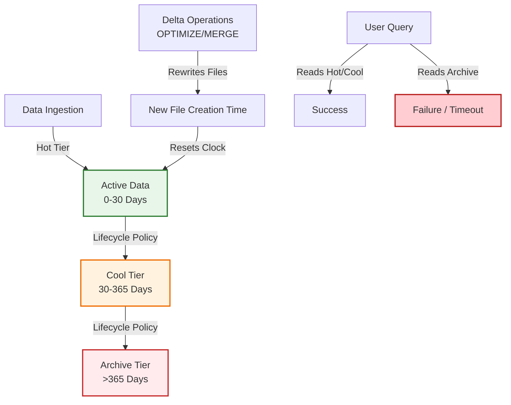

## The Challenge: Delta Lake vs. Storage Tiers

Delta Lake and Azure Storage operate at different layers, which creates specific challenges when combining them:

1.  **File Rewriting Resets Clocks:** Operations like `OPTIMIZE`, `MERGE`, `UPDATE`, and `DELETE` rewrite Parquet files. In Azure Storage, this resets the **creation time** of the file. If your lifecycle policy is based on "last modified" or "creation date," these maintenance operations can inadvertently delay archival, keeping data in expensive hot storage longer than intended.
2.  **Query Failures in Archive Tier:** If a user queries a table and the query engine attempts to read a file stored in the **Archive** tier, the query will fail unless the file is first restored (rehydrated), which can take hours.
3.  **Cost Surprises in Cool Tier:** While the **Cool** tier allows immediate access, it has higher read transaction costs. Accidentally querying large volumes of cold data for ad-hoc analysis can lead to unexpected bills.

<!-- path-normalized -->