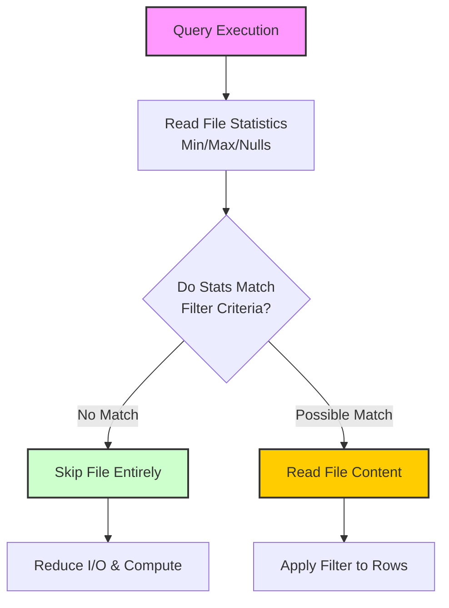

## Understand Data Skipping Fundamentals

Before examining specific clustering techniques, it is important to understand the underlying mechanism they all leverage: **data skipping**. Delta Lake automatically collects statistics for each data file, including minimum and maximum values, null counts, and record counts for each column. When you execute a query with filter conditions, the query engine checks these statistics first and skips files that cannot possibly contain matching records.

### How Data Skipping Works

For example, if you query sales data for January 2026, and a particular file's statistics show it contains only records from March 2026, the engine skips that file entirely without reading its contents. This optimization happens automatically, but its effectiveness depends on how well your data is organized.

### The Importance of Data Organization

Data skipping becomes powerful when **related records are stored together** in the same files. If records for each month are scattered randomly across all files, the engine cannot skip any files because each file contains records from every month. Clustering techniques exist to solve exactly this problem by co-locating related data.

> **Key Insight:** While data skipping is automatic, its efficiency is directly proportional to the physical organization of your data. Poorly organized data results in "statistical overlap," where every file contains a mix of values, forcing the engine to read nearly every file in the table.

### Data Skipping Logic Flow

The following diagram illustrates the decision process the query engine uses during a scan.

