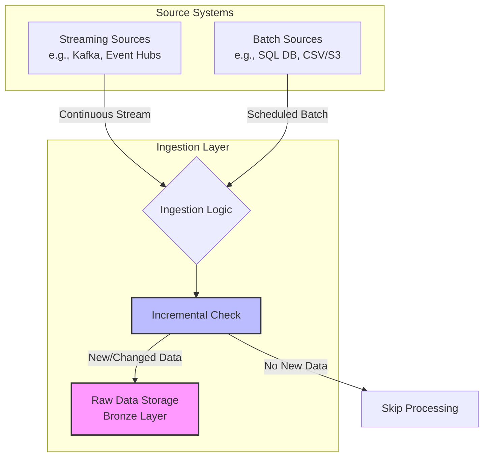

## Ingest Data from Source Systems

**Data ingestion** is the entry point of your pipeline. At this stage, the focus is on capturing data from source systems and preserving it in its original form. The primary goals are **reliability** and **completeness**—ensuring that no data is lost during transfer.

### Key Considerations for Ingestion

When designing the ingestion layer, consider these critical factors:

*   **Source Characteristics:** Different sources demand different approaches. **Streaming sources**, such as message queues, deliver data continuously, while **batch sources**, like databases or file systems, provide data at scheduled intervals.
*   **Data Preservation:** Store ingested data with minimal transformation. Maintaining the **raw state** enables you to reprocess data if downstream requirements change or if errors are discovered later in the pipeline.
*   **Incremental Processing:** Configure ingestion to process only new or changed data. This approach reduces processing time and compute costs by avoiding redundant work on historical records.

### Ingestion Flow Architecture

The following diagram illustrates how different source types feed into the Bronze Layer while maintaining data integrity and incremental processing logic.

>[!Note]
> This stage corresponds to the **Bronze Layer** in the medallion architecture. Data engineers typically implement ingestion logic that runs on a schedule or triggers automatically when new data arrives, ensuring a consistent and reliable flow of raw information into the platform.
