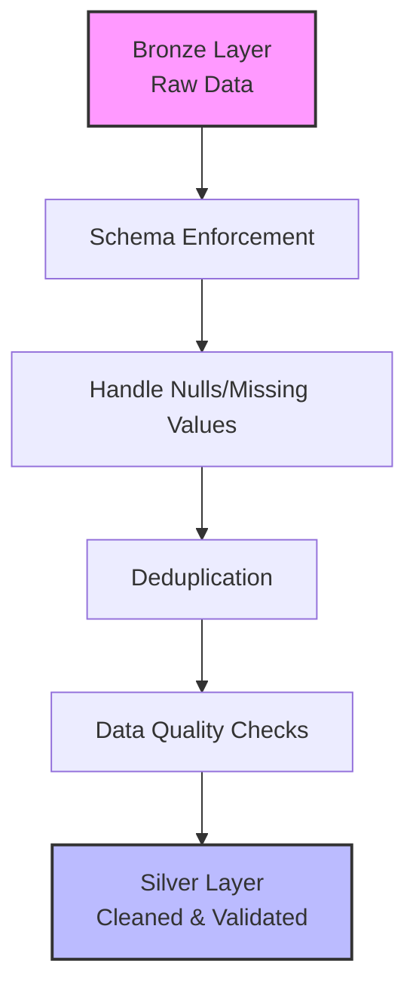

## Clean and Validate Data

After ingestion, data enters the **cleaning and validation** stage. You transform raw data into a validated, consistent format that downstream processes can rely on. This stage is critical because **data quality issues** caught early prevent problems from propagating through the rest of your pipeline.

### Core Cleaning Operations

Cleaning operations typically include:

*   **Schema Enforcement:** Apply consistent data types and structures to ensure data conforms to expected formats.
*   **Null and Missing Value Handling:** Define rules for how your pipeline treats incomplete records—whether to fill defaults, drop records, or flag for review.
*   **Deduplication:** Identify and remove duplicate records that might have entered through multiple ingestion paths or retry mechanisms.
*   **Data Quality Checks:** Apply validation rules that verify business constraints, such as ensuring dates fall within valid ranges or required fields contain appropriate values.

> **Note:** This stage maps to the **Silver Layer**. By separating cleaning from ingestion, you maintain the raw data for **auditing** while providing a reliable foundation for transformation.

### Implementation in PySpark

Below are common patterns for implementing these cleaning steps in Azure Databricks using PySpark.

#### 1. Schema Enforcement
Using `cast` ensures that columns match the expected data types, preventing downstream type-mismatch errors.

```python
from pyspark.sql.functions import col

# Enforce specific data types for consistency
df_silver = df_bronze.select(
    col("id").cast("long"),
    col("transaction_date").cast("timestamp"),
    col("amount").cast("double"),
    col("customer_name").cast("string")
)
```

#### 2. Null and Missing Value Handling
You can choose to drop records with missing critical fields or fill them with default values.

```python
# Drop records where 'id' or 'amount' is null
df_cleaned = df_silver.dropna(subset=["id", "amount"])

# Alternatively, fill missing 'customer_name' with 'Unknown'
df_cleaned = df_cleaned.fillna({"customer_name": "Unknown"})
```

#### 3. Deduplication
Use `dropDuplicates` to remove redundant records based on a unique key or a combination of columns.

```python
# Remove duplicates based on the primary key 'id'
df_deduped = df_cleaned.dropDuplicates(["id"])

# Or remove duplicates based on a combination of fields
df_deduped = df_cleaned.dropDuplicates(["transaction_date", "customer_id", "amount"])
```

#### 4. Data Quality Checks (Expectations)
In Lakeflow Declarative Pipelines, you can use SQL expectations. In notebooks, you can filter invalid rows or log them for review.

```python
from pyspark.sql.functions import expr

# Filter out records where amount is negative (business constraint)
df_valid = df_deduped.filter(col("amount") >= 0)

# Count invalid records for monitoring
invalid_count = df_deduped.filter(col("amount") < 0).count()
print(f"Records dropped due to invalid amount: {invalid_count}")
```

### Silver Layer Flow

The following diagram illustrates the progression from raw Bronze data to cleaned Silver data.


