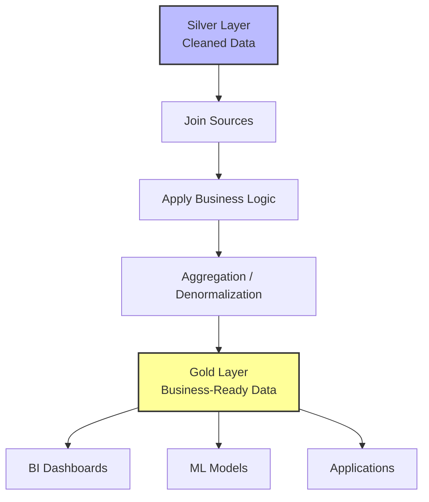

## Transform Data for Consumption

**Transformation** shapes your validated data into structures that serve specific business needs. At this stage, you apply **business logic**, combine data from multiple sources, and create the datasets that analysts, data scientists, and applications use. This final stage corresponds to the **Gold Layer** in the medallion architecture.

### Common Transformation Patterns

*   **Joining Datasets:** Combine data from different sources to create unified views. For example, joining customer records with transaction data to create a complete customer activity dataset.
*   **Aggregation:** Summarize data at different levels of granularity, such as calculating daily totals, monthly averages, or regional summaries.
*   **Denormalization:** Flatten hierarchical or normalized data structures to optimize **query performance** for analytics workloads.
*   **Business Logic Application:** Implement calculations, categorizations, and derived metrics that align with how your organization measures and reports on data.

> **Best Practice:** Transformation logic should be **clear and testable**. When business requirements change, well-structured transformations are easier to modify without disrupting other parts of the pipeline. Use modular functions or separate notebooks for complex logic to maintain readability.

### Implementation in PySpark

Here are examples of common transformation patterns applied to Silver layer data.

#### 1. Joining Datasets
Combining transactional data with reference data (like customer details) to enrich the record.

```python
# Join transactions with customer dimension
df_gold = df_silver_transactions.join(
    df_customers, 
    on="customer_id", 
    how="inner"
).select(
    "transaction_id",
    "transaction_date",
    "amount",
    "customer_name",
    "region"
)
```

#### 2. Aggregation
Creating summary tables for reporting dashboards.

```python
from pyspark.sql.functions import sum, avg, col

# Calculate daily sales by region
df_daily_sales = df_gold.groupBy("transaction_date", "region").agg(
    sum("amount").alias("total_sales"),
    avg("amount").alias("avg_transaction_value")
)
```

#### 3. Denormalization and Business Logic
Flattening data and adding calculated fields for specific business metrics.

```python
from pyspark.sql.functions import when, lit

# Add a 'sales_category' column based on amount
df_final = df_gold.withColumn(
    "sales_category",
    when(col("amount") > 1000, "High Value")
    .when(col("amount") > 500, "Medium Value")
    .otherwise("Standard")
)
```

### Gold Layer Flow

The following diagram illustrates how Silver data is transformed into business-ready Gold datasets.


