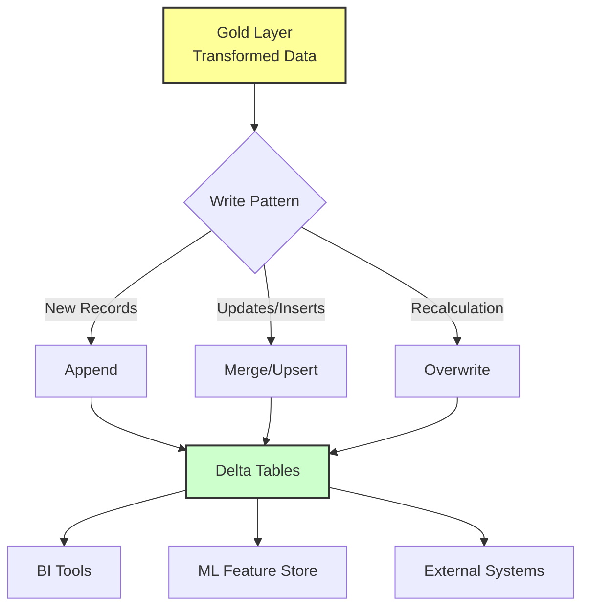

## Load Data to Target Destinations

**Loading** represents the handoff from data engineering to data consumption. At this stage, you write processed data to tables, views, or external systems where consumers access it. This final step ensures that the transformed Gold layer data is accessible and optimized for its intended use.

### Key Considerations for the Load Stage

*   **Table Design:** Structure tables to support common query patterns. Consider **partitioning strategies** (e.g., by date or region) that align with how users typically filter data to improve query performance.
*   **Write Patterns:** Choose between **full refresh**, **incremental append**, or **merge operations** based on data volumes and freshness requirements.
*   **Schema Evolution:** Plan for how your tables handle changes to data structure over time without breaking dependent workloads. Delta Lake’s schema evolution features allow for safe addition of new columns.

> **Note:** Data loaded at this stage often corresponds to the **Gold Layer**—highly curated datasets optimized for analytics, reporting, and machine learning.

### Implementation in PySpark

Below are common patterns for loading data into Delta tables in Azure Databricks.

#### 1. Incremental Append
Ideal for streaming data or when you only need to add new records without modifying existing ones.

```python
# Append new records to the target table
df_gold.write.mode("append").saveAsTable("gold_sales_transactions")
```

#### 2. Merge (Upsert)
Useful for maintaining a "latest state" table where records might be updated or inserted based on a unique key.

```python
from delta.tables import *

deltaTable = DeltaTable.forName(spark, "gold_customer_profile")

# Merge based on customer_id
deltaTable.alias("target").merge(
    df_updates.alias("source"),
    "target.customer_id = source.customer_id"
).whenMatchedUpdateAll().whenNotMatchedInsertAll().execute()
```

#### 3. Full Refresh
Best for small dimension tables or aggregated summaries that are recalculated entirely each run.

```python
# Overwrite the entire table with new data
df_aggregated.write.mode("overwrite").option("overwriteSchema", "true").saveAsTable("gold_daily_regional_summary")
```

### Load Flow Architecture

The following diagram illustrates the flow from the Gold layer to various consumer destinations.


