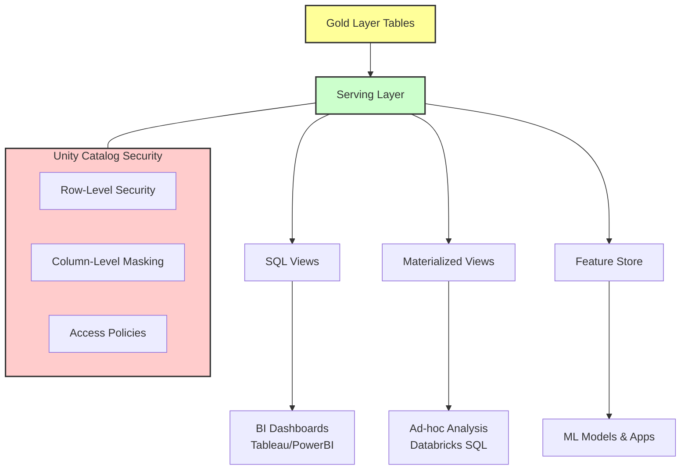

## Serve Data to Consumers

Once data reaches its target destination, the **serving layer** makes it accessible to different consumer groups. This stage focuses on providing appropriate **access patterns** and **performance characteristics** for each use case, bridging the gap between raw storage and business value.

### Key Serving Considerations

*   **Views and Access Layers:** Create views that present data in formats optimized for specific consumer needs, such as dashboards, reports, or analytical queries. This abstraction allows you to change underlying table structures without breaking downstream reports.
*   **Performance Optimization:** Configure **compute resources** (such as SQL Warehouses) and **caching strategies** (like Delta Cache) that meet latency requirements for interactive queries.
*   **Access Control:** Implement **security policies** using Unity Catalog to ensure consumers see only the data they're authorized to access through row-level and column-level security.

> **Best Practice:** The serving layer should abstract pipeline internals. Analysts and applications should interact with clean, well-documented views or tables without needing to understand the complex transformation logic that produced them.

### Implementation Patterns

#### 1. Creating Optimized Views
Views provide a logical layer over physical tables, allowing for consistent definitions of metrics across the organization.

```sql
-- Create a view for the finance team with specific aggregations
CREATE OR REPLACE VIEW finance.sales_summary AS
SELECT 
    region,
    transaction_date,
    SUM(amount) as total_revenue,
    COUNT(*) as transaction_count
FROM gold_sales_transactions
GROUP BY region, transaction_date;
```

#### 2. Configuring Access Control
Using Unity Catalog to manage permissions ensures that sensitive data remains protected while still being accessible to authorized users.

```sql
-- Grant SELECT permission on the view to the 'analysts' group
GRANT SELECT ON VIEW finance.sales_summary TO `analysts`;

-- Apply row-level security if needed
-- (Typically managed via Unity Catalog policies in the UI or API)
```

### Serving Architecture Flow

The following diagram illustrates how served data reaches various consumer endpoints.


