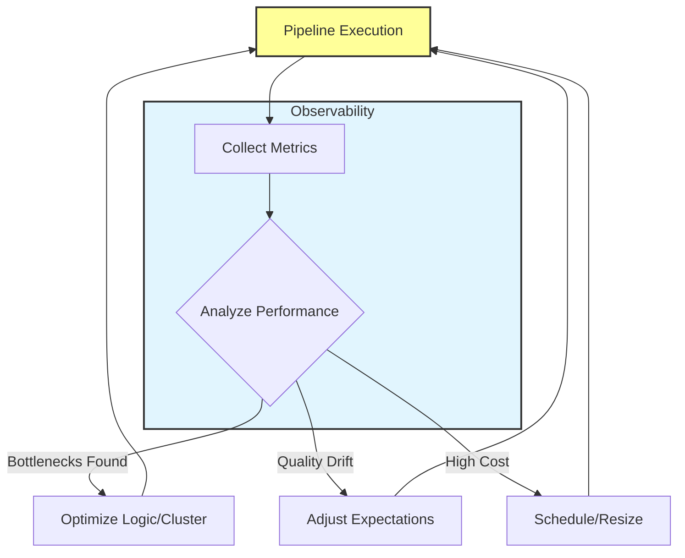

## Monitor and Optimize Pipeline Performance

**Pipeline monitoring** ensures your data flows reliably and efficiently over time. Without ongoing observation, issues like **data delays**, **quality degradation**, or **resource inefficiency** can go unnoticed until they affect business decisions.

### Key Monitoring Areas

Establish monitoring for these critical dimensions:

*   **Processing Metrics:** Track **execution times**, **record counts**, and **resource utilization** to identify bottlenecks or unexpected changes in data volumes.
*   **Data Quality Trends:** Monitor validation results over time to detect gradual **drift** in data quality or sudden spikes in invalid records.
*   **Cost and Performance:** Review compute usage patterns to identify opportunities for **optimization**, such as adjusting cluster sizes or scheduling non-urgent workloads during off-peak hours.

> **Note:** **Optimization** is an ongoing activity. As data volumes grow and business requirements evolve, revisit your pipeline design to ensure it continues to meet performance and cost objectives.

### Implementation Strategies

#### 1. Tracking Processing Metrics
Use Databricks system tables or custom logging to capture execution details.

```python
import time

start_time = time.time()

# Your transformation logic here
df_result = df_source.transform(clean_data).transform(aggregate_data)

end_time = time.time()
execution_duration = end_time - start_time

# Log metrics to a monitoring table
metrics_df = spark.createDataFrame([(execution_duration, df_result.count())], ["duration_seconds", "record_count"])
metrics_df.write.mode("append").saveAsTable("pipeline_monitoring_metrics")
```

#### 2. Monitoring Data Quality Trends
In Lakeflow Declarative Pipelines, you can set up expectations that fail the pipeline if quality drops below a threshold.

```sql
-- Example of a data quality expectation in a declarative pipeline
EXPECT (valid_transaction_date) 
  EXPECT transaction_date > '2020-01-01' ON VIOLATION DROP ROW;

EXPECT (positive_amount) 
  EXPECT amount >= 0 ON VIOLATION FAIL UPDATE;
```

#### 3. Cost Optimization Checks
Regularly review the Spark UI and Databricks SQL Dashboards to identify expensive shuffles or skewed partitions.

```python
# Check for data skew before a join
df_source.groupBy("partition_key").count().orderBy("count", ascending=False).show(10)
```

### Monitoring and Optimization Loop

The following diagram illustrates the continuous cycle of monitoring and improving pipeline performance.


