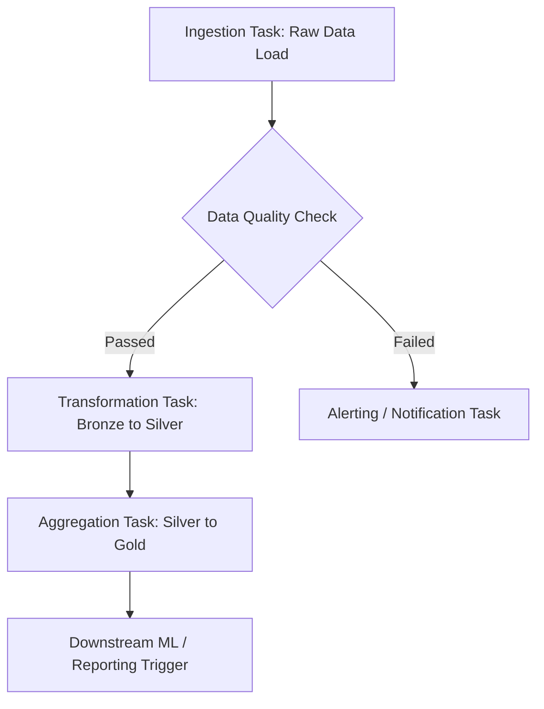

# Designing Lakeflow Job Logic

## Overview & Core Concepts

When designing task logic for a **Lakeflow Job**, you orchestrate complex data workflows that balance performance, cost, and maintainability. Lakeflow Jobs unify orchestration (workflows) and declarative ingestion, enabling you to build resilient, parameterizable, and scalable pipelines.

Key design pillars include:

* **Task Dependencies:** Defining how tasks interact sequentially or concurrently.
* **Execution Patterns:** Managing fan-out, fan-in, and conditional branching.
* **Dynamic Parameterization:** Passing runtime values and state between tasks to ensure reusability.

## 1. Architectural Patterns & Task Dependencies

Lakeflow jobs support flexible graph topologies. Designing an efficient DAG (Directed Acyclic Graph) prevents bottlenecks and optimizes cluster utilization.

### Common Topologies

* **Linear:** Task A $\rightarrow$ Task B $\rightarrow$ Task C (Simple sequential execution).
* **Fan-out (Parallel):** Task A triggers Task B1, B2, and B3 simultaneously to process independent partitions or datasets.
* **Fan-in (Aggregation):** Tasks B1, B2, and B3 all flow into Task C, which only runs once all upstream tasks complete successfully.
* **Conditional Branching:** Using `if/else` evaluation tasks to control execution paths based on data validation results or metrics.

### Workflow Architecture Diagram



## 2. Dynamic Parameters & Task Values

To make Lakeflow jobs reusable across environments (Dev, Staging, Prod) and dates, you must leverage **job parameters** and **task values**.

### Passing Data Between Tasks

Tasks can output values at runtime using dbutils, which subsequent tasks can consume using task value references.

* **Task A (Producer):**

```python
# Set a dynamic task value (e.g., latest processed partition date)
dbutils.jobs.taskValues.set(key="processed_date", value="2026-03-30")

```

* **Task B (Consumer):**

```python
# Access the task value from a previous task named 'ingest_task'
target_date = "{{tasks.ingest_task.values.processed_date}}"
print(f"Processing data for date: {target_Ddate}")

```

## 3. End-to-End Worked Example: Multi-Stage Lakeflow Pipeline

Let's walk through an end-to-end design for an e-commerce order processing pipeline using the Databricks Python SDK to define the Lakeflow Job logic.

### Scenario

1. **Ingest:** Pull hourly transactional data from cloud storage.
2. **Validate:** Check for null values and schema compliance using a conditional check.
3. **Transform:** Cleanse and write to a Delta Lake Silver table.
4. **Aggregate:** Compute hourly revenue metrics into a Gold summary table.

### Job Definition Code Example (Databricks SDK / Python)

```python
from databricks.sdk import WorkspaceClient
from databricks.sdk.service.jobs import Task, JobCluster, PythonWheelTask, NotebookTask

w = WorkspaceClient()

# Define the Job structure
job = w.jobs.create(
    name="eCommerce_Lakeflow_Pipeline",
    tasks=[
        # Task 1: Ingestion
        Task(
            task_key="ingest_task",
            notebook_task=NotebookTask(
                notebook_path="/Workspace/Production/Lakeflow/01_Ingest",
                base_parameters={"environment": "production"}
            ),
            existing_cluster_id="1204-150000-abc123xy"
        ),
        # Task 2: Validation (Depends on Ingest)
        Task(
            task_key="validation_task",
            depends_on=[{"task_key": "ingest_task"}],
            notebook_task=NotebookTask(
                notebook_path="/Workspace/Production/Lakeflow/02_Validate"
            ),
            existing_cluster_id="1204-150000-abc123xy"
        ),
        # Task 3: Transformation (Runs only if validation succeeds)
        Task(
            task_key="transform_task",
            depends_on=[{"task_key": "validation_task"}],
            notebook_task=NotebookTask(
                notebook_path="/Workspace/Production/Lakeflow/03_Transform",
                base_parameters={"source_date": "{{tasks.ingest_task.values.processed_date}}"}
            ),
            existing_cluster_id="1204-150000-abc123xy"
        )
    ]
)
print(f"Created Lakeflow Job with ID: {job.job_id}")

```

## 4. Production Best Practices & Resilience

>[!Important]
> Designing for failure is just as critical as designing for success in data pipelines.

* **Retry Policies:** Configure exponential backoffs for tasks prone to transient cloud storage or API issues.
* **Cluster Management:** Prefer **Job Clusters** over All-Purpose clusters for production Lakeflow jobs to lower costs and ensure environment isolation.
* **Alerting & Notifications:** Set up webhook or email triggers for `on_failure`, `on_success`, and `on_duration_warning` to maintain reliable SLAs.
