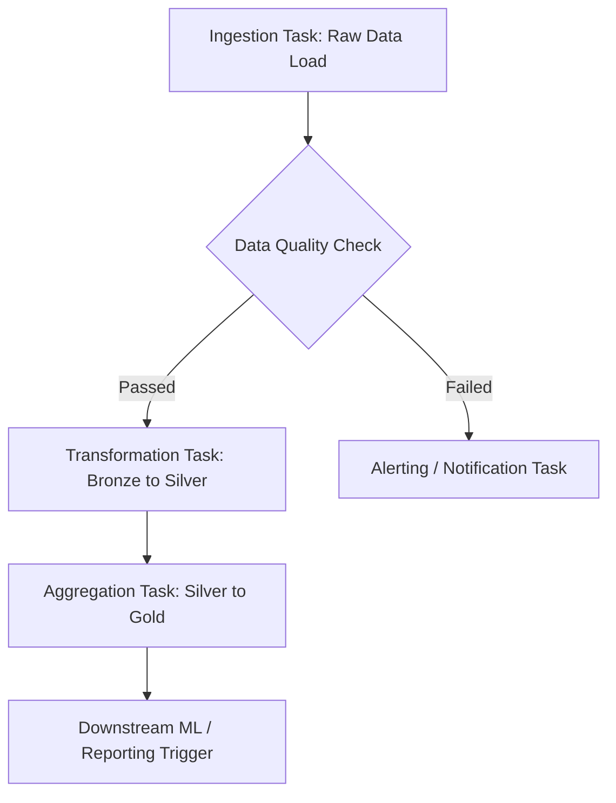

## Design Lakeflow job logic

When you design task logic for a **Lakeflow Job**, you make decisions that affect how your workflow executes, scales, and responds to changing conditions. A well-designed job balances performance, cost, and maintainability while meeting business requirements. In this unit, you learn how to structure task dependencies, choose execution patterns, and configure parameters that make your jobs flexible and reusable.

### Overview & Core Concepts

Lakeflow Jobs unify orchestration and declarative data ingestion, enabling you to build resilient, parameterizable, and scalable pipelines. Key design pillars include:

* **Task Dependencies:** Defining how individual tasks interact sequentially or concurrently within a Directed Acyclic Graph (DAG).
* **Execution Patterns:** Managing patterns like fan-out, fan-in, and conditional execution paths.
* **Dynamic Parameterization:** Passing runtime values and state between tasks to ensure modularity and reusability.
* **Official References:** Read more in the official [Databricks Lakeflow Jobs Documentation](https://docs.databricks.com/aws/en/jobs/?utm_source=gemini) and guidelines on [Configuring Task Parameters](https://docs.databricks.com/aws/en/jobs/task-parameters?utm_source=gemini).

### 1. Architectural Patterns & Task Dependencies

Lakeflow jobs support flexible graph topologies. Designing an efficient DAG prevents bottlenecks and optimizes cluster utilization.

* **Linear:** Task A executes, followed by Task B, followed by Task C.
* **Fan-out (Parallel):** Task A triggers multiple child tasks (B1, B2, B3) simultaneously to process independent data partitions.
* **Fan-in (Aggregation):** Parallel tasks flow into a single downstream task that triggers only after all upstream dependencies succeed.
* **Conditional Branching:** Evaluating data metrics or output states to dynamically route execution pathways.



### 2. Dynamic Parameters & Task Values

To make Lakeflow jobs reusable across environments (Dev, Staging, Prod) and dates, you leverage job parameters and task values. Tasks can output values at runtime using Databricks utilities, which subsequent tasks consume using dynamic value references.

* **Producer Task Example (`dbutils.jobs.taskValues.set`)**:
```python
# Set a dynamic task value to be consumed by downstream tasks
# Key: 'processed_date', Value: string representation of the processing date
dbutils.jobs.taskValues.set(key="processed_date", value="2026-03-30")

```


* **Consumer Reference Syntax**:
```text
{{tasks.ingest_task.values.processed_date}}

```


* Learn more about this mechanism in the guide on [Using Task Values to Pass Information Between Tasks](https://learn.microsoft.com/en-us/azure/databricks/jobs/task-values?utm_source=gemini) and [Dynamic Value References](https://docs.databricks.com/aws/en/jobs/dynamic-value-references?utm_source=gemini).

### 3. End-to-End Worked Example: Multi-Stage Lakeflow Pipeline

This end-to-end example uses the Databricks Python SDK to programmatically build a multi-task Lakeflow job.

* **Scenario Steps:**
1. Pull transactional data.
2. Validate schema and record counts.
3. Transform and write to Delta Silver tables using dynamic parameter passing from Task 1.


* **Job Definition Code Example with Comments:**
```python
from databricks.sdk import WorkspaceClient
from databricks.sdk.service.jobs import Task, NotebookTask

# Initialize the Databricks Workspace Client for SDK interactions
w = WorkspaceClient()

# Create a multi-task Lakeflow job definition
job = w.jobs.create(
    name="eCommerce_Lakeflow_Pipeline",
    tasks=[
        # Task 1: Ingestion task loading raw files from storage
        Task(
            task_key="ingest_task",
            notebook_task=NotebookTask(
                notebook_path="/Workspace/Production/Lakeflow/01_Ingest",
                base_parameters={"environment": "production"}
            ),
            existing_cluster_id="1204-150000-abc123xy"
        ),

        # Task 2: Validation task dependent on the completion of the ingestion task
        Task(
            task_key="validation_task",
            depends_on=[{"task_key": "ingest_task"}],
            notebook_task=NotebookTask(
                notebook_path="/Workspace/Production/Lakeflow/02_Validate"
            ),
            existing_cluster_id="1204-150000-abc123xy"
        ),

        # Task 3: Transformation task depending on validation and consuming an upstream task value
        Task(
            task_key="transform_task",
            depends_on=[{"task_key": "validation_task"}],
            notebook_task=NotebookTask(
                notebook_path="/Workspace/Production/Lakeflow/03_Transform",
                # Dynamically fetch output from ingest_task via task values syntax
                base_parameters={"source_date": "{{tasks.ingest_task.values.processed_date}}"}
            ),
            existing_cluster_id="1204-150000-abc123xy"
        )
    ]
)

# Output the newly generated Job ID for tracking
print(f"Created Lakeflow Job with ID: {job.job_id}")

```


* Reference implementation details are available in the [Databricks SDK for Python Documentation](https://databricks-sdk-py.readthedocs.io/en/latest/workspace/jobs/jobs.html?utm_source=gemini) and [Python Script Task Guide](https://docs.databricks.com/aws/en/jobs/tasks/python-script?utm_source=gemini).

### 4. Production Best Practices & Resilience

* **Retry Policies:** Configure exponential backoffs for tasks prone to transient network or cloud storage errors.
* **Cluster Management:** Use dedicated Job Clusters rather than all-purpose clusters to isolate workloads and minimize infrastructure expenditure.
* **Alerting:** Configure webhook or email notifications for workflow failures, successes, or duration thresholds to meet operational SLAs.
