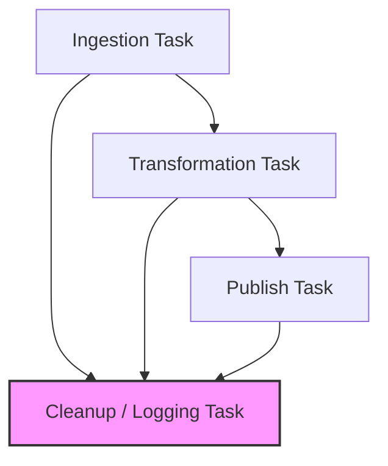

## Understand task relationships in a job

Lakeflow Jobs represent tasks and their relationships as a **Directed Acyclic Graph (DAG)**. Each task in the DAG can depend on one or more upstream tasks, creating a visual map of your workflow's execution order. This structure not only governs the execution sequence but also defines how failures propagate through the pipeline.

### Core Dependency Conditions

When configuring task dependencies in Databricks Lakeflow, you can select from several explicit dependency conditions to manage operational flow:

| Dependency condition | Behavior & Use Case |
| --- | --- |
| **All succeeded** | Runs only when all upstream tasks complete successfully (Default behavior for sequential pipelines). |
| **At least one succeeded** | Runs when any single upstream task succeeds, useful for redundant fallback tasks. |
| **None failed** | Runs when no upstream tasks failed, even if some tasks were skipped. |
| **All done** | Runs after all upstream tasks finish, regardless of success, failure, or skip outcomes. Ideal for cleanup routines. |
| **At least one failed** | Runs only when at least one upstream task fails, often used for targeted error alerting. |
| **All failed** | Runs only when all upstream tasks fail completely. |

* Read more about configuring these rules in the official [Databricks Job Task Dependencies Documentation](https://www.google.com/search?q=https://docs.databricks.com/aws/en/jobs/task-dependencies&utm_source=gemini) and [Databricks Jobs Overview](https://docs.databricks.com/aws/en/jobs/?utm_source=gemini).

### Workflow Dependency Visualization

Here is an example of a DAG utilizing different termination states, such as a cleanup task executing on an **All done** condition regardless of upstream outcomes:

### Operational Best Practices: Disabling vs. Deleting Tasks

When debugging or troubleshooting production data pipelines, proper task management minimizes downtime:

* **Disabling Tasks:** Instead of deleting a broken or unneeded task, you can disable it. A disabled task is skipped at runtime while preserving its configuration, dependencies, and execution history.
* **Re-enabling:** You can easily re-enable the task later without having to recreate or rebuild it from scratch.
* **Pipeline Resilience:** Pausing a problematic task allows the rest of the healthy DAG components to continue running on schedule without breaking the overall workflow execution.
