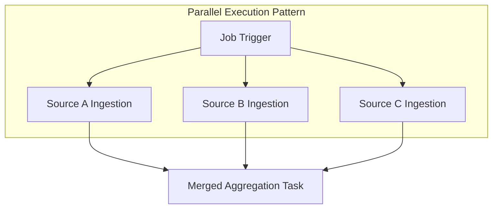

## Design task execution patterns

Your choice between serial and parallel execution affects both runtime performance and resource utilization in Databricks Lakeflow Jobs. Tasks without dependencies on each other can run simultaneously, reducing total job duration, but this requires careful balancing against cluster capacity and workspace limits.

### Core Concepts: Serial vs. Parallel Execution

* **Serial Execution:** Tasks execute one after another in a strict linear sequence. This approach is ideal for dependent transformations (e.g., Bronze $\rightarrow$ Silver $\rightarrow$ Gold) but results in longer overall job durations.
* **Parallel Execution:** Independent tasks execute simultaneously. For example, processing data from three separate regional sources concurrently significantly cuts down total execution time.
* **Resource Contention & Quenching:** Highly parallel jobs consume more compute resources. Azure/AWS Databricks enforces limits on concurrent task runs per workspace, meaning excessive parallelism can lead to job queuing during peak usage windows.
* **Official References:** Learn more in the official [Databricks Jobs Configuration Guide](https://docs.databricks.com/aws/en/jobs/?utm_source=gemini) and [Cluster Configuration Best Practices](https://www.google.com/search?q=https://docs.databricks.com/aws/en/clusters/&utm_source=gemini).

### Execution Pattern Comparison

| Pattern | Performance | Resource Usage | Best Use Case |
| --- | --- | --- | --- |
| **Serial** | Lower (Cumulative duration) | Low (Runs one task at a time) | Dependent pipelines where step B requires output from step A. |
| **Parallel (Fan-out)** | High (Reduced overall wall-clock time) | High (Spawns concurrent tasks/threads) | Independent data streams, multi-region ingestion, or parallel data partitions. |

### Execution Topology Visualization



### Compute Sharing & Strategy

* **Shared Compute:** Tasks sharing a cluster run on the same infrastructure, eliminating startup latency (cold-start costs). However, they compete for the same CPU and memory pools. Use this for lightweight, related tasks.
* **Dedicated Compute:** Resource-intensive tasks (such as heavy ML training or large-scale shuffle operations) should be isolated on dedicated clusters or job clusters to avoid resource starvation across concurrent tasks.

### Code Example: Defining Parallel Tasks with the Databricks SDK

```python
from databricks.sdk import WorkspaceClient
from databricks.sdk.service.jobs import Task, NotebookTask

# Initialize the Databricks Workspace Client
w = WorkspaceClient()

# Create a job with parallel ingestion tasks that feed into a single aggregation task
job = w.jobs.create(
    name="Parallel_Ingestion_Pipeline",
    tasks=[
        # Independent Parallel Task 1: Ingest US region data
        Task(
            task_key="ingest_us_region",
            notebook_task=NotebookTask(notebook_path="/Workspace/Pipelines/Ingest_US"),
            existing_cluster_id="shared-cluster-id-123"
        ),
        
        # Independent Parallel Task 2: Ingest EU region data (runs concurrently with US ingestion)
        Task(
            task_key="ingest_eu_region",
            notebook_task=NotebookTask(notebook_path="/Workspace/Pipelines/Ingest_EU"),
            existing_cluster_id="shared-cluster-id-123"
        ),
        
        # Fan-in Aggregation Task: Depends on both ingestion tasks completing successfully
        Task(
            task_key="global_aggregation",
            depends_on=[
                {"task_key": "ingest_us_region"},
                {"task_key": "ingest_eu_region"}
            ],
            notebook_task=NotebookTask(notebook_path="/Workspace/Pipelines/Aggregate_Global"),
            existing_cluster_id="shared-cluster-id-123"
        )
    ]
)

print(f"Created job with parallel execution flow. Job ID: {job.job_id}")
```

* Reference documentation for setting up task dependencies and clusters is available in the [Databricks SDK for Python Jobs API Reference](https://databricks-sdk-py.readthedocs.io/en/latest/workspace/jobs/jobs.html?utm_source=gemini).
